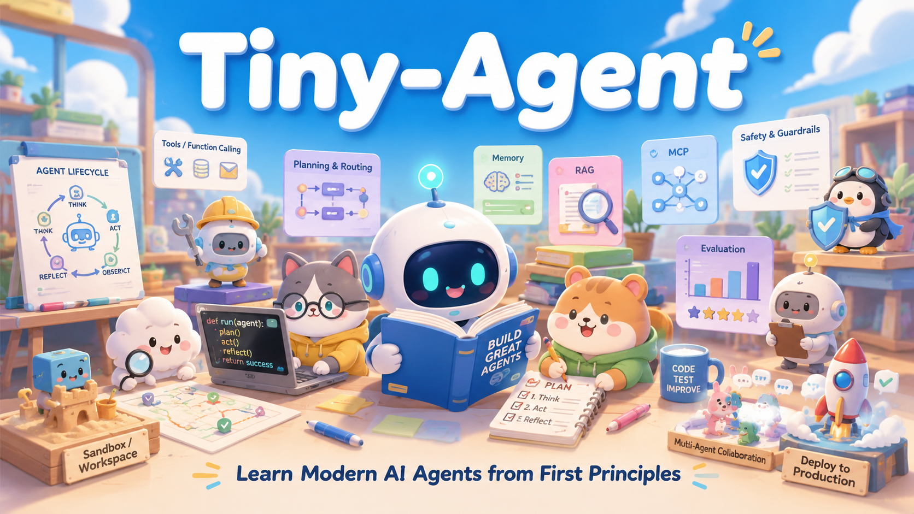

<p align="center">
  
</p>

<h1 align="center">Tiny-Agent</h1>

<p align="center">
  🌐 语言 / Language：<strong>中文</strong> | <a href="README.md"><strong>English</strong></a>
</p>

**一条以机制为先、面向生产工程的现代 AI Agent 学习路线：从一次 ToolCall 出发，逐步学习上下文工程、MCP、记忆、安全、评估、多 Agent 互操作、受控工作区、可恢复的长时程 harness，最终完成一个完整的研究型 Agent capstone。**

Tiny-Agent 面向那些不希望把 Agent 学成“一堆框架装饰器”的学习者。

整个仓库反复遵循同一条学习顺序：

```text
为什么需要这个抽象？
        ↓
先用普通 Python 手写机制
        ↓
测试边界条件
        ↓
再映射到当前框架 / 协议
        ↓
明确这个抽象没有解决什么
```

## 核心工程原则

1. **模型输出只是提案，不是权限。**
2. **使用能够解决任务的最小动态架构。**
3. **state、context、checkpoint、memory、evidence 与 artifact 属于不同作用域。**
4. **发现能力不等于获得授权。**
5. **审批不等于授权。**
6. **失败可以重试，不代表操作可以安全地重复执行。**
7. **检索到或远程获得的内容是不可信数据，不是控制策略。**
8. **Graph 是编排机制，不会自动变成 Agent。**
9. **Agent 越多并不自动越好。**
10. **子进程不是安全沙箱。**
11. **大上下文窗口只是容量，不代表应该把所有内容都塞给模型。**
12. **Skill 教程序，Tool 暴露能力，memory 保存经过选择的信息。**
13. **Durable execution 要把进度外部化，而不是依赖一次模型会话或单个进程。**
14. **最终文本正确，也可能来自失败或不安全的 Agent 轨迹。**
15. **框架和协议负责 plumbing；应用负责语义与策略。**

---

# 2026 课程体系

数字编号 Stage 构成原始能力进阶路线。字母扩展 Stage 来自 2026 年全项目审查，用于补齐现代 Context、Skills、Sandbox 与长期运行 Harness 等关键能力，同时不打乱已经成熟的历史编号。

| Stage | 能力 | 核心问题 |
|---|---|---|
| [00](stages/00-foundations/README.zh-CN.md) | LLM / messages / Structured Output / Tool Calling / 模型与上下文基础 | 模型究竟做什么？哪些责任仍属于应用？ |
| [01](stages/01-react-runtime/README.zh-CN.md) | ReAct 与核心 runtime | 一次 ToolCall 如何变成有边界的 decide-act-observe 循环？ |
| [02](stages/02-planning-routing/README.zh-CN.md) | Workflow / routing / planning | 哪些控制决策应当确定化，哪些才交给模型？ |
| [03](stages/03-stateful-orchestration/README.zh-CN.md) | 显式 state 与 LangGraph | 什么时候需要状态机或图运行时？ |
| [04](stages/04-agentic-rag/README.zh-CN.md) | RAG 与 Agentic retrieval | Agent 如何获得并评估外部证据？ |
| [05](stages/05-mcp/README.zh-CN.md) | MCP 2026 | 如何跨边界标准化外部能力与上下文？ |
| [06](stages/06-memory-persistence-hitl/README.zh-CN.md) | Memory / durability / HITL | 什么信息应该持久化？执行如何安全暂停与恢复？ |
| [06A](stages/06a-context-engineering/README.zh-CN.md) | Context Engineering | 在有限注意力预算下，这一轮模型究竟应该看到什么？ |
| [06B](stages/06b-agent-skills/README.zh-CN.md) | Agent Skills | 可复用程序性知识如何被发现并按需加载？ |
| [07](stages/07-reliability-safety/README.zh-CN.md) | Reliability / safety / governance | 如何限制、验证、授权、重试以及拒绝执行？ |
| [08](stages/08-evaluation-observability/README.zh-CN.md) | Tracing 与 evaluation | 到底发生了什么？结果是否优秀？新版本是否回归？ |
| [09](stages/09-multi-agent/README.zh-CN.md) | Multi-Agent / A2A | 什么时候 delegation / handoff 才能产生可测量价值？ |
| [09A](stages/09a-agent-workspace-sandbox/README.zh-CN.md) | Workspace 与 sandbox compute | Agent 在哪里检查文件、运行命令，同时又不直接获得宿主机权限？ |
| [10](stages/10-production-deployment/README.zh-CN.md) | Production service / identity / durable jobs | 当其他用户或 Agent 开始依赖这个服务后，系统发生了什么变化？ |
| [10A](stages/10a-long-horizon-harness/README.zh-CN.md) | Long-horizon harness | Agent 如何跨会话、worker 与 sandbox 丢失持续推进任务？ |
| [11](stages/11-capstone-enterprise-agent/README.zh-CN.md) | OpenScholar capstone | 这些机制能否组合成一个真正证据驱动的 Agent 系统？ |

详细能力覆盖：**[现代 Agent 能力地图](docs/modern-agent-competency-map.zh-CN.md)**  
框架与协议映射：**[框架与工具地图](docs/framework-and-tooling-map.zh-CN.md)**

---

# 能力阶梯

```text
LLM call
  ↓
Structured decision / ToolCall
  ↓
ReAct runtime
  ↓
workflow / router / planner
  ↓
explicit state graph
  ↓
retrieval and external evidence
  ↓
MCP capability boundary
  ↓
memory / checkpoint / HITL
  ↓
context engineering + Agent Skills
  ↓
reliability / permissions / budgets
  ↓
tracing / evaluation / regression
  ↓
multi-Agent / A2A
  ↓
governed workspace / sandbox compute
  ↓
production identity / jobs / infrastructure
  ↓
long-horizon resumable harness
  ↓
OpenScholar capstone
```

这个仓库**并不认为图越往下就一定越高级、越适合你的任务**。只使用任务真正需要的复杂度。

---

# 哪些机制是从零实现的？

`src/tiny_agent/` 中提供可复用实现：

```text
runtime.py                 ReAct 风格循环
workflows.py               routing / planning / replanning
state_graph.py             手写 graph 机制
retrieval.py               chunking / embeddings / cosine / top-k
rag.py                     Basic + Agentic RAG
mcp_bridge.py              MCP Tool 归一化
memory_policy.py           受治理的 memory candidate
approval.py                approve / edit / reject
context_engineering.py     context budget / selection / compaction
skills.py                  SKILL.md catalog + progressive activation
reliability.py             failures / retries / budgets / loop detection
governance.py              principals / permissions / exact approval binding
guarded_runtime.py         组合式执行策略
observability.py           本地 traces / spans
evaluation.py              datasets / graders / regression gates
multi_agent.py             delegation / handoff / fan-out / context projection
workspace.py               workspace confinement + Docker sandbox baseline
jobs.py                    durable local run queue + leases
service_identity.py        trusted identity / tenant binding
production.py              bounded service execution + readiness
harness.py                 durable task ledger + long-horizon handoffs
capstone/                  OpenScholar domain + orchestration + eval
integrations/              OpenAI / FastAPI / MCP / A2A / OTel / DB adapters
```

只有在底层机制已经可见之后，课程才引入框架集成。

---

# 必须分清的现代 Agent 概念

```text
Structured Output != Tool Calling
Tool Calling != Tool execution
Tool != Skill
Skill != Memory
MCP != A2A
Retriever != Vector Store
RAG != Agent
State != Context
Checkpoint != Long-term Memory
Graph != Agent
Delegation != Handoff
Discovery != Authorization
Approval != Authorization
Timeout != Hard termination
Subprocess != Sandbox
Service run != Agent checkpoint != long-horizon task ledger
```

如果这些边界足够清楚，大多数框架 API 都会容易理解得多。

---

# 安装

核心机制尽量保持轻依赖：

```bash
python -m pip install -e ".[dev]"
```

按阶段安装可选依赖：

```bash
python -m pip install -e ".[openai]"
python -m pip install -e ".[dev,stage03]"   # LangGraph / LangChain
python -m pip install -e ".[dev,stage04]"   # FAISS / Qdrant / LangChain retrieval
python -m pip install -e ".[dev,stage05]"   # MCP v2
python -m pip install -e ".[dev,stage06]"   # SQLite/Postgres checkpointing
python -m pip install -e ".[dev,stage06b]"  # Agent Skills YAML parsing
python -m pip install -e ".[dev,stage07]"   # jsonschema / Pydantic / Tenacity
python -m pip install -e ".[dev,stage08]"   # LangSmith / OpenTelemetry
python -m pip install -e ".[dev,stage09]"   # OpenAI Agents SDK / A2A
python -m pip install -e ".[dev,stage10]"   # FastAPI / Postgres / Redis / A2A server
python -m pip install -e ".[dev,stage11]"   # 完整 OpenScholar integrations
```

Stage 06A、09A 与 10A 的手写机制主要依赖标准库与 Tiny-Agent core。只有实际运行 Stage 09A 的容器 sandbox 示例时，Docker 才是外部运行时要求。

---

# Agent 机制验证

`tests/` 目录属于 Agent 学习内容的一部分：它用于展示课程里讲到的 runtime semantics 应该如何用确定性方式验证，**不再承担与 Agent 学习无关的仓库维护检查**。

当前验证内容包括：

- runtime / Tool 边界条件；
- Structured Output / provider adapters；
- planning / replanning budgets；
- 手写与 LangGraph state semantics；
- FAISS / Qdrant retrieval；
- MCP v2 server / client / transport；
- durable SQLite / Postgres checkpoint 与 HITL；
- validation / retry / permission / approval / injection 边界；
- tracing / evaluation / regression gates；
- multi-Agent ownership、context isolation、handoff loops、A2A objects；
- FastAPI / Postgres / Redis / A2A service integration；
- context budget / compaction；
- Agent Skill discovery / activation；
- workspace 路径约束与 Docker command hardening；
- durable job leases 与 long-horizon resume；
- OpenScholar evidence / citation / semantic support，以及经过身份验证的 bounded serving。

这些 Agent 机制与集成验证直接通过 `pytest` 运行；仓库维护自动化不作为学习内容提交到课程树中。

---

# OpenScholar 最终 Capstone

Stage 11 刻意不是“再做一个框架 Demo”。它组合了：

```text
bounded planning
+ local full-text RAG
+ scholarly metadata discovery
+ explicit evidence trust classes
+ evidence abstention
+ reviewer/writer coordination
+ governed memory
+ HITL export
+ deterministic + optional semantic citation evaluation
+ traces/metrics
+ MCP / A2A / HTTP boundaries
+ real semantic embedding/Qdrant production path
+ trusted service identity
+ BoundedAgentService
```

默认离线路径保持可复现且不依赖 API key；生产基础设施则通过相同的领域边界注入。

仓库不会假装一个 demo API key、本地 SQLite、普通 Docker 或单个向量数据库就自动满足所有企业级 IAM、合规或多租户威胁模型。目标是教清楚并测试正确的**语义与组合边界**。

---

# 2026 参考锚点

Tiny-Agent 跟踪当前概念与 API，而不是把旧教程冻结成永久答案：

- OpenAI model/API docs — https://platform.openai.com/docs/
- OpenAI Agents SDK 2026 harness/sandbox direction — https://openai.com/index/the-next-evolution-of-the-agents-sdk/
- LangGraph/LangChain docs — https://docs.langchain.com/
- MCP 2026-07-28 — https://blog.modelcontextprotocol.io/posts/2026-07-28/
- Agent Skills open specification — https://agentskills.io/specification
- A2A specification — https://a2a-protocol.org/latest/specification/
- Anthropic context engineering — https://www.anthropic.com/engineering/effective-context-engineering-for-ai-agents
- Anthropic long-running harness guidance — https://www.anthropic.com/engineering/effective-harnesses-for-long-running-agents
- OWASP GenAI Security — https://genai.owasp.org/
- OpenTelemetry — https://opentelemetry.io/

版本相关的框架代码由 `tests/` 中的确定性测试与集成测试覆盖；若外部教程与当前官方文档或仓库依赖范围冲突，应优先相信当前官方文档。

---

# 仓库理念

Tiny-Agent 是学习仓库，但“教学”不是传播危险架构习惯的理由。

教学实现刻意保持小而可检查，并明确写出限制；生产示例再补上缺失机制，而不是事后把一个小 Demo 包装成“本来就企业级”。

---

# 🙏 致谢

---

# License

Tiny-Agent 基于 [MIT License](LICENSE) 开源。

---

# ⭐ 支持 Tiny-Agent

如果 Tiny-Agent 对你理解或构建现代 AI Agent 有帮助，欢迎给项目一个 Star。它既是对项目最直接的支持，也能让更多学习者发现这套课程。

<p align="center">
  <a href="https://github.com/wds1996/Tiny-Agent"><strong>⭐ 如果这个项目对你有帮助，请给 Tiny-Agent 一个 Star！</strong></a>
</p>

---

# Star History

<p align="center">
  <a href="https://www.star-history.com/wds1996/Tiny-Agent">
    
  </a>
</p>

<p align="center">在 Star History 查看 Tiny-Agent 的成长轨迹。</p>
