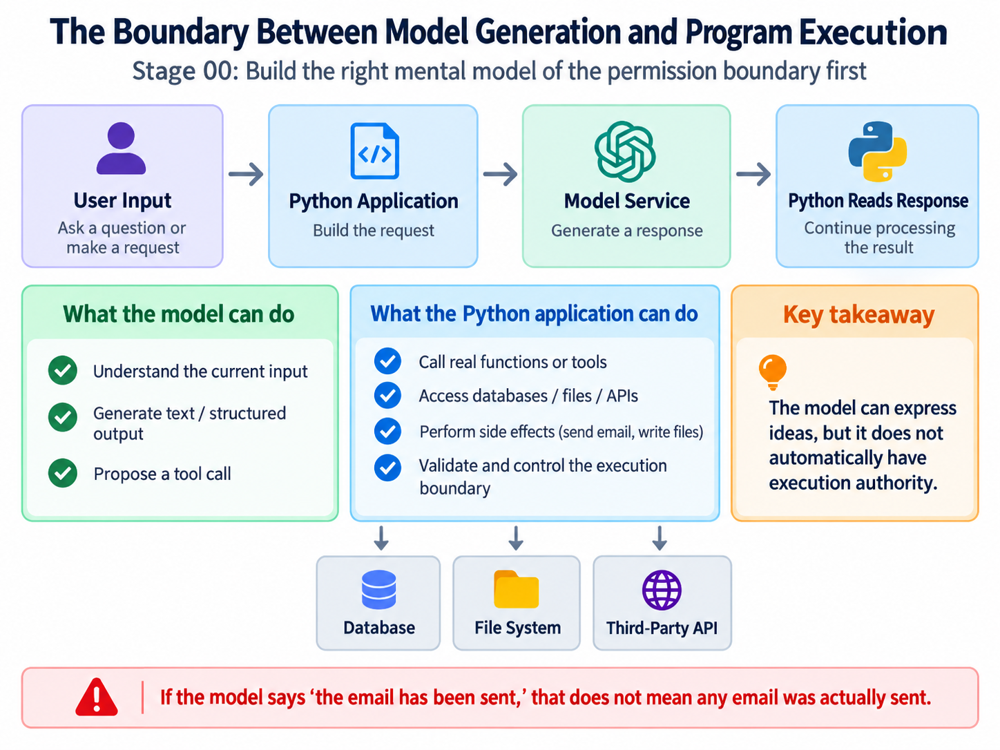
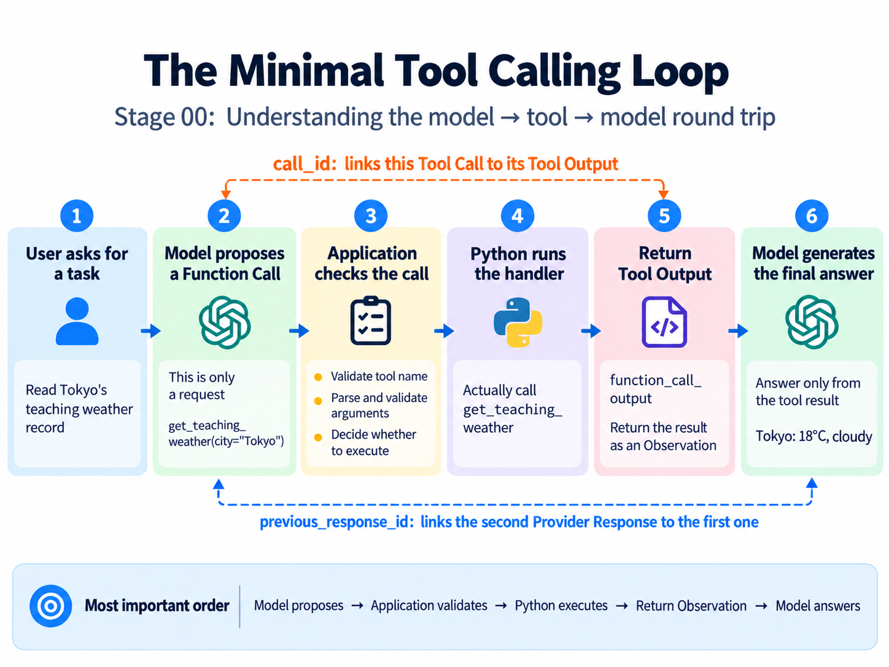
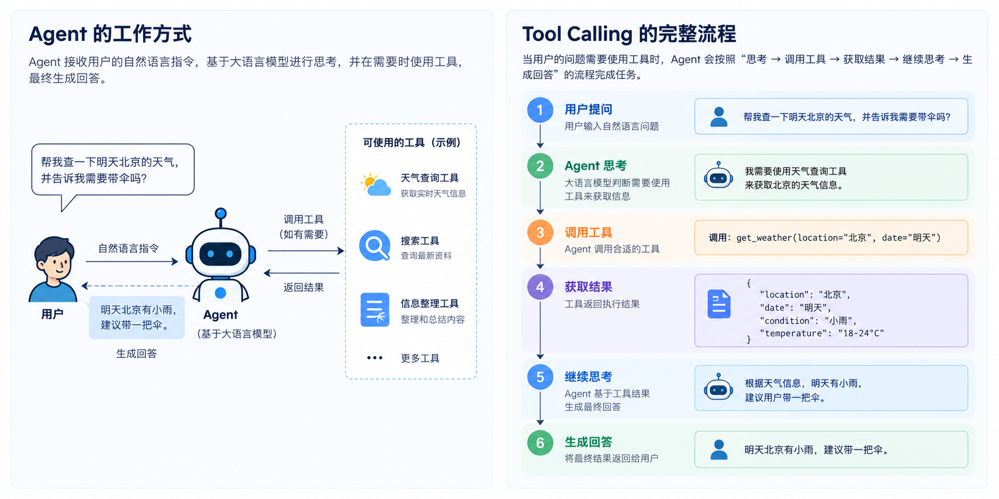

# Stage 00: Help the Assistant Read One Weather Record — From Model Replies to Tool Calls

> Language: **English** | [简体中文](README.zh-CN.md)

Lin is building a small travel exercise page and wants one weather note on it: “Read Tokyo's teaching weather record and tell me the temperature in Celsius and the condition.” The record is fixed classroom data, not the weather in Tokyo right now. It is a small request, but it raises the questions we need to answer: who understands it, who reads the record, and who explains the result to Lin?

You can follow along with basic Python functions, dictionaries, and terminal commands. We will call a real DeepSeek model, but an ordinary local Python function will supply the weather. Those are separate sources of capability: the model helps interpret and express things; the record supplies the facts for this task. No weather-service account or Agent framework is needed.

For now, think of an Agent as a program that uses information and tools to work toward a task. Saying something that sounds completed is not enough: the program must actually perform the relevant work and return its results. This chapter builds one small round trip. We will process Lin's same request three times: first find out what a model alone is missing, then represent the request as data, and finally read the record through a tool. Each step addresses a problem we have already encountered.

## 1. Does “I looked it up” mean a lookup happened?

Suppose we send Lin's question to the model and it replies, “Tokyo is 18°C and cloudy.” That looks ready to put on the page. As developers, though, we need to ask where the number came from. Our program has not read a weather record or included one in its request. Even if the number happens to match, the sentence is not evidence that a lookup occurred.

A **large language model (LLM)** generates content from its input. Training gives it language capabilities and some knowledge, but does not let it inspect the value of a variable in your current Python process. The model we call runs in a remote service. A teaching record does not enter its view simply because you placed it somewhere in the same project as your script.

Imagine calling a colleague and asking them to check a record that is still in your desk drawer. They may understand your request perfectly, but the telephone does not also open the drawer. The first improvement is not to ask for a more confident answer. It is to distinguish what the colleague has received from what they still need.

<p align="center">
  
</p>

For the custom Python tool in this chapter, the model proposes a call and the application executes the function. “Application” means the Python program we write, not another model. Some services also offer built-in tools executed on their servers; that is a different execution arrangement, and we are not enabling those tools here.

We will start honestly: tell the model that it has neither the record nor a lookup tool, and ask it to explain what is missing rather than guess a temperature. That lets us observe an ordinary model call before combining understanding, retrieval, and answering. First, we need a way for Python to contact the service.

## 2. Give Python a service address and a credential

An **API** is the service's programmatic interface: you submit a request in an agreed format and receive a response. An **SDK** is a client library that helps your program send and read those requests. We use one so that our first lesson does not also have to become an exercise in manually assembling network messages.

Start in the repository root, the directory containing `stages/`. Python 3.10 or newer is required. Create a separate dependency environment so the course packages do not interfere with another project's packages:

```bash
python --version
python -m venv .venv
```

On macOS or Linux, activate it and install the dependencies:

```bash
source .venv/bin/activate
python -m pip install -r stages/00-foundations/code/requirements.txt
```

On Windows PowerShell, activate with `.\.venv\Scripts\Activate.ps1`, then use the same installation command. If local policy prevents activation scripts, use `.\.venv\Scripts\python.exe` wherever these commands say `python`. You do not need to weaken a machine's execution policy to run the exercise.

Prepare an API key in the [DeepSeek platform](https://platform.deepseek.com/api_keys). A key is a credential, not a model name. Do not place a real key in source code, Git history, or screenshots. The following commands put configuration in the current terminal's environment. On macOS or Linux:

```bash
export DEEPSEEK_API_KEY="replace-with-your-key"
export DEEPSEEK_MODEL="deepseek-v4-flash"
```

On PowerShell:

```powershell
$env:DEEPSEEK_API_KEY="replace-with-your-key"
$env:DEEPSEEK_MODEL="deepseek-v4-flash"
```

Environment variables are configuration your process can read when it starts, not instructions already sent to the model. A new terminal may need them set again. These examples do not automatically load `.env` files. Choose a model your account can access that supports this interface; check the example against [DeepSeek's Responses API guide](https://api-docs.deepseek.com/guides/responses_api/). The live examples make real API requests and may consume account credit. The offline checks introduced later do not need a key.

The client configuration in [`common.py`](code/common.py) is:

```python
return OpenAI(
    api_key=api_key,
    base_url="https://api.deepseek.com",
    timeout=30.0,
    max_retries=0,
)
```

Why does a class called `OpenAI` contact DeepSeek? DeepSeek supports the compatible client format; `base_url` determines the service address, and we supply a DeepSeek key. Creating this client prepares a connection mechanism. It does not itself ask a model to generate anything.

`timeout` configures network waiting limits, while `max_retries=0` disables the SDK's automatic retries in this example. The timeout is not a guarantee that the entire program finishes within exactly thirty seconds. Disabling retries makes a failed request easier to distinguish from several hidden attempts. Each entry point uses `with create_client() as client:` to close the client after use. These settings manage network access; they do not give the model extra abilities. Now we can send Lin's request.

## 3. The first call understands the request, but has no record

We prepare two pieces of text. The application supplies answering instructions: there is no weather record yet, so do not guess values or claim to have read a file. Lin supplies the actual task. The first goes in `instructions`; the second goes in `input`. Keeping them separate preserves their different purposes and sources.

The request in [`first_llm_call.py`](code/first_llm_call.py) is:

```python
response = client.responses.create(
    model=model,
    instructions=INSTRUCTIONS,
    input=request_for(city, language),
    max_output_tokens=4096,
)
```

`model` selects the model. `INSTRUCTIONS` contains the application requirements just described. `request_for(city, language)` builds the same weather request for the selected city and language. `max_output_tokens` caps output; it does not ask the model to fill that entire allowance. The returned `response` comes from the model service, not from a Python weather lookup.

To follow the English version of the exercise, run:

```bash
python stages/00-foundations/code/first_llm_call.py --language en
```

The shared defaults are Tokyo and Chinese; `--language en` changes the requested language without changing the task. A suitable reply might say, “Please supply Tokyo's teaching weather record before I can report its temperature and condition.” That is an example of the desired behavior, not a guaranteed exact response. If the model supplies a temperature anyway, inspect its input for evidence rather than accepting the confidence of its wording.

Before printing the answer, the program checks completion and usable text. It also prints some metadata: the response identifier, model, and usage. Metadata describes the response, not the weather. The completion check in [`common.py`](code/common.py) is small:

```python
def require_completed(response: Any) -> None:
    if response.status != "completed":
        raise RuntimeError(f"Response did not complete: {response.status}")
```

A returned response can still represent an incomplete generation. We should not turn a truncated sentence into a finished answer. Conversely, `completed` only describes the generation's completion, not the truth of its content. `require_text()` also rejects empty text and a new function request where an answer was expected.

There are already three distinct questions: did the network call succeed, did generation finish, and is the content supported? This program checks basic response conditions, but **does not automatically fact-check the prose**. The model has received Lin's request. No weather lookup has run.

## 4. What did the model actually see this time?

Lin might object that the record is already in the project. That is true of the application, but not of this model request. We sent instructions and a question, not the local weather dictionary. The information supplied for a particular call is its **context**. Think of the material actually handed to a colleague, not everything stored anywhere in the office.

Both `instructions` and `input` contribute to that context, but their origins still matter. A user may choose the city without gaining permission to read arbitrary files by writing “ignore the rules.” Prompt instructions help guide generation; actual execution limits will still need Python checks. Separating inputs clarifies the relationship. It is not a switch that makes every future output safe or correct.

Models process text in smaller units called **tokens**. For now, treat tokens as units used to measure input, output, and some service usage. One token is not consistently one word or one character. Inputs have size limits and outputs have allowances, so sending every available document is not free. Our short request does not yet require an elaborate context-management system.

The first program also prints the usage supplied by the service:

```python
if response.usage is not None:
    print("input_tokens:", response.usage.input_tokens)
    print("output_tokens:", response.usage.output_tokens)
    print("total_tokens:", response.usage.total_tokens)
else:
    print("token usage: not reported")
```

Missing usage is reported as unknown, not converted to zero. Depending on the model mode, output usage can include reasoning tokens, so the visible answer's length alone is not a bill. The [DeepSeek response reference](https://api-docs.deepseek.com/api/create-response/) documents these fields. We read final text without needing to print any other reasoning content the model might return.

Lin now adds a small requirement: the page should let the program tell which city is requested and whether information is still missing. A person understands the model's explanation, but a program needs a more stable interface. That is the next problem—not an excuse to introduce a new abstraction before we need it.

## 5. Give the program fields instead of making it guess sentences

Suppose our program looks for “need the record” in the model's reply. On the next run the model writes, “Please provide the teaching data.” The meaning is almost unchanged, but the string test fails. We have made a freely paraphrased sentence carry the burden of a software interface.

Instead, decide which fields the program needs and ask the model to fill them. For this request, we want the goal, city, whether information outside the current input is needed, and a short explanation. We can represent that form using **JSON**, a text data format. Field names and strings use double quotes; `true` is a boolean value:

```json
{
  "goal": "Read the teaching weather record",
  "city": "Tokyo",
  "needs_external_data": true,
  "reason": "The current input does not contain the record"
}
```

There is deliberately no temperature field: we are describing a request, not reporting a lookup. “External” means outside the model's current input. The information might live in an internet service, but a local Python dictionary also qualifies. The field does not mean “must browse the web.”

**Structured Output** means asking for data that follows explicit field and type constraints. “Please return JSON” expresses a format requirement, but it does not by itself explain which fields are required or what values they may contain. That explanation is a **schema**. Start by thinking of it as instructions for filling out the form, rather than a specification you must memorize.

[`structured_output.py`](code/structured_output.py) uses Pydantic to express the contract. Pydantic is a Python validation library. Its `BaseModel` is a base class for data, not another language model:

```python
class TaskCard(BaseModel):
    model_config = ConfigDict(extra="forbid", strict=True, str_strip_whitespace=True)
    goal: str = Field(min_length=1, max_length=200)
    city: Literal["Tokyo", "Paris"]
    needs_external_data: bool
    reason: str = Field(min_length=1, max_length=300)
```

Read the fields first. `str` requires text, `bool` represents true or false, and `Literal` limits the city to two choices. `Field` supplies length boundaries. The configuration rejects undeclared fields, avoids converting a string such as `"false"` into a boolean in this contract, and trims surrounding whitespace before validating text. A goal consisting only of spaces cannot pretend to be a filled-in goal. See [Pydantic's strict-mode documentation](https://docs.pydantic.dev/latest/concepts/strict_mode/) for the validation behavior.

Then we ask the SDK to parse into that type:

```python
response = client.responses.parse(
    model=model,
    instructions=INSTRUCTIONS,
    input=request_for(city, language),
    text_format=TaskCard,
    max_output_tokens=4096,
)
```

These instructions ask for a description of the task, not a weather answer. The SDK converts the data type into structured-output configuration and attempts to parse the returned content into a `TaskCard`. The remote service is not executing your Python class. DeepSeek's Responses interface supports JSON Schema through `text.format`; the application must still handle incomplete responses, validation failures, and missing parsed output.

After successful parsing, `response.output_parsed` is the task card that the application can use. Run:

```bash
python stages/00-foundations/code/structured_output.py --language en
```

Now code can read `card.city` and `card.needs_external_data` without searching prose for phrases. Lin still has no weather, however. A clearer form makes reading the request more reliable; it does not make everything written on the form true. We need to understand that limit before using the fields.

## 6. A complete form can still name the wrong city

Lin selected Tokyo, but imagine that the card says `city="Paris"`. Paris is one of the allowed values, so the schema accepts it. It is still wrong for this request. Or the city is correct, but `needs_external_data=False` because the model claims to know the weather already. That is a valid boolean, even though the record was never supplied.

Validation has different scopes. Can JSON be read at all? That is syntax. Are the declared fields and types present? That is structure. Do the fields describe the task correctly, and are the claims supported? Those are semantic and factual questions. “Validated” needs a scope; it is not an all-purpose certificate of truth.

For this exercise, the application already knows the city selected in the command line and knows it has not supplied the record. It can check those two facts directly:

```python
def validate_card_for_request(card: TaskCard, expected_city: str) -> None:
    if card.city != expected_city:
        raise RuntimeError("Task card refers to a different city than the request.")
    if not card.needs_external_data:
        raise RuntimeError("This request requires a record that was not supplied.")
```

The second condition is specific to this task. If the user had included the record in the input, requiring the same flag would be wrong. These checks also do not prove that every word in `goal` or `reason` is accurate. They verify the two properties the application can decide here.

We now have data saying “read Tokyo's record,” but the card will not perform the lookup. If the application already knows the required operation, calling a Python function directly is perfectly reasonable; a model is not mandatory for a dictionary lookup. We will let the model request that function to understand a different boundary: when a model is allowed to choose a capability, how does its proposal become real execution?

## 7. Turn “I need the record” into a capability it may request

First, put the data somewhere the application can read. In [`tool_calling.py`](code/tool_calling.py), both values are fixed classroom records, not measurements of today's weather:

```python
TEACHING_WEATHER = {
    "Tokyo": {"temperature_c": 18.0, "condition": "cloudy"},
    "Paris": {"temperature_c": 12.0, "condition": "light rain"},
}
```

The suffix `_c` means Celsius, and `condition` describes the weather. An ordinary function receives a city, returns the corresponding record, and adds a source label:

```python
def get_teaching_weather(city: str) -> dict[str, Any]:
    if city not in TEACHING_WEATHER:
        raise ValueError("Unsupported teaching city.")
    return {"city": city, **TEACHING_WEATHER[city], "source": "fixed teaching record"}
```

The `**` expression copies the stored fields into a new dictionary. Returning a copy prevents a caller from changing the fixed record by modifying a result. Python can now perform the lookup, but nothing has invoked the function yet.

Defining a function does not automatically advertise it to the model. The application must describe its name, purpose, and accepted arguments. That is the beginning of **Tool Calling**: providing a capability description, not handing over a Python interpreter.

Here is the argument contract:

```python
WEATHER_PARAMETERS = {
    "type": "object",
    "properties": {"city": {"type": "string", "enum": ["Tokyo", "Paris"]}},
    "required": ["city"],
    "additionalProperties": False,
}
```

`object` describes a group of fields, `properties` defines them, `required` makes `city` mandatory, and `additionalProperties=False` disallows other fields in the request contract. `enum` expresses a finite set of values, just as `Literal` did in the Python model, but in a different representation.

`WEATHER_TOOL` attaches the name `get_teaching_weather` and a description explaining that it reads fixed teaching records, returns Celsius and condition, and does not provide live weather. The description influences how the model understands the capability. “Universal query tool” is less useful than explaining exactly what it can do. We send this description, not the handler's source code or the whole weather dictionary. DeepSeek's [function-tool reference](https://api-docs.deepseek.com/api/create-response/) documents the corresponding `name`, `description`, and `parameters` fields.

We now have two sides of the same capability: instructions for requesting it on the model side, and an implementation on the application side. Let us send Lin's request through that boundary.

## 8. The application checks the request before doing the work

The third entry point handles the same user request. This time it supplies the weather tool and asks the model to request that particular capability:

```python
first = client.responses.create(
    model=model,
    instructions=FIRST_INSTRUCTIONS,
    input=history,
    tools=[WEATHER_TOOL],
    tool_choice={"type": "function", "name": "get_teaching_weather"},
    max_output_tokens=4096,
)
```

At this point `history` contains just the user message. Naming the tool makes this experiment about the call mechanism; it is not evidence that the model independently selected the best tool. With `tool_choice="auto"`, a model could return text or tool calls, but we will not introduce that branch before the current data flow is clear.

The service returns output items in `first.output`. They are not necessarily final text. We select items whose `type` is `function_call`. This application accepts exactly one call and stops before execution if there are zero or several. Naming a function does not guarantee a single invocation. In particular, DeepSeek currently ignores `parallel_tool_calls=False`, so our limit must be checked by Python rather than assumed from that parameter.

One call might look like this. The identifier is illustrative and can differ between responses:

```json
{
  "type": "function_call",
  "name": "get_teaching_weather",
  "arguments": "{\"city\":\"Tokyo\"}",
  "call_id": "call-1"
}
```

`arguments` is a **JSON string**, not yet a Python dictionary. The application parses it with `json.loads()` and stops if parsing fails or produces something other than an object. Then it checks the fields and value:

```python
def validate_weather_arguments(arguments: dict[str, Any]) -> str:
    if set(arguments) != {"city"}:
        raise RuntimeError("Weather lookup expects exactly one field: city.")
    city = arguments["city"]
    if not isinstance(city, str) or city not in TEACHING_WEATHER:
        raise RuntimeError("city must be Tokyo or Paris.")
    return city
```

The tool description says how a request should be made. This function checks what actually arrived. Those are different responsibilities. The application also validates the tool name, the call identifier, and agreement with the city selected for Lin's request. A generated name never goes through `eval()` or an unrestricted search through Python functions.

Only after these checks does the lookup happen:

```python
result = get_teaching_weather(requested_city)
```

Pause at this line. Before it, the model had merely requested work. Here, Python actually reads the record. Returning `18.0` shows that the function read classroom data; it does not establish Tokyo's real current temperature. This is a narrow read-only example, not a complete identity and authorization system.

Python now knows the lookup result, but the remote model still does not. Storing a value in `result` does not send it through the network. One explicit return trip remains.

## 9. Send the result back, with the identity of its request

If Tokyo and Paris are both looked up through the same function, a function name alone cannot distinguish the two results. `call_id` links a result to one invocation, like a collection number on two otherwise identical meal orders. It is not the Python function name, and it does not automatically make business operations safe to repeat.

The tool output carries that original identifier:

```python
history.append({
    "type": "function_call_output",
    "call_id": call.call_id,
    "output": json.dumps(result, ensure_ascii=False),
})
```

`json.dumps()` converts the dictionary to JSON text suitable for transmission. `ensure_ascii=False` keeps non-ASCII characters readable. Sending only “success” would throw away the information Lin needs. The returned output must include the actual temperature and condition.

Before appending this receipt, the program also preserves the first response's output items:

```python
history.extend(item.model_dump(mode="json", exclude_none=True) for item in first.output)
```

`model_dump()` turns each SDK item into data we can send. We preserve the items rather than reconstructing only a function name because the response can contain other items needed for protocol continuation. We do not need to display their reasoning content. The next request therefore contains the original user message, the model's request, and the application's result with their relationships intact.

DeepSeek's Responses API is currently stateless: it does not retain a conversation that can be continued using `previous_response_id`. The application must supply the earlier items explicitly, not merely return a response identifier. This is a provider behavior described in the [compatibility guide](https://api-docs.deepseek.com/guides/responses_api/); a parameter's existence in the SDK does not establish support in every compatible service.

Now we make the second model call:

```python
final = client.responses.create(
    model=model,
    instructions=FINAL_INSTRUCTIONS,
    input=history,
    tools=[WEATHER_TOOL],
    tool_choice="none",
    max_output_tokens=4096,
)
```

`FINAL_INSTRUCTIONS` asks for an answer based only on the returned record, explicitly identified as teaching data. `tool_choice="none"` asks for the answer rather than another tool request. The program rejects a response that nevertheless contains another function call or lacks usable text. For the first time in this task, the model has a result produced by application execution. That execution feedback is also called an **observation**.

<p align="center">
  
</p>

Run the round trip:

```bash
python stages/00-foundations/code/tool_calling.py --language en
```

The terminal prints the proposed call, the application's lookup result, and the model's final answer in that order. Tokyo's tool result contains `temperature_c: 18.0` and `condition: "cloudy"`. A suitable final answer says this is a fixed Tokyo teaching record of 18°C and cloudy, not live weather. The record is deterministic; the model's wording is not.

Compare this with the first program. Without the record, the model could only explain the missing information. With the receipt, it finally has evidence for a temperature. The difference is not a more impressive expert persona. It is the arrival of an actual execution result. Even now, the model could misstate that result: `require_text()` does not check whether 18 became 99 in the prose. When a number matters, identify the tool output supporting it instead of trusting wording alone.

## 10. Change the city, then make a request fail on purpose

Lin's original request is complete. Try Paris to check that you understand the path rather than merely remembering Tokyo's expected answer:

```bash
python stages/00-foundations/code/first_llm_call.py --city Paris --language en
python stages/00-foundations/code/structured_output.py --city Paris --language en
python stages/00-foundations/code/tool_calling.py --city Paris --language en
```

These commands start separate programs; they do not automatically share the previous program's response. They compare three capabilities on the same task: explain what is missing, extract the request as data, and complete one tool round trip. The third program itself makes two model requests. Follow `Paris` from the user input into the task card and function arguments, then into the fixed 12°C, `light rain` result.

A successful path is not the whole boundary. If the model returns `{"city": 42}`, argument validation should stop it. If it requests an unregistered function, the weather handler should never run. If it requests two lookups, this single-call example should reject them before executing either, not arbitrarily choose one. We do not have to wait for a live model to make these mistakes to test the program.

[`checks.py`](code/checks.py) supplies preset response objects and runs the actual handling functions against them. Such objects are **test doubles**. They check what the program does when a response arrives, not how often a real model will generate it. Pydantic validation runs normally, and no paid model call is made:

```bash
python stages/00-foundations/code/checks.py
```

Two counterexamples are especially useful. A schema-valid task card can name the wrong city; the request-specific check rejects it. A completed, nonempty final response can still state the wrong temperature; the test explicitly demonstrates that this prose is not automatically fact-checked. A green test result is useful only when we know what it proves. When `openai` is installed, one additional test uses a local HTTP mock to check real SDK request serialization and structured parsing. Without that optional library, the integration test reports a skip.

For a live-run failure, first locate the layer. A missing-variable error means checking this terminal's configuration. A missing-package error means checking which Python environment is running. A service rejection calls for checking credentials, credit, model access, and supported parameters. An incomplete response or invalid structure means stopping rather than continuing into the handler. `except: pass` does not repair missing information; it merely hides where it was lost.

One more case is worth recognizing: the local lookup succeeds, then the final model request fails. The lookup still happened, and its result is not automatically a completed model answer. This script stops without repeating the whole operation. Even before designing recovery mechanisms, we should describe accurately what already occurred.

## 11. Lin received more than a convincing sentence

The same request passed through three distinct changes. First the model described it in prose, without a record. Then the request became a task card the application could read, still without executing a lookup. Finally the model requested a tool, the application validated and executed it, and the result returned to the model for an answer. A task card describes a need, a tool call requests an action, and a tool output reports execution data. They may all look structured, but they have different jobs.

<p align="center">
  
</p>

You should now be able to point to the exact line where 18°C entered the application result, identify the model request that first received it, and check whether a claimed action has a corresponding execution. Following that path is more important than reciting a vocabulary list.

Lin now asks for the temperature in Fahrenheit as well. That adds another operation. Our current script has two fixed model requests and allows one tool execution between them; it does not automatically adapt to a different number of steps. Carry that new problem into [Stage 01: Turn the Tool Loop into an Agent Runtime](../01-react-runtime/README.md).
