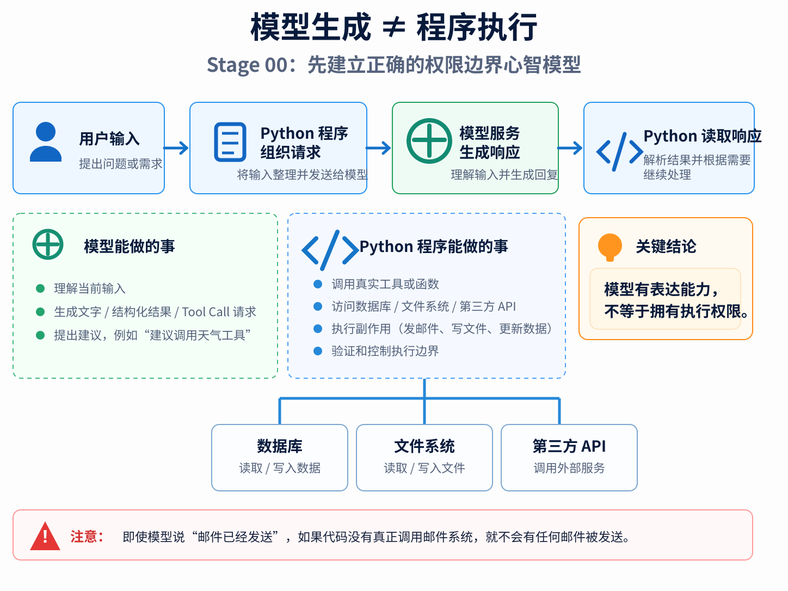
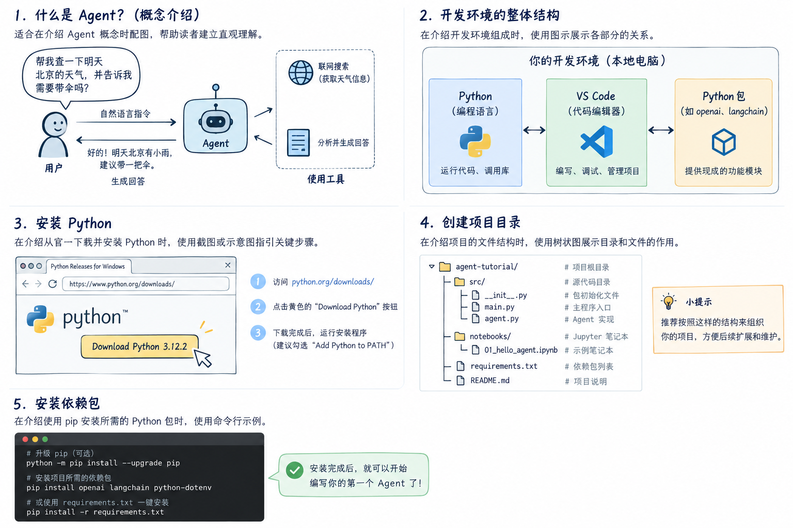
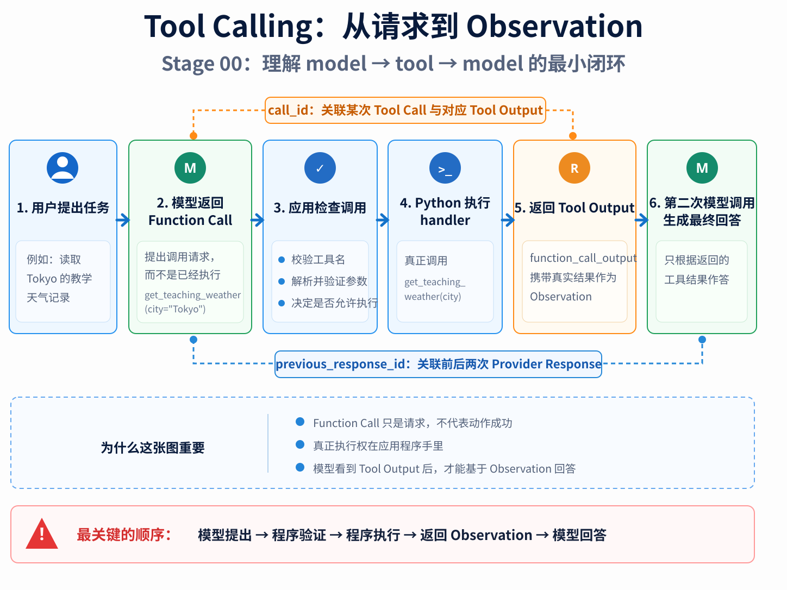

# Stage 00：先把一次模型调用讲明白

> Language: [English](README.md) | **简体中文**

如果你第一次学 Agent，我想先劝你做一件看起来很“慢”的事：先别急着写 Agent。

这听起来有点反直觉。你打开这个仓库，本来就是为了学 Agent，结果第一章却让你盯着一次普通的模型调用看半天，好像报名了游泳课，教练第一节课只让你站在池边研究水。但这一步很重要，因为后面所谓的 Tool、Runtime、Memory、Workflow，说到底都建立在同一个事实之上：**你的 Python 程序在调用一个模型服务，而模型服务只会根据当前输入生成下一段输出。**

本章我们不背一串名词，而是顺着程序真正遇到的问题往前走。先让模型回答一句话；接着发现自然语言不适合直接给程序使用，于是引入 Structured Output；然后发现结构化结果仍然不能替你查询外部数据，于是再引入 Tool Calling。到最后，你会完成一次完整的 `model → tool → model` 往返。

---

## 1. 先建立一个不会害你的心智模型

我们从最简单的情况开始。假设用户问：

> 为什么语言模型给出的回答只是一个“提案”，而不是 Python 程序已经执行的动作？

程序做的事情其实很朴素：

```text
用户输入
   ↓
Python 组织请求
   ↓
模型服务生成响应
   ↓
Python 读取响应
```

这里最值得你记住的，不是 API 名字，而是“谁做了什么”。模型负责生成输出，Python 程序负责真正的程序行为。模型可以说“邮件已经发送”，但如果你的代码里没有调用邮件系统，世界上并不会因此多出一封邮件。

可以把模型想成坐在玻璃房里的顾问。它能看你递进去的材料，能告诉你“建议调用天气接口”“建议发邮件”“建议把这个字段改成 42”，但真正能碰到数据库、文件系统和第三方 API 的，仍然是玻璃房外的应用程序。**模型有表达能力，不等于拥有执行权限。**

这条边界看起来基础，却是后面几乎所有 Agent 安全设计的起点。

把这条边界画出来，大致就是下面这样：

<p align="center">
  
</p>

### 1.1 先把环境准备好

<p align="center">
  
</p>

本章示例使用 Python 3.10 及以上版本。先安装依赖：

```bash
python -m pip install -r stages/00-foundations/code/requirements.txt
```

然后配置 API Key 和你项目中可用的模型：

```bash
export OPENAI_API_KEY="your-api-key"
export OPENAI_MODEL="your-model-id"
```

PowerShell 对应写法是：

```powershell
$env:OPENAI_API_KEY="your-api-key"
$env:OPENAI_MODEL="your-model-id"
```

示例故意不把模型名称写死。教程最怕的事情之一，就是正文说得云淡风轻，读者复制代码以后发现“这个模型我根本没有权限”。把 `OPENAI_MODEL` 作为显式配置，反而更诚实。

三个示例都会先检查环境变量：

```python
def required_env(name: str) -> str:
    value = os.getenv(name)
    if value is None or not value.strip():
        raise RuntimeError(f"Set {name} before running this example.")
    return value.strip()
```

这不是 AI 特有技巧，就是普通的软件工程：**尽量在边界处尽早失败。** 如果 API Key 没配好，最好一启动就告诉你，而不是让程序跑到第五层函数以后再报一个不知所云的错误。

---

## 2. 第一次真正的模型调用

运行：

```bash
python stages/00-foundations/code/first_llm_call.py
```

完整程序在 [`code/first_llm_call.py`](code/first_llm_call.py)。我们先只看最核心的调用：

```python
response = client.responses.create(
    model=model,
    instructions=(
        "You are a patient programming teacher. Explain the idea accurately, "
        "use one concrete analogy, and avoid unexplained jargon."
    ),
    input=(
        "In no more than 120 words, explain why a language model response is "
        "a proposal produced by a model rather than an action performed by my "
        "Python program."
    ),
)
```

第一次看到这种调用时，很多人会下意识把它理解成：

```text
输入一个字符串 → 输出一个字符串
```

这个理解勉强能用，但很容易把后面学歪。更准确的理解是：**你向模型服务提交了一次请求，拿回了一个 Response 对象。** 文本只是这个响应对象里的一部分。

所以示例不会直接 `print(response.output_text)` 然后宣布下课，而是先检查状态：

```python
if response.status != "completed":
    raise RuntimeError(f"The response did not complete: {response.status}")

if not response.output_text.strip():
    raise RuntimeError("The response completed without text output.")
```

为什么这么啰嗦？因为“HTTP 请求没抛异常”“模型响应状态是 completed”“最终确实有可用文本”是三件不同的事。程序越往后走，越应该把这些边界拆开，而不是统统归类成一句“模型好像没答对”。

### 2.1 `instructions` 和 `input` 为什么要分开

这两个参数最容易被刚入门的同学看成“反正都是字符串”。但它们的来源不同。

`instructions` 更像应用给模型的行为要求：你希望它怎样回答、遵守怎样的约束。`input` 则是这一轮真正要处理的任务或数据。

如果把它们混成一大坨：

```python
prompt = policy + user_question + documents + tool_result
```

一开始会觉得很省事，等项目长大以后就会发现自己失去了来源信息：哪段是应用规则？哪段是用户说的？哪段只是外部资料？

本章先给 Context（上下文）一个足够实用的定义：

> **某次模型调用真正能看到的全部输入，就是这一轮的 Context。**

`instructions`、用户输入、之后的 Tool Output 都可能进入 Context。注意，这还不是“长期记忆”，也不是“数据库里有什么模型就都知道”。模型只看得到你在这一轮实际给它的东西。

### 2.2 模型输出为什么不能当成事实

语言模型是生成模型。它擅长根据已有信息继续生成合理的内容，但“合理”不等于“真实”。同样一个问题多问几次，措辞甚至结论细节都可能变化。

这带来一个非常朴素的工程结论：凡是程序必须稳定依赖的东西，都不应该靠一句自然语言去猜。

比如模型说：

> This looks important. We probably need current weather data first.

人一眼就看懂，程序却很尴尬。你当然可以写：

```python
if "important" in answer.lower():
    priority = "high"
```

然后模型下一次换成 `urgent`，你的程序就像只认识一个暗号的门卫，当场失业。

于是我们来到下一步。

---

## 3. Structured Output：让程序拿到“数据”，而不是猜句子

Structured Output（结构化输出）解决的不是“让回答更像 JSON”，而是**让模型返回满足明确结构约束的数据**。

假设程序希望拿到这样的对象：

```json
{
  "goal": "compare current weather in Tokyo and Paris",
  "priority": "medium",
  "needs_external_data": true,
  "reason": "current weather must be retrieved"
}
```

这个结构一旦确定，程序后面就可以写：

```python
if task.needs_external_data:
    ...
```

而不是在一整段话里找关键词。

运行：

```bash
python stages/00-foundations/code/structured_output.py
```

完整程序在 [`code/structured_output.py`](code/structured_output.py)。其中最重要的部分其实不是模型调用，而是先把应用需要的数据定义出来：

```python
class Priority(str, Enum):
    LOW = "low"
    MEDIUM = "medium"
    HIGH = "high"


class TaskCard(BaseModel):
    model_config = ConfigDict(extra="forbid")

    goal: str = Field(min_length=1)
    priority: Priority
    needs_external_data: bool
    reason: str = Field(min_length=1)
```

这一步的思路很重要：不是“先让模型自由发挥，再想办法从结果里捞字段”，而是**先决定程序真正需要什么，再让模型去填这张表**。

随后调用时，把这个类型告诉 SDK：

```python
response = client.responses.parse(
    model=model,
    instructions=(
        "Turn the request into a task card. Describe only the request itself; "
        "do not guess the weather or pretend that external data was retrieved."
    ),
    input=(
        "Compare the current weather in Tokyo and Paris and tell me which city "
        "is warmer."
    ),
    text_format=TaskCard,
)
```

解析成功后，程序拿到的是 `TaskCard`：

```python
task = response.output_parsed
if task is None:
    raise RuntimeError("The response contained no parsed TaskCard.")
```

这时你终于可以像操作正常业务数据一样操作模型结果。

### 3.1 结构正确和事实正确，差得还很远

这是 Structured Output 最容易被误解的地方。

假设模型返回：

```json
{
  "goal": "compare current weather",
  "priority": "high",
  "needs_external_data": false,
  "reason": "the model already knows it"
}
```

从 Schema 的角度，这个对象完全可能合法：字段齐、类型对、枚举也没越界。但从任务语义看，“比较当前天气却不需要外部数据”显然值得怀疑。

所以最好把三层校验分开：

| 层次 | 它检查什么 | Schema 能不能单独保证 |
|---|---|---|
| 语法 | JSON 能不能被解析 | 可以 |
| 结构 | 字段、类型、枚举是否合法 | 可以 |
| 语义 / 事实 | 判断是否合理、事实是否真实 | 不可以 |

这张表很值得记住。Structured Output 像一个认真负责的前台，它可以检查表格有没有漏填、身份证号格式对不对；但它不会顺便替你调查“申请人说的事情到底是真是假”。

因此本节真正要记住的是：

> **Structured Output 解决“程序怎样可靠读取模型输出”，并不自动解决“模型输出为什么值得相信”。**

接下来，天气例子正好暴露出另一个问题：如果模型不应该自己编当前天气，那它从哪里拿数据？

---

## 4. Tool Calling：给模型一张“可以申请使用的能力清单”

模型没有你的数据库连接，也不会自动拥有 Python 解释器的控制权。要让它使用外部能力，应用需要把一部分能力描述给它。

一个 Tool 可以先理解成有两面：

```text
给模型看的
    name / description / parameters

给程序用的
    Python handler
```

模型看到的是“这个能力叫什么、什么时候用、参数长什么样”。真正的 Python 函数仍然在应用程序里。

本章使用固定的教学天气数据：

```python
TEACHING_WEATHER = {
    "Tokyo": {"temperature_c": 18.0, "condition": "cloudy"},
    "Paris": {"temperature_c": 12.0, "condition": "light rain"},
}
```

为什么不直接接实时天气 API？因为这一章要学的是 Tool Calling。如果同时把 OAuth、网络超时、第三方接口变化、额度限制全拉进来，你最后很可能学会的是“网络真烦”，而不是 Tool 的职责边界。固定数据让每次运行都可复现，教学上更干净。

运行：

```bash
python stages/00-foundations/code/tool_calling.py
```

完整程序在 [`code/tool_calling.py`](code/tool_calling.py)。

### 4.1 Tool Schema 其实是在教模型“怎么向你提申请”

工具描述大致长这样：

```python
WEATHER_TOOL = {
    "type": "function",
    "name": "get_teaching_weather",
    "description": (
        "Return the deterministic teaching weather record for Tokyo or Paris. "
        "Use this function whenever the user asks about those teaching records."
    ),
    "parameters": {
        "type": "object",
        "properties": {
            "city": {
                "type": "string",
                "enum": sorted(TEACHING_WEATHER),
            }
        },
        "required": ["city"],
        "additionalProperties": False,
    },
    "strict": True,
}
```

很多人第一次写 Tool 时，只关心参数 Schema，`description` 随手写一句 `query weather`。实际上，description 也是模型判断“什么时候该用这个工具”的依据。如果描述含糊，模型只能猜。

好的 Tool 描述至少应该让模型知道：这个能力返回什么、在什么情况下使用、关键参数是什么意思。如果能力有明显限制，也应该说清楚。本章的限制就很明确：这只是东京和巴黎的**教学记录**，不是实时天气。

### 4.2 Function Call 只代表“模型提出了调用请求”

第一轮模型请求如下：

```python
first = client.responses.create(
    model=model,
    instructions=(
        "Use the supplied function to read teaching weather records. A function "
        "call only requests an action; never claim a result before the function "
        "output is returned."
    ),
    input=(
        "Read Tokyo's deterministic teaching weather record and report the "
        "temperature and condition."
    ),
    tools=[WEATHER_TOOL],
    tool_choice={"type": "function", "name": "get_teaching_weather"},
    parallel_tool_calls=False,
)
```

这里我们故意用 `tool_choice` 强制走一遍 Tool Call 流程，因为这一章要观察机制，而不是观察模型“今天愿不愿意主动调用”。`parallel_tool_calls=False` 也把轨迹保持成单线，方便第一次学习。

模型返回 Function Call 以后，Python 函数还没有执行。此时发生的只是：

```text
模型：我建议调用 get_teaching_weather(city="Tokyo")
```

仅此而已。

### 4.3 为什么不能把模型给的函数名直接执行

应用先检查返回的调用：

```python
calls = [item for item in first.output if item.type == "function_call"]
if len(calls) != 1:
    raise RuntimeError(...)

call = calls[0]
if call.name != "get_teaching_weather":
    raise RuntimeError(...)
```

这一步看起来有点死板，但非常关键。模型返回的名字，本质上仍然是外部输入。不要因为它“长得像函数名”，就把它送进 `eval()`、`exec()` 或随便从 `globals()` 里找函数。

接着才是解析和验证参数：

```python
arguments = parse_arguments(call.arguments)
city = validate_weather_arguments(arguments)
```

然后，应用自己执行函数：

```python
result = get_teaching_weather(city)
```

注意这个顺序：模型提出 → 程序解析 → 程序验证 → 程序执行。谁控制了这条顺序，谁才真正控制了能力边界。

### 4.4 Provider 侧的严格 Schema，为什么还不够

你可能会问：工具已经 `strict=True` 了，为什么应用还要再验证一次参数？

因为“上游尽量按 Schema 生成”与“执行边界确认自己即将接受的参数”是两个位置的责任。Tool Call 以后可能来自网络响应，也可能被保存、转发、回放，甚至被别的系统构造。真正要调用 Python handler 的那一刻，应用应该对自己接收的参数负责。

这和普通 Web 开发里“前端已经校验过表单，后端为什么还要校验”是一个道理。答案通常是：因为真正承担后果的是后端。

### 4.5 `call_id` 是动作和结果之间的“订单号”

工具执行完以后，结果不能随便塞回模型，而要和原来的调用对应起来：

```python
{
    "type": "function_call_output",
    "call_id": call.call_id,
    "output": json.dumps(result, ensure_ascii=False),
}
```

`call_id` 解决的是：**这份结果属于哪一次 Tool Call？**

假设同一轮里有：

```text
call_A → get_teaching_weather(Tokyo)
call_B → get_teaching_weather(Paris)
```

两个工具名完全相同，只看 `name` 根本分不清结果该回给谁。`call_id` 就像订单号，菜名相同不代表是同一桌点的。

### 4.6 第二次模型调用，才真正拿到了 Observation

第二轮这样继续：

```python
final = client.responses.create(
    model=model,
    instructions=(
        "Answer only from the returned function output. Make clear that this is "
        "a deterministic teaching record, not live weather."
    ),
    previous_response_id=first.id,
    input=[
        {
            "type": "function_call_output",
            "call_id": call.call_id,
            "output": json.dumps(result, ensure_ascii=False),
        }
    ],
    tools=[WEATHER_TOOL],
    tool_choice="none",
)
```

这里有两个 ID，别混：

- `call_id` 关联的是 Tool Call 和它的 Tool Output；
- `previous_response_id` 关联的是这次模型响应和上一份 Provider Response。

这一轮模型终于看到了 Python 执行后的真实结果，于是可以根据 Observation 生成最终文字。

整个过程连起来就是：

```text
用户提出任务
    ↓
模型提出 Function Call
    ↓
应用检查工具名和参数
    ↓
应用执行 Python 函数
    ↓
应用返回 Function Call Output
    ↓
模型根据 Observation 回答
```

如果把 `call_id` 和 `previous_response_id` 也放回这条时间线里，关系会更直观：

<p align="center">
  
</p>

到这里，你已经拥有了 Agent 最小循环的一半。

---

## 5. 把几个容易混的词一次分清

学到这里，Structured Output 和 Tool Calling 都长得“结构化”，很容易糊成一团。最简单的区分方式是问：**这个结构最终拿来做什么？**

Structured Output 的目标是“让程序读取模型的判断结果”；Tool Call 的目标是“让模型请求程序执行一个能力”；Tool Output 则是“程序执行以后，把结果作为 Observation 送回模型”。

可以把它们想成公司里的几个东西：Structured Output 像一张填好的表格，Tool Call 像一张申请单，真正的 Tool Execution 是工作人员去办事，Tool Output 则是办完之后拿回来的回执。

一张申请单写得再漂亮，也不会自己跑去仓库搬货。

---

## 6. 为什么 Stage 00 到这里就该停了

现在的 `tool_calling.py` 仍然是固定脚本：

```text
模型第一次调用
→ 工具执行一次
→ 模型第二次调用
→ 结束
```

如果用户要求：

> 先读取东京的教学天气，再把摄氏度换算成华氏度。

模型可能需要先调用天气工具，再调用温度换算工具，最后才回答。你当然可以继续加 `second`、`third`、`fourth`，但很快会发现程序在提前假设“到底会有几轮”。

这时真正需要的抽象才出现：

```python
while run_not_finished:
    turn = ask_model_for_next_step()

    if turn_requests_tool:
        execute_and_record_observation()
    else:
        return_final_answer()
```

这个循环就是下一章要写的 Runtime。

注意学习顺序：不是因为“Agent 教程都应该有 Runtime”所以我们先造一个 Runtime，而是因为**固定的两次调用已经开始不够用了**，所以 Runtime 这个抽象自然出现。好的工程抽象通常都是被问题逼出来的，不是为了凑目录层级。

---

## 7. 现在最常见的几个误区

如果你能把下面这些误区讲清楚，说明 Stage 00 已经掌握得差不多了。

**“模型知道工具名，就等于它能执行工具。”** 不对。模型只能生成一个调用请求，真正执行需要应用找到允许的 handler。

**“Structured Output 是合法 JSON，所以内容一定靠谱。”** 不对。结构正确与事实正确是两层问题。

**“Tool Call 返回了，说明动作成功了。”** 仍然不对。Tool Call 只是请求；成功或失败要等 Python handler 真正执行之后才知道。

**“模型说它已经做了，就是做了。”** 这条尤其危险。你永远应该看程序执行轨迹，而不是看模型措辞有多肯定。

这些听起来像常识，但真正的 Agent 系统出事故，往往就是把这些边界悄悄混在了一起。

---

## 8. 动手做几个小实验

这里的练习不要求你背定义，建议直接复制 `code/` 下的程序做实验。

先试着给 `TaskCard` 增加一个 `confidence: float`，限制在 0 到 1。然后问自己：模型返回 `0.99`，到底说明了什么？答案是：它说明模型给出了一个很高的自评数值，不等于这个判断被外部证据证明了。

再把 Tool Calling 的城市从东京改成巴黎，观察 `Paris` 是怎样从用户请求进入 Function Call 参数，经过 Python 参数校验，再进入 Tool Output 的。你会发现 Tool Calling 不是“模型神奇地调用了函数”，而是一条非常具体的数据流。

最后，试着在纸上画两个相同工具的调用，把 `call_id` 擦掉。一般几十秒后，你就会理解为什么“这个字段看着多余”往往是因为我们只看了单调用的最简单情况。

---

## 9. 本章结束前，自己回答这几个问题

不用背术语，沿着程序执行顺序回答就行：为什么 `response.output_text` 不是整个 Response？`instructions` 和 `input` 的来源有什么不同？Structured Output 到底保证了哪一层正确性？Function Call 在哪一行代码之后才真正变成 Python 执行？`call_id` 和 `previous_response_id` 分别解决什么关联问题？为什么教学示例宁愿用固定天气，也不急着接真实天气 API？

如果这些问题你都能顺着代码讲明白，就可以进入下一章。

---

## 10. 本章代码

完整可执行代码只保存在这里：

```text
stages/00-foundations/
├── README.md
├── README.zh-CN.md
└── code/
    ├── first_llm_call.py
    ├── structured_output.py
    ├── tool_calling.py
    └── requirements.txt
```

➡️ [Stage 01：把 Tool Loop 变成 Agent Runtime](../01-react-runtime/README.zh-CN.md)
