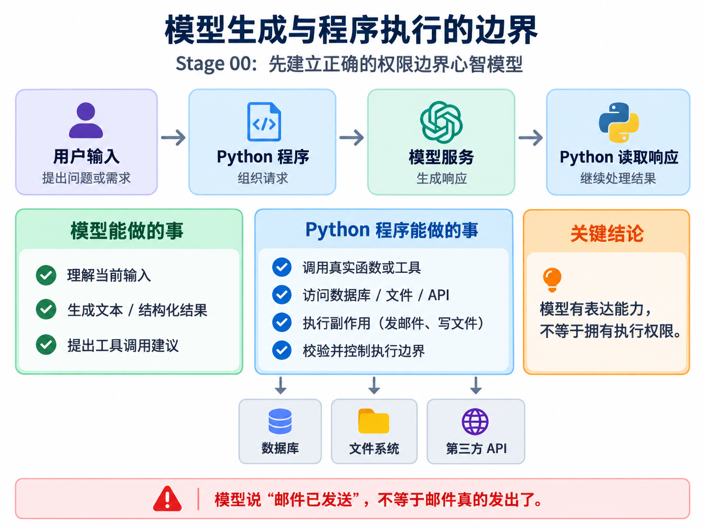
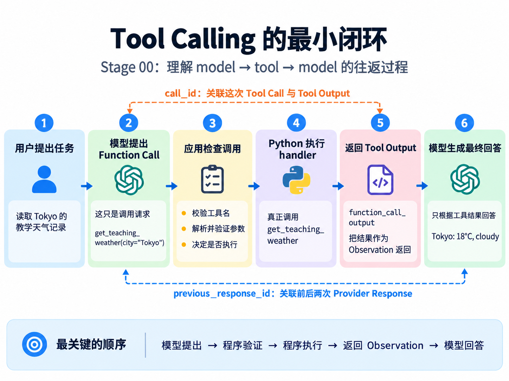

# Stage 00：先让助手查清一条天气记录——从模型回答到工具调用

> Language: [English](README.md) | **简体中文**

小林正在做一个出行练习页面，想在页面上加一句天气提示。她的要求很简单：“请读取 Tokyo 的教学天气记录，告诉我摄氏温度和天气状况。”这里的记录是课程准备的一份固定数据，不是此刻东京的真实天气。我们先把这样一件小事做清楚：这句话交给模型之后，谁理解需求，谁查记录，最后又是谁把查到的结果说给小林听？

如果你会写 Python 函数、使用字典，并能在终端运行脚本，就可以跟着做。暂时不用安装一个 Agent 框架，也不用准备天气服务账号。我们会调用真实的 DeepSeek，但天气数据由本地 Python 提供。模型服务和天气来源是两件不同的事：前者帮助理解和表达，后者提供这次任务所需的事实。

先把 Agent 理解成一个会围绕任务使用信息和工具的程序。它不只是让模型“说得像办过事”，还需要真正执行，并把结果交回去。本章先做出其中最小的一次往返。我们会三次处理小林的同一个要求：先看看只有模型时缺什么，再让程序读懂这项要求，最后让程序实际查出记录。每次只补上眼前缺的那一块。

## 1. 助手说“查到了”，记录就真的被查了吗？

假设我们把小林的话发给模型，它回答：“Tokyo 是 18°C，多云。”这句话看起来已经够用了，但作为写程序的人，需要追问一个问题：这个 18 是从哪里来的？我们的代码还没有读取任何天气记录，也没有把记录放进请求里。模型即使恰好说中了，也不能据此证明发生过查询。

**大语言模型（LLM）** 可以先理解成一个根据输入生成内容的模型。它通过训练学到了语言和一些知识，但这不意味着它知道当前 Python 变量的值，更不意味着它能够自动翻看你的文件。我们调用的模型运行在远端服务中，手边这份教学记录不会因为“在同一个项目里”就自动进入它的视野。

这像是打电话请一位同事帮忙。对方可以理解“查东京天气”这句话，但如果记录还放在你的抽屉里，又没有给他任何查询办法，他不能隔着电话把抽屉翻开。第一步不是让他更自信，而是分清楚：目前他拿到了什么，尚未拿到什么。

<p align="center">
  
</p>

对本章的自定义 Python 工具，模型负责提出请求，应用负责执行函数。应用就是我们写的 Python 程序，并不是另一个模型。某些模型服务也提供由服务端执行的内置工具，那是另一种执行安排；这里没有启用它们，不能把两种情况混在一起。

我们先做一个诚实的起点：明确告诉模型，它还没有教学记录，也没有查询工具，请它说明缺少什么，不要猜温度。这样就能先观察一次普通模型调用，而不是一开始就把“理解、查询、回答”揉成一团。要打这通电话，先把电话号码和通话凭证准备好。

## 2. 先让 Python 能联系上模型服务

我们通过 **API** 调用 DeepSeek。这个词在这里不神秘：它就是服务约定好的程序接口，你按约定提交请求，它按约定返回结果。Python 使用的 **SDK** 则是一套帮你发送请求、读取响应的客户端库，不需要手工拼每一条网络报文。

先确认终端已经进入 Tiny-Agent 仓库根目录，也就是能看到 `stages/` 的那个目录。本章需要 Python 3.10 或更新版本。下面的命令建立一个独立的依赖环境，避免课程依赖和其他项目挤在一起：

```bash
python --version
python -m venv .venv
```

在 macOS 或 Linux 的终端中激活环境，然后安装依赖：

```bash
source .venv/bin/activate
python -m pip install -r stages/00-foundations/code/requirements.txt
```

Windows PowerShell 的激活命令是 `.\.venv\Scripts\Activate.ps1`，安装命令相同。如果环境不允许执行激活脚本，可以直接用 `.\.venv\Scripts\python.exe` 代替下面命令里的 `python`，不用为了做练习去放宽系统执行策略。

接着在 [DeepSeek 平台](https://platform.deepseek.com/api_keys) 准备 API Key。Key 是调用凭证，不是模型名字；不要把真实 Key 写进源文件、提交到 Git，或者发进截图。下面把它放到当前终端的环境变量中。macOS / Linux 使用：

```bash
export DEEPSEEK_API_KEY="替换为你的密钥"
export DEEPSEEK_MODEL="deepseek-v4-flash"
```

PowerShell 使用：

```powershell
$env:DEEPSEEK_API_KEY="替换为你的密钥"
$env:DEEPSEEK_MODEL="deepseek-v4-flash"
```

环境变量是启动程序时可以读取的配置，不是已经写入模型的一段提示词。新开终端后可能需要重新设置；示例也不会自动加载 `.env` 文件。模型 ID 请以账户实际可用且支持本章接口的模型为准，示例值可对照 [DeepSeek 的 Responses API 说明](https://api-docs.deepseek.com/zh-cn/guides/responses_api/)。这些入口会产生真实 API 请求，可能消耗账户额度；后面的离线检查不需要 Key。

创建客户端的关键部分在 [`common.py`](code/common.py)：

```python
return OpenAI(
    api_key=api_key,
    base_url="https://api.deepseek.com",
    timeout=30.0,
    max_retries=0,
)
```

类名为什么叫 `OpenAI`，却在调用 DeepSeek？因为 DeepSeek 提供兼容接口，可以使用 `openai` 客户端库。这里决定服务地址的是 `base_url`，凭证也必须是 DeepSeek 的 Key。客户端对象只是准备好联系服务；创建它，不等于已经请求模型生成。

`timeout` 配置网络等待超时，`max_retries=0` 表示本例不由 SDK 自动重试。前者不是“整个程序一定在 30 秒内结束”的硬保证，后者方便我们看清一次调用失败就是一次失败。主程序用 `with create_client() as client:` 在使用结束后关闭客户端连接。先记住这些配置是在管理网络访问，不是在给模型增加能力；现在可以真正发出小林的请求了。

## 3. 第一次调用：它理解了要求，却还没有记录

调用前，先分别准备两类文字。一类来自应用，规定这次怎样回答：当前没有天气记录，不允许猜数，也不能声称查过文件。另一类来自小林，就是要处理的问题。我们把前者放进 `instructions`，后者放进 `input`，让来源和用途保持清楚。

[`first_llm_call.py`](code/first_llm_call.py) 发出请求的部分是：

```python
response = client.responses.create(
    model=model,
    instructions=INSTRUCTIONS,
    input=request_for(city, language),
    max_output_tokens=4096,
)
```

`model` 指定使用哪个模型；`INSTRUCTIONS` 是刚才那段应用要求；`request_for(city, language)` 按所选城市和语言产生用户请求。默认城市是 `Tokyo`，语言是中文。`max_output_tokens` 设置输出上限，不是要求它一定写满这么长。函数调用返回时，我们拿到的 `response` 是服务响应，而不是 Python 查询到的天气。

从仓库根目录运行：

```bash
python stages/00-foundations/code/first_llm_call.py
```

一个符合要求的回答可能是：“还没有提供 Tokyo 的教学天气记录，请先提供记录，才能确定温度和天气状况。”这是期望的回答类型，不是逐字固定输出。模型可能换一种说法，也可能没有遵守要求；如果它直接报出温度，先问它的输入里有没有依据，而不是把语气坚定当成查询成功。

程序会先检查响应是否完成，是否有可用文字，再打印答案和部分元数据。所谓元数据，就是关于这次响应的信息，例如响应编号、模型名称和用量；它不是天气事实。在 [`common.py`](code/common.py) 中，完成状态的检查很短：

```python
def require_completed(response: Any) -> None:
    if response.status != "completed":
        raise RuntimeError(f"Response did not complete: {response.status}")
```

为什么有了返回值还要检查？因为请求返回了，不代表生成完整结束。例如输出被截断时，就不能把半句答案当成完整结果。同样，`completed` 只说明生成流程完成，不保证它说对了；没有文字时，也不能假装拿到了答案。`require_text()` 继续拒绝空文本以及本应回答却又提出工具调用的响应。

所以这里已经有三件不同的事：网络调用是否成功、生成是否完成、内容是否有依据。第一版程序只检查前两类中的基本条件，**没有自动核验自然语言的事实正确性**。小林的要求被听见了，但天气还没有被查询。

## 4. 它这一次到底看到了什么？

小林可能会问：“我明明把记录写在项目里了，为什么还要提供？”原因是模型的输入和应用的存储不是同一个地方。对这次普通调用，我们只发送了应用要求和用户请求，没有发送本地天气字典。我们把一次调用真正提供给模型的信息叫作 **上下文（Context）**。它像这次递到同事手里的材料，不是整间办公室里的所有文件。

`instructions` 和 `input` 都会成为这次输入的一部分，但不是可以随便互换的两段文字。小林可以在请求里表达想查哪个城市，却不能仅靠一句“忽略规则”就获得应用的文件访问权。提示词有助于引导模型；真正的执行限制，稍后仍需要 Python 检查。把不同来源写进不同参数，是让输入关系清楚，不是一个能防住所有错误的魔法开关。

模型把文本处理成较小的单位，通常称为 **token**。先把它当成服务用来计算输入长度、输出长度和部分用量的单位即可；一个 token 不固定等于一个汉字或一个英文单词。输入有长度限制，输出也有上限，所以“把所有东西全发过去”并不是没有成本的办法。本例只问一个短问题，暂时不需要设计复杂的上下文管理。

第一份程序也会打印服务报告的用量：

```python
if response.usage is not None:
    print("input_tokens:", response.usage.input_tokens)
    print("output_tokens:", response.usage.output_tokens)
    print("total_tokens:", response.usage.total_tokens)
else:
    print("token usage: not reported")
```

没有收到用量，就显示“未报告”，不能把未知写成零。不同模型模式的输出用量还可能包含推理 token，因此不能简单用最终看到的文字长度推算账单；字段定义可对照 [DeepSeek 响应格式](https://api-docs.deepseek.com/zh-cn/api/create-response/)。我们读取的是最终文字，不需要打印模型可能返回的其他推理内容。

现在小林又提了个小需求：页面不仅给人看，还要让程序知道“要查哪个城市、是不是还缺数据”。模型刚才那句解释，人容易理解，程序却不好稳定使用。这才是下一步要解决的问题。

## 5. 别让程序猜句子，先给它一张明确的表

假设第一次回答是“我需要读取外部记录”，程序于是检查答案里有没有“需要”。下一次模型写成“请先提供教学数据”，意思没变，你的判断却可能失效。问题不在于程序不够会中文，而是我们把一段可自由改写的文字，当成了稳定的数据接口。

更合适的做法，是先决定程序需要什么字段，再让模型填进去。对小林这项任务，我们要知道目标、城市、是否需要输入之外的数据，以及一条简短说明。这样的结果可以用 **JSON** 表达。JSON 是一种文本数据格式，下面的字段名和字符串使用双引号，`true` 表示布尔值：

```json
{
  "goal": "读取教学天气记录",
  "city": "Tokyo",
  "needs_external_data": true,
  "reason": "当前输入没有提供天气记录"
}
```

这张表没有温度字段，因为我们现在只在描述要求，还没有查到温度。`needs_external_data` 里的“外部”是相对于模型当前输入而言：记录可以在互联网服务中，也可以只是本地字典，并不意味着一定要上网。

让输出遵循明确字段和类型约束，就是这里说的 **结构化输出（Structured Output）**。只说“请给我 JSON”，主要表达的是格式要求；要知道哪些字段必填、值能是什么，还需要一份数据约定，通常叫 **Schema**。先把它理解成这张表的填写说明，不必急着背一整套规范。

[`structured_output.py`](code/structured_output.py) 用 Pydantic 定义这份约定。Pydantic 是 Python 数据验证库，`BaseModel` 是它提供的基类，不是另一个大语言模型：

```python
class TaskCard(BaseModel):
    model_config = ConfigDict(extra="forbid", strict=True, str_strip_whitespace=True)
    goal: str = Field(min_length=1, max_length=200)
    city: Literal["Tokyo", "Paris"]
    needs_external_data: bool
    reason: str = Field(min_length=1, max_length=300)
```

先看四个字段。`str` 是字符串，`bool` 是真假值；`Literal` 把城市限制在两个选项中。`Field` 给文字设置长度边界。配置中的 `extra="forbid"` 拒绝未声明字段，`strict=True` 不把这里的字符串 `"false"` 自动当成布尔值，`str_strip_whitespace=True` 会去掉文字两侧空白再验证。这样，一串空格也不能冒充已经填写了目标。严格验证的具体行为可参考 [Pydantic 文档](https://docs.pydantic.dev/latest/concepts/strict_mode/)。

约定有了，再让 SDK 按这个类型读取响应：

```python
response = client.responses.parse(
    model=model,
    instructions=INSTRUCTIONS,
    input=request_for(city, language),
    text_format=TaskCard,
    max_output_tokens=4096,
)
```

这里的 `INSTRUCTIONS` 要求描述任务，而不是回答天气。`parse()` 会把类型转换为结构化输出配置，并尝试把结果解析成 `TaskCard`；这不是模型服务在运行你的 Python 类。DeepSeek 的 Responses 接口提供 `text.format` 的 JSON Schema 模式，应用侧仍要处理不完整响应、验证失败或没有解析结果的情况。

读取成功后，`response.output_parsed` 才是程序可使用的任务卡。运行第二个入口：

```bash
python stages/00-foundations/code/structured_output.py
```

现在可以直接读取 `card.city` 和 `card.needs_external_data`，不用搜索句子里的关键词。不过小林还没拿到天气。填表这件事变可靠了一些，并不意味着表里每句话都是真的。先把这个区别看清楚，再去查询。

## 6. 表格填得完整，也可能填错了城市

假设小林选择 Tokyo，模型却交来 `city="Paris"`。这个值属于允许的城市，因此符合 Schema，却不符合这次请求。再假设城市正确，但 `needs_external_data=False`，理由是“我已经知道天气”。布尔类型也没有错，但模型并没有获得这份教学记录。

这说明验证至少有不同层次：JSON 能不能读，是语法问题；字段和类型对不对，是结构问题；有没有正确理解请求、数值有没有来源，是语义和事实问题。不能把“通过验证”当成一个没有范围的勋章，戴上以后就什么都可信了。

本例中，程序本来就知道命令行选择的城市，也知道记录还没有放入输入。因此可以额外验证这两项，而不需要请第二个模型来投票：

```python
def validate_card_for_request(card: TaskCard, expected_city: str) -> None:
    if card.city != expected_city:
        raise RuntimeError("Task card refers to a different city than the request.")
    if not card.needs_external_data:
        raise RuntimeError("This request requires a record that was not supplied.")
```

注意第二个条件只适用于眼前这项任务。如果温度已经写进用户输入，就不能照搬“必须缺外部数据”的规则。这个检查也没有证明 `goal` 和 `reason` 的每一个自然语言细节都正确；它只检查了应用能够明确判断的两件事。

任务卡至此可以告诉程序“需要读取 Tokyo 的记录”，但它本身不会查字典。如果应用已经确定要查哪个城市，直接调用一个 Python 函数当然更简单，并不一定需要模型参与。我们接下来让模型提出查询请求，是为了看清：当应用允许模型选择某项能力时，这份选择怎样真正变成执行，而不是为了把普通查询包装得更神秘。

## 7. 把“我需要查记录”变成一项可申请的能力

先准备真正存放数据的地方。在 [`tool_calling.py`](code/tool_calling.py) 中，两座城市的值是课程固定的，不随今天的天气变化：

```python
TEACHING_WEATHER = {
    "Tokyo": {"temperature_c": 18.0, "condition": "cloudy"},
    "Paris": {"temperature_c": 12.0, "condition": "light rain"},
}
```

`temperature_c` 中的 `c` 表示摄氏温度，`condition` 表示天气状况。下面这个普通函数接收城市，返回相应记录，并附上来源说明：

```python
def get_teaching_weather(city: str) -> dict[str, Any]:
    if city not in TEACHING_WEATHER:
        raise ValueError("Unsupported teaching city.")
    return {"city": city, **TEACHING_WEATHER[city], "source": "fixed teaching record"}
```

`**` 在这里把原记录的字段放进一个新字典。返回副本可以避免调用者修改结果时，顺手改掉后续查询使用的固定数据。到这一步，程序已经能查询；它只是在等待某个地方真正调用这个函数。

模型并不会因为函数定义存在，就知道它可以请求这项能力。还需要告诉它：工具叫什么、做什么、怎样传参数。**工具调用（Tool Calling）** 的起点，就是应用给模型这样一份能力说明，而不是把 Python 解释器交给它。

先看参数约定：

```python
WEATHER_PARAMETERS = {
    "type": "object",
    "properties": {"city": {"type": "string", "enum": ["Tokyo", "Paris"]}},
    "required": ["city"],
    "additionalProperties": False,
}
```

这里的 `object` 对应一组字段，`properties` 描述字段，`required` 表示城市必填，`additionalProperties=False` 表示不要附带其他参数。`enum` 和前面的 `Literal` 一样，都在表达有限选项，只是属于不同形式的数据约定。

`WEATHER_TOOL` 再给它配上 `get_teaching_weather` 这个名字，以及“读取固定教学记录、返回摄氏温度和天气状况、不是实时天气”的描述。描述会影响模型怎样理解工具用途，不能随便写一句“万能查询”。发送的是说明，不是函数源码，也不是整个天气字典。[DeepSeek 的函数工具格式](https://api-docs.deepseek.com/zh-cn/api/create-response/)中，`name`、`description` 和 `parameters` 就分别承担这些职责。

现在同一件事有了两面：模型看到的是申请办法，应用持有的是查询实现。接下来让小林的要求通过这两面走一遍。

## 8. 接到申请以后，Python 才开始检查和执行

第三个入口仍然处理相同的用户请求。不过这次请求里带有天气工具说明，并指定模型先申请这个工具：

```python
first = client.responses.create(
    model=model,
    instructions=FIRST_INSTRUCTIONS,
    input=history,
    tools=[WEATHER_TOOL],
    tool_choice={"type": "function", "name": "get_teaching_weather"},
    max_output_tokens=4096,
)
```

此时 `history` 只有一项用户消息。`tool_choice` 在本次实验中指定工具，是为了明确观察“提出调用”这一段；它不是证明模型自己选对了工具。工具选择设为 `auto` 时，模型可以回答文字，也可以请求工具，但我们先不让这个变化打断眼前的数据流。

服务返回的 `first.output` 是一个输出项列表，不保证只装最终文字。我们从中找到 `type == "function_call"` 的项。本例只允许一次调用，零次或多次都会在执行前停止。指定一个工具不等于保证只返回一次；尤其不能依赖 DeepSeek 当前会忽略的 `parallel_tool_calls=False` 来实现这个限制，调用数量由 Python 检查。

一项调用请求可能包含下面这些内容。编号只是示意，每次服务返回的值可能不同：

```json
{
  "type": "function_call",
  "name": "get_teaching_weather",
  "arguments": "{\"city\":\"Tokyo\"}",
  "call_id": "call-1"
}
```

`arguments` 此时是 **JSON 字符串**，还不是 Python 字典。所以先用 `json.loads()` 解析；解析失败，或者得到列表而非对象，就停止。再检查字段和城市：

```python
def validate_weather_arguments(arguments: dict[str, Any]) -> str:
    if set(arguments) != {"city"}:
        raise RuntimeError("Weather lookup expects exactly one field: city.")
    city = arguments["city"]
    if not isinstance(city, str) or city not in TEACHING_WEATHER:
        raise RuntimeError("city must be Tokyo or Paris.")
    return city
```

工具说明表达的是模型应当怎样申请；这里检查的是程序实际上收到了什么。两者不是重复劳动。我们还会核对工具名字、调用编号，以及返回城市是否等于小林选择的城市。模型写了另一个名字，不会让程序去 `eval()` 它，也不会让程序到全部函数中随便查找。

所有检查通过后，真正的查询只发生在这一行：

```python
result = get_teaching_weather(requested_city)
```

这条线很值得停下来辨认：上一刻只是模型提出请求，这一刻才是应用读取字典。返回 `18.0`，证明本地函数读到了教学数据；它不证明此刻东京真的是 18°C。这里限定的是一个只读示例，也还不是完整的身份授权系统。

现在 Python 已经知道答案，但电话那端的模型还不知道函数返回了什么。把值存进 `result` 变量，不会自动把它传到远端。最后还差一次明确的回传。

## 9. 把查询结果送回去，还要说清它属于哪次调用

假设同一个工具被用来查 Tokyo 和 Paris，仅靠函数名字就分不清哪份结果属于哪次申请。`call_id` 是这次调用的关联编号，像取餐号：两份套餐名字相同，也不能让柜台随意把它们对调。它不是 Python 函数名，也不是让业务动作自动避免重复的凭据。

工具结果使用原来的编号：

```python
history.append({
    "type": "function_call_output",
    "call_id": call.call_id,
    "output": json.dumps(result, ensure_ascii=False),
})
```

`json.dumps()` 把字典变成可以传输的 JSON 文本，`ensure_ascii=False` 让中文直接保留为中文字符。这里也不能随便换成“查询成功”四个字：模型需要温度和天气状况，回传的内容就必须包含这些实际数据。

在追加结果之前，程序先把第一次模型输出的项目也放回历史里：

```python
history.extend(item.model_dump(mode="json", exclude_none=True) for item in first.output)
```

`model_dump()` 是把 SDK 返回的项目转成可发送的数据。为什么保留完整输出项，而不是只手写一个函数名？因为除了函数调用，还可能存在协议续接需要的项目。我们原样保留这些项目，不必在终端展示其中的推理内容。这样，第二次请求同时带着用户原话、模型申请和应用结果，关系是完整的。

DeepSeek 的 Responses API 当前是无状态接口：服务不会替这份请求保存可用 `previous_response_id` 续接的会话。因此，第二次调用要显式带上这些历史项目，不能只把响应编号传回去。这个行为应以服务的[兼容性说明](https://api-docs.deepseek.com/zh-cn/guides/responses_api/)为准，不能因为 SDK 有某个参数，就推断所有兼容服务都实现了它。

最后发出第二次模型请求：

```python
final = client.responses.create(
    model=model,
    instructions=FINAL_INSTRUCTIONS,
    input=history,
    tools=[WEATHER_TOOL],
    tool_choice="none",
    max_output_tokens=4096,
)
```

`FINAL_INSTRUCTIONS` 要求只依据返回记录回答，并明确它是教学数据；`tool_choice="none"` 表示这次生成答案，不再请求工具。如果响应仍含新的工具调用或没有可用文字，程序会拒绝把它当成最终答案。到此，模型第一次拥有了来自应用执行的结果，这种用于下一步判断的执行反馈也常被称作 **Observation（观察结果）**。

<p align="center">
  
</p>

现在运行第三个入口：

```bash
python stages/00-foundations/code/tool_calling.py
```

终端会按顺序显示模型申请、应用查询结果和模型最终文字。东京的固定工具结果应包含 `temperature_c: 18.0`、`condition: "cloudy"`；最终文字可能表述为“Tokyo 的教学记录为 18°C，多云，这不是实时天气”。只有工具结果固定，模型措辞并不固定。

请再做一次对照：第一份程序拿不到记录时，只能说明缺什么；第三份程序拿到回执后，才有依据报告温度。区别不是提示词更像专家，而是输入里终于有了实际执行结果。不过模型仍可能解释错结果，`require_text()` 不会自动检查它有没有把 18 写成 99。需要相信某个数字时，先看它来自哪份工具结果，而不是只看最终话术。

## 10. 换一座城市，再故意让一次申请出错

到这里，小林的原始要求已经完成。我们用 Paris 再走一遍，检查自己是否真正理解数据流，而不是只记住了一个东京的答案：

```bash
python stages/00-foundations/code/first_llm_call.py --city Paris
python stages/00-foundations/code/structured_output.py --city Paris
python stages/00-foundations/code/tool_calling.py --city Paris
```

这三条命令分别启动独立程序，不会自动共享前一条的返回值。它们是在同一个任务上比较三种能力：先描述缺口，再提取需求，最后完成一次工具往返。第三份程序本身发出两次模型请求。运行时可以观察 `Paris` 如何从用户输入进入任务卡和调用参数，最后对应到 12°C、`light rain` 的固定结果。加上 `--language en` 可以用英文处理同样的任务。

正常路径能跑通，还不够解释程序的边界。假如模型返回 `{"city": 42}`，应当在参数检查时失败；假如它请求未登记的函数，应当连天气函数都不进入；假如它一次申请两次查询，本章脚本也应拒绝，而不是随意执行其中一次。测试这些情况，不需要真的等在线模型犯错。

[`checks.py`](code/checks.py) 会给程序预设的响应对象，让原来的处理函数继续运行。这样的预设对象叫测试替身：它检验的是“程序收到这类结果会怎样”，不是“真实模型会不会产生这类结果”。Pydantic 的字段验证会真实执行，测试不会请求付费模型：

```bash
python stages/00-foundations/code/checks.py
```

检查也保留两个很有用的反例：一个结构合法的任务卡，仍可能填错城市；一个最终文字响应，即使完成且非空，仍可能报错温度。前者由本例的任务一致性检查拒绝，后者刻意展示尚未自动验证的范围。测试的价值不是把结果刷成绿色，而是说清绿色到底证明了哪件事。安装了 `openai` 时，还会用本地模拟 HTTP 响应检查 SDK 的结构化请求和解析；没有安装则明确跳过这一项。

运行真实入口遇到问题时，先确定停在哪一层。提示设置环境变量，就检查当前终端；提示缺少依赖，就检查正在使用哪个 Python；服务拒绝请求，就核对 Key、额度、模型权限和接口支持；返回未完成或结构验证失败，就不要继续执行工具。不要为让程序“看起来跑完”而写 `except: pass`，把不完整数据交给下一步。

还有一种失败尤其容易误解：查询已经完成，第二次模型请求却失败了。这时不能说“没有查询过”，也没有必要假装查询结果就是模型最终答案。示例会报错停止，不自动重复整个过程。即使我们还没设计复杂的恢复机制，也应准确描述已经发生的事。

## 11. 小林拿到的，不只是一句话

回头看同一个要求，它经历了三个不同变化。第一次，模型把要求理解成自然语言回答，但没有记录；第二次，要求被整理成程序可以读取的任务卡，却仍没有发生查询；第三次，模型提出工具申请，应用验证并读取记录，再把回执交给模型组织答案。任务卡是需求数据，工具调用是动作申请，工具结果才是执行后的数据。它们都可能长得像 JSON，但责任完全不同。

<p align="center">
  
</p>

现在你应该能指着代码回答三个具体问题：18°C 在哪一行真正进入程序结果？哪一次模型调用才看到了它？如果最终回答声称做过别的操作，程序里有没有对应的执行证据？能顺着这条线回答，比背出一串英文名词重要得多。

小林接着问：“能不能把摄氏温度也换成华氏温度？”这就比一次查询多了一步。当前脚本把两次模型请求写好了，中间只接受一次工具执行；如果步骤数量变了，它不会自动知道怎样继续。带着这个新问题进入 [Stage 01：把 Tool Loop 变成 Agent Runtime](../01-react-runtime/README.zh-CN.md)。
