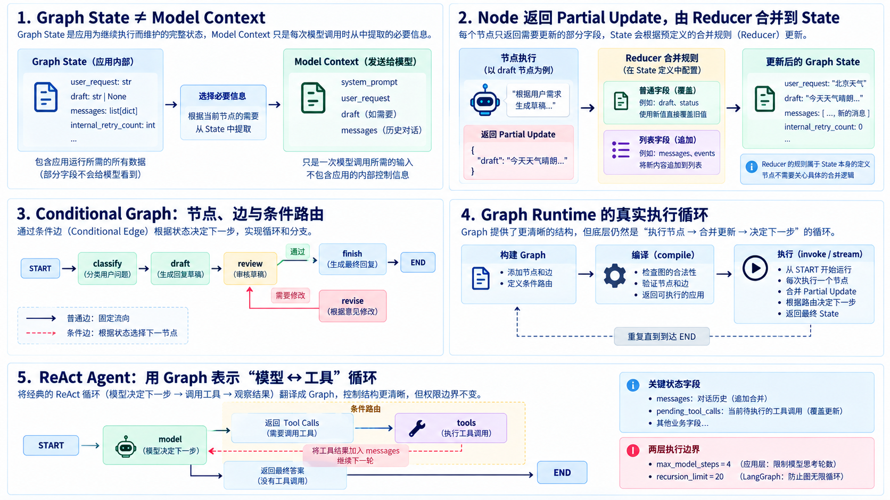

# Stage 03：把状态摊在桌面上——从普通 Workflow 到 Stateful Orchestration

> Language: [English](README.md) | **简体中文**

上一章结束时，我们已经有了四种控制手段：固定 Workflow、Router、Planner + Executor，以及会根据 Observation 循环决策的 Agent Runtime。

这些东西单独拿出来都不难。真正让程序开始“长刺”的，是它们组合起来以后。

假设你写了一个稍微复杂一点的流程：先分类请求，再生成草稿，再审核；审核不过就修改，修改后重新审核；如果某一步失败，还要根据已有结果决定是否换一条路径。最开始你大概会写出这样的代码：

```python
category = classify(request)
draft = make_draft(request, category)
revisions = 0

while True:
    decision = review(draft)

    if decision == "accept":
        break

    draft = revise(draft)
    revisions += 1

    if revisions >= 2:
        raise RuntimeError("too many revisions")
```

这段代码没有错。事实上，如果你的流程就这么几步，我建议你先保留它。普通 Python 是很优秀的编排工具，别因为学到了 Graph，就突然觉得 `if` 和 `while` 配不上你了。

问题出现在流程继续变复杂的时候。

你开始多出 `category`、`draft`、`review_result`、`revisions`、`error`、`completed_steps`、`pending_tool_calls`……这些数据有的藏在局部变量里，有的塞在对象属性里，有的只存在某个分支中。过一阵子你再看代码，最难回答的往往不是“这个函数做什么”，而是：

> **程序现在到底处于什么状态？下一步为什么会走到这里？**

Stage 03 就解决这个问题。

这章不会把 Graph 当成一种“更高级的 Agent”。我们要做的事情更朴素：把执行过程中真正重要的数据显式表示出来，再把“谁修改状态”和“下一步去哪里”分开。

<p align="center">
  
</p>

---

### 阅读与运行路线

本章默认你已理解 Stage 00 的模型调用和工具边界、Stage 01 的“决策 → 执行 → 观察”循环，以及 Stage 02 的有限路由和执行预算。需要会读 Python 字典、函数和类；不要求事先使用过 LangGraph。

先读第 1–12 节，用纯 Python 理解状态合并和转移；再读第 13–19 节，对照相同流程学习 LangGraph；第 20–29 节用于回顾设计边界。第 30 节集中给出运行命令。`langgraph_scripted_agent.py` 是离线对照示例；完整的真实模型对照示例是 `langgraph_deepseek_agent.py`，才需要 DeepSeek Key。

所有命令均在 `Tiny-Agent` 仓库根目录执行。章节中的机制片段不都能独立运行；完整可运行程序位于 `code/`，下面会标明片段依赖的定义。


## 1. 先别急着画图，先找出那些藏起来的 State

我们先把刚才那段审核流程稍微展开一点。

```python
category = classify(request)
draft = make_draft(request, category)
revisions = 0
review_result = None
answer = None
```

这些变量其实已经组成了一个状态快照。只是 Python 没有强迫你把它们放在一起。

如果把它们集中起来，可以写成：

```python
state = {
    "request": request,
    "category": None,
    "draft": None,
    "review": None,
    "revisions": 0,
    "answer": None,
}
```

这就是本章最重要的第一步：**State 不是某个框架发明的神秘对象，它只是“为了继续执行，我们现在必须知道哪些数据”。**

注意这个定义里的“为了继续执行”。

数据库里可能还有用户头像、注册时间、积分、上次登录 IP，但如果当前流程根本用不到，它们就不一定属于这个 Graph 的 State。反过来，一个很不起眼的 `revisions=1` 可能非常重要，因为下一次审核到底继续修改还是结束，就取决于它。

所以 State 不是“系统里所有数据的集合”，而是**当前编排所需的执行快照**。

一个常见误区是把 State 理解成“把所有东西扔进一个大字典”。那不叫显式状态管理，那叫搬家时把整个房间塞进一个纸箱，然后在纸箱上写“杂物”。

好的 State 应该让控制逻辑更清楚，而不是更模糊。

---

## 2. State 和模型看到的内容不是一回事

Stage 00 里我们已经说过，模型每次调用只能看到应用真正发给它的 Context。

Graph State 则是应用运行时保存的执行数据。这两者有交集，但绝不是同一个东西。

假设状态是：

```python
state = {
    "request": "I was charged twice.",
    "category": "billing",
    "draft": "I can help review the billing issue.",
    "revisions": 1,
    "internal_retry_count": 2,
}
```

如果某个节点需要调用模型做润色，真正发给模型的也许只有：

```python
model_input = {
    "request": state["request"],
    "draft": state["draft"],
}
```

`internal_retry_count` 完全可以留在应用内部。

因此要建立一个很牢固的边界：

```text
Graph State
    = 应用继续执行所需要的数据

Model Context
    = 当前这次模型调用真正收到的数据
```

如果把二者混为一谈，很容易出现一种糟糕设计：为了让程序“记住”一个内部计数器，顺手把所有状态都塞进 Prompt。模型看到一堆和任务无关的控制字段，Prompt 越来越胖，程序却没有因此更聪明。

State 是应用的执行结构。模型 Context 是模型的输入结构。它们应该由不同问题来决定。

---

## 3. Node：一次只负责完成一个明确的状态变化

有了 State 以后，我们不再让一个巨大函数从头管到尾，而是把流程拆成几个 Node。

例如分类节点：

```python
def classify(state):
    request = state["request"].lower()

    if "refund" in request or "charged" in request:
        category = "billing"
    elif "password" in request or "login" in request:
        category = "technical"
    else:
        category = "general"

    return {"category": category}
```

这里有一个很重要的设计习惯：Node 不需要返回完整 State，只返回它修改的部分。

输入可能是：

```python
{
    "request": "I was charged twice.",
    "category": None,
    "revisions": 0,
}
```

`classify()` 只返回：

```python
{"category": "billing"}
```

Runtime 再把这个更新合并回已有 State。

这个模式可以写成：

```text
Node:
State -> Partial State Update
```

为什么不让 Node 每次把整个 State 原样复制回来？

因为那会产生一个很讨厌的问题：Node 明明只负责分类，却突然有机会无意中覆盖 `revisions`、`draft`、`answer` 等完全不属于它的字段。

只返回局部更新，相当于让函数在代码层面承认：

> “我这次只碰这几个字段，其他东西不是我的事。”

这比口头写一句“请不要随便修改别的状态”靠谱得多。

---

## 4. Edge：Node 负责干活，Edge 负责决定下一站

如果 Node 是工位，那么 Edge 就是走廊。

固定流程最简单：

```text
START
  ↓
classify
  ↓
draft
  ↓
review
  ↓
finish
  ↓
END
```

代码层面可以理解成：

```python
add_edge("classify", "draft")
add_edge("draft", "review")
```

但审核节点稍微特殊一点。

如果审核通过，去 `finish`；如果要求修改，去 `revise`：

```text
                 ┌────────── revise ──────────┐
                 │                             │
                 v                             │
draft -------> review -------------------------┘
                 |
                 | accept
                 v
               finish
```

这就是 Conditional Edge。

它做的事情不是“执行修改”，而只是**根据当前 State 选择一个已经允许的目的地**。

```python
def route_after_review(state):
    return state["review"]
```

然后应用提前声明合法映射：

```python
{
    "revise": "revise",
    "accept": "finish",
}
```

这和 Stage 02 的 Router 有一个非常熟悉的味道：模型或函数可以提出一个 Route，但真正可走的目的地仍由应用定义。

Graph 并没有消灭我们前面学过的控制边界，只是把它们换成了一种更清晰的表示。

---

## 5. START 和 END 不是业务节点

一个 Graph 通常会有两个特殊位置：

```text
START
END
```

它们不是在做业务处理，而是在描述拓扑。

`START` 告诉 Runtime 从哪里进入，`END` 表示执行结束。

例如：

```python
builder.add_edge(START, "classify")
builder.add_edge("finish", END)
```

这样做有一个很朴素的好处：Graph 的入口和出口不再偷偷藏在某段循环代码里。

你拿到 Graph 定义时，可以直接问：

- 从哪里开始？
- 哪些路径能结束？
- 有没有某个 Node 根本走不到？
- 有没有一个环永远没有退出条件？

这些问题在普通 Python 里当然也能回答，只是流程复杂以后，需要靠人脑沿着 `if`、`while`、函数调用和异常路径一路追踪。Graph 的价值之一，就是把这种追踪工作变得显式。

---

## 6. 我们先手写一个最小 Graph Runtime

在碰 LangGraph 之前，先自己写一个小版本。

核心结构其实没有多少东西：

```python
class MiniStateGraph:
    def __init__(self, *, reducers=None):
        self._nodes = {}
        self._edges = {}
        self._conditional_edges = {}
        self._reducers = dict(reducers or {})
```

它只保存四类信息：

```text
nodes
fixed edges
conditional edges
reducers
```

注册任何出边之前，Builder 会先拒绝不可能的来源，或同一来源的第二条出边：

```python
def _ensure_no_outgoing_edge(self, source: str) -> None:
    if source == END:
        raise ValueError("END cannot have an outgoing edge")
    if source in self._edges or source in self._conditional_edges:
        raise ValueError(f"{source!r} already has an outgoing edge")
```

Node 注册就是一个名字到函数的映射：

```python
def add_node(self, name: str, node: Node) -> None:
    if not name or name in {START, END}:
        raise ValueError(f"invalid node name: {name!r}")
    if name in self._nodes:
        raise ValueError(f"duplicate node: {name!r}")
    self._nodes[name] = node
```

Fixed Edge 是从来源到目的地的映射。它先执行同一份校验，再保存这条映射：

```python
def add_edge(self, source: str, destination: str) -> None:
    self._ensure_no_outgoing_edge(source)
    self._edges[source] = destination
```

例如，`add_edge("draft", "review")` 之后，内部数据是：

```python
self._edges == {"draft": "review"}
```

Conditional Edge 则保存一个 Router，以及“路由名称到目的地”的映射。Router 读取 State；允许去哪些目的地则由映射表提前声明，而不是让 Router 任意指定。

```python
@dataclass(frozen=True, slots=True)
class ConditionalEdge:
    router: Router
    destinations: dict[str, str]


def add_conditional_edges(
    self,
    source: str,
    router: Router,
    destinations: Mapping[str, str],
) -> None:
    self._ensure_no_outgoing_edge(source)
    if not destinations:
        raise ValueError("conditional edges need at least one destination")
    self._conditional_edges[source] = ConditionalEdge(
        router=router,
        destinations=dict(destinations),
    )
```

例如，`add_conditional_edges("review", route_after_review, {"revise": "revise", "accept": "finish"})` 会同时保存决策函数和允许的分支表：

```python
{
    "review": ConditionalEdge(
        router=route_after_review,
        destinations={"revise": "revise", "accept": "finish"},
    )
}
```

到这里你应该已经能发现：Graph Runtime 本身并不会“思考”。

它做的主要工作更像交通调度：

> 当前在哪个 Node？这个 Node 产生了什么 State Update？更新后下一站去哪？

---

## 7. 真正的执行循环其实仍然是一个 while

这是很值得看的一段。

手写 Runtime 的核心大概是：

```python
state = dict(initial_state)
current = self._next_node(START, state)

while current != END:
    update = self._nodes[current](dict(state))

    if update is not None:
        self._apply_update(state, update)

    current = self._next_node(current, state)
```

`_next_node()` 正是连接“已保存的边”和执行循环的桥梁：它先检查是否存在 Conditional Edge，调用 Router 并验证返回的路由名称；否则就跟随 Fixed Edge。

```python
def _next_node(self, source: str, state: State) -> str:
    branch = self._conditional_edges.get(source)
    if branch is not None:
        route = branch.router(dict(state))
        try:
            return branch.destinations[route]
        except KeyError as exc:
            allowed = ", ".join(sorted(branch.destinations))
            raise RuntimeError(
                f"router from {source!r} returned {route!r}; "
                f"allowed routes: {allowed}"
            ) from exc

    try:
        return self._edges[source]
    except KeyError as exc:
        raise RuntimeError(f"{source!r} has no outgoing edge") from exc
```

看到这里，Graph 的神秘感应该下降不少。

Graph Runtime 底层仍然需要不断执行节点、更新状态、寻找下一步。Graph 并不是把 `while` 从宇宙里删除了，而是把**控制流声明**从一个越来越复杂的大循环中提取出来。

普通循环可能长这样：

```text
while True:
    if phase == "draft":
        ...
    elif phase == "review":
        ...
    elif phase == "revise":
        ...
```

Graph 则把“阶段”和“转移关系”直接放进拓扑里：

```text
draft -> review
review --revise--> revise
review --accept--> finish
revise -> review
```

当流程足够复杂时，后者更容易检查和测试。

但如果你的流程只有两行：

```python
validate()
save()
```

请不要为了画出两个漂亮方框引入一整个 Graph Runtime。那不是架构升级，只是把楼梯换成了机场廊桥。

---

## 8. Partial Update 需要一个问题的答案：到底怎么合并？

假设当前 State 是：

```python
{
    "draft": "first",
    "events": ["classified"],
}
```

某个 Node 返回：

```python
{
    "draft": "second",
    "events": ["revised"],
}
```

`draft` 很简单，通常我们希望新值覆盖旧值：

```text
"first" -> "second"
```

但 `events` 呢？

如果也直接覆盖：

```text
["classified"] -> ["revised"]
```

前面的执行记录就没了。

如果我们希望累积，则应该得到：

```python
["classified", "revised"]
```

这就是 Reducer 要解决的问题。

可以把 `draft` 想成“一份文档的当前版本”：新版本来了，旧版本就应被替换。把 `events` 想成“值班日志”：新的记录应加在旧记录之后。它们都保存在 State 中，却表示不同的东西，因此合并规则也不同。

Reducer 就是某一个 State 字段的合并规则：

```python
new_value = reducer(old_value, update_value)
```

例如列表追加：

```python
def append_events(left, right):
    return [*left, *right]
```

下面把刚才的 State 和 Update 完整合并一次。把这一整个代码块直接运行：

```python
def append_events(left, right):
    return [*left, *right]


def apply_update(state, update, reducers):
    for key, right in update.items():
        reducer = reducers.get(key)
        if reducer is None or key not in state:
            state[key] = right
        else:
            state[key] = reducer(state[key], right)

state = {
    "draft": "first",
    "events": ["classified"],
}
update = {
    "draft": "second",
    "events": ["revised"],
}

apply_update(state, update, reducers={"events": append_events})
print(state)
```

输出是：

```python
{
    "draft": "second",
    "events": ["classified", "revised"],
}
```

`draft` 没有配置 Reducer，因此 Runtime 直接用新值覆盖它。`events` 配置了 `append_events`，因此 Runtime 把已有历史和 Node 返回的新记录拼在一起。Node 本身不需要读取、复制再返回完整的历史。

这就是它的意义：每个 Node 只返回自己负责的字段，而 Graph 统一持有合并规则。Node 返回 `"events": ["revised"]` 时，并不由 Node 临时决定“我要覆盖”还是“我要追加”；**State 字段的定义决定更新语义。**

---

## 9. Reducer 用错了，State 会悄悄变成另一种东西

想象 `messages` 是一个列表。

如果没有 Reducer：

```python
{"messages": ["hello"]}
```

下一次 Node 返回：

```python
{"messages": ["tool result"]}
```

结果通常是：

```python
{"messages": ["tool result"]}
```

如果这个字段本来表示“完整消息历史”，那前面的内容已经被覆盖掉了。

反过来，如果某个字段本来只表示“当前 pending Tool Calls”，你却给它用了追加 Reducer：

```text
old pending calls + new pending calls
```

那么已经执行完的 Tool Call 可能永远留在 State 里，后面一轮又被执行一次。

所以 Reducer 不是“列表就 append”这么简单。

先问字段的语义：

```text
这个字段表示最新值？
还是累计历史？
还是一个需要去重/替换的集合？
```

然后再选择 Reducer。

State Schema 不是只管类型，还要管更新语义。

---

## 10. 用一个小 Workflow 看完整状态变化

本章的手写示例处理一条客服请求：

```text
request
  ↓
classify
  ↓
draft
  ↓
review
  ├── accept ──────────────> finish -> END
  │
  └── revise -> revise
                 |
                 └─────────> review
```

初始 State 很简单：

```python
{
    "request": "I was charged twice and need a refund.",
    "revisions": 0,
    "events": [],
}
```

分类节点只增加：

```python
{
    "category": "billing",
    "events": ["classified as billing"],
}
```

草稿节点继续增加：

```python
{
    "draft": "I can help review the billing issue.",
    "events": ["drafted first response"],
}
```

第一次审核故意要求修改：

```python
{
    "review": "revise",
    "events": ["review requested one revision"],
}
```

于是 Conditional Edge 把执行位置送到 `revise`。

修改节点返回：

```python
{
    "draft": state["draft"] + " I will keep the next step specific.",
    "revisions": state["revisions"] + 1,
    "events": ["revised response"],
}
```

第二次回到 `review`，这次得到：

```python
{
    "review": "accept",
    "events": ["review accepted response"],
}
```

Conditional Edge 因此把流程送到 `finish`。

运行：

```bash
python stages/03-stateful-orchestration/code/state_graph.py
```

你会看到 Trace：

```text
classify -> draft -> review -> revise -> review -> finish
```

这个 Trace 很有价值。

因为现在“程序怎么走到这里”不再需要你从日志里猜，也不需要沿着七层函数调用逆向侦探。执行路径已经是 Graph Runtime 的结果。

---

## 11. Cycle 不可怕，没有边界的 Cycle 才可怕

刚才的 Graph 有一个环：

```text
review -> revise -> review
```

Graph 中出现 Cycle 很正常。

ReAct 本身就是一种循环结构：

```text
model -> tool -> model -> tool -> ...
```

Planner 失败后重新规划，也可以形成循环。

问题从来不是“有没有环”，而是：

> **谁负责保证它不会永远转下去？**

我们的手写 Runtime 使用：

```python
max_steps
```

执行前先检查：

```python
if len(trace) >= max_steps:
    raise RuntimeError(f"graph exceeded max_steps={max_steps}")
```

这和 Stage 01 的 `max_steps`、Stage 02 的 `max_replans` 是同一种工程思想：**开放式控制必须有应用拥有的 Budget。**

不要让 Node 自己说“放心，我不会循环太久”。

如果一个模型已经陷入循环，它通常也是全场最不适合负责判断“我是不是陷入循环”的那个角色。

---

## 12. 为什么要有 compile()？

我们构建完 Graph 后，不直接执行，而是先：

```python
graph = builder.compile()
```

对于我们的手写版本，`compile()` 会提前检查一些拓扑错误。

例如没有入口：

```python
builder.add_node("draft", draft)
builder.compile()
```

应该直接报错，因为没有任何 Edge 从 `START` 出发。

再比如 Edge 指向不存在的 Node：

```text
review -> magic_node
```

也应该在真正执行用户请求前发现。

这就像搭铁路。

最理想的情况不是“火车开到半路以后才发现前面的铁轨名字拼错了”，而是线路投入运行前先做结构检查。

Graph Compile 的价值之一，就是把一部分运行期惊喜提前变成构建期错误。

当然，Compile 只能验证它知道的结构。

它不会证明你的业务逻辑正确，也不会证明某个模型节点一定返回好答案，更不会证明外部 API 永不失败。**拓扑正确只是最低门槛，不是质量认证。**

---

## 13. 认识 LangGraph，再映射相同的机制

[LangGraph](https://docs.langchain.com/oss/python/langgraph/overview) 是 LangChain 团队提供的有状态 Agent 与工作流编排框架。它把 State、Node、Edge、条件路由和循环这些概念变成可执行的图，适合需要多步骤、可恢复或可观察执行过程的程序。

如果你还没有接触过 LangGraph，先阅读官方的 [概览](https://docs.langchain.com/oss/python/langgraph/overview) 和 [Workflows and agents 指南](https://docs.langchain.com/oss/python/langgraph/workflows-agents)。它们会系统介绍框架 API、常见工作流模式和更完整的生产能力。

本教程不额外重复 LangGraph 的框架教学。前 01，02 节已经用纯 Python 拆开了图运行时的核心机制；从这一节开始，我们只用 LangGraph 把同一套 State、Node、Edge 和路由逻辑重新表达出来，重点是理解 Agent 的状态与控制流如何映射到框架代码。

安装本章依赖：

```bash
python -m pip install -r stages/03-stateful-orchestration/code/requirements.txt
```

在 LangGraph 中，我们先定义 State Schema：

```python
from operator import add
from typing import Annotated
from typing_extensions import TypedDict

class SupportState(TypedDict, total=False):
    request: str
    category: str
    draft: str
    review: str
    revisions: int
    events: Annotated[list[str], add]
    answer: str
```

这里最值得注意的是：

```python
events: Annotated[list[str], add]
```

它相当于告诉 LangGraph：

> `events` 收到新列表时，不要直接覆盖，用 `operator.add` 合并。

而没有显式 Reducer 的字段，默认就是新值覆盖旧值。

`TypedDict` 描述 State 字典可能有哪些字段；`total=False` 允许由后续 Node 产生的字段在初始 State 中缺失，但它不会自动填默认值，也不做运行时验证。因为 `events` 使用 `add`，每个 Node 只能返回本次新增的事件；如果返回完整历史，旧事件会被再追加一次。

这正是我们刚刚手写过的逻辑。

LangGraph 官方 Graph API 也是用这个思路描述 State：State Schema 定义有哪些 Channel，Reducer 决定每个 Channel 如何接受 Node Update。

---

## 14. LangGraph 的 Node 仍然只是 Python 函数

例如分类节点：

```python
def classify(state: SupportState) -> dict:
    request = state["request"].lower()

    if "refund" in request or "charged" in request:
        category = "billing"
    elif "password" in request or "login" in request:
        category = "technical"
    else:
        category = "general"

    return {
        "category": category,
        "events": [f"classified as {category}"],
    }
```

并没有出现什么“Graph 专用函数语言”。

还是 Python。

然后注册：

```python
from langgraph.graph import END, START, StateGraph

builder = StateGraph(SupportState)

builder.add_node("classify", classify)
builder.add_node("draft", draft)
builder.add_node("review", review)
builder.add_node("revise", revise)
builder.add_node("finish", finish)
```

这点非常重要。

Graph Runtime 的价值不是把业务代码变成框架咒语，而是给普通函数提供一个明确的 State 和 Transition 运行模型。

如果某个 Node 里面只是普通计算，它就是普通计算。

如果某个 Node 里面调用模型，它才是模型节点。

如果某个 Node 调用外部 Tool，它才发生 Tool Execution。

**Node 这个身份不会自动赋予函数新的权限。**

---

## 15. 固定 Edge 和 Conditional Edge 几乎是一一对应

固定 Edge：

```python
builder.add_edge(START, "classify")
builder.add_edge("classify", "draft")
builder.add_edge("draft", "review")
```

Conditional Edge：

```python
builder.add_conditional_edges(
    "review",
    route_after_review,
    {
        "revise": "revise",
        "accept": "finish",
    },
)
```

再把环接回来：

```python
builder.add_edge("revise", "review")
builder.add_edge("finish", END)
```

最后：

```python
graph = builder.compile()
```

你会发现，它和手写版本的概念对应关系非常直接：

| 我们手写的概念 | LangGraph |
|---|---|
| State 字典 | State Schema |
| Node 函数 | `add_node()` |
| 固定下一站 | `add_edge()` |
| 根据 State 选下一站 | `add_conditional_edges()` |
| State Update 合并 | Reducer |
| 构建后检查 | `compile()` |
| 执行 | `invoke()` / `stream()` |

这时候再学 API，记忆成本会小很多。因为你不是在背六个互不相关的方法名，而是在给已经理解的机制找框架对应物。

---

### 把前面的片段连起来运行

第 14–15 节的 `draft`、`review`、`revise`、`finish` 和 `route_after_review` 来自 `langgraph_workflow.py`。只复制注册语句会缺少这些定义。先在该文件所在的 `code/` 目录启动 Python 交互环境，再尝试这个完整入口：

```python
from langgraph_workflow import build_graph, initial_state

graph = build_graph()
result = graph.invoke(initial_state(), config={"recursion_limit": 20})
print(result["answer"])
assert result["revisions"] == 1
assert len(result["events"]) == 6
```

## 16. `invoke()` 给你最终 State，`stream()` 让你看到过程

普通执行：

```python
result = graph.invoke(
    initial_state(),
    config={"recursion_limit": 20},
)
```

最后拿到的是累积后的 State。这里沿用上一节导入的 `initial_state()` 函数；调用它才能得到初始字典。

但 Graph 的一个常见需求是观察执行过程。LangGraph 可以：

```python
for update in graph.stream(
    initial_state(),
    stream_mode="updates",
    config={"recursion_limit": 20},
):
    print(update)
```

`updates` 模式关注的是每一步 Node 新产生了什么更新，而不是每次都把整份 State 重印一遍。

例如你可能看到：

```text
{"classify": {"category": "billing", ...}}
{"draft": {"draft": "...", ...}}
{"review": {"review": "revise", ...}}
{"revise": {...}}
```

这对于理解控制流非常有帮助。

请注意，Streaming 并没有改变 Graph 的业务语义。它只是让 Runtime 执行过程中产生的事件更容易被观察。

不要把“能实时看到更新”理解成“Graph 突然获得了另一套决策能力”。

---

注意：先 `stream()` 再 `invoke()` 会执行两次独立的运行，不是读取同一次运行的结果。离线示例这样做是为了比较两种接口；真实 DeepSeek 示例只执行一次 `stream()`，避免重复请求和工具执行。

## 17. LangGraph 的 Recursion Limit 和我们手写的 max_steps 是一类东西

有 Cycle 时，我们的手写版本用：

```python
max_steps=30
```

LangGraph 提供运行时递归/步数边界，可以在配置中指定：

```python
config = {
    "recursion_limit": 20,
}
```

它们实现细节并不完全相同，但在工程目的上非常接近：

> 不允许一个循环图无限执行。

尤其是当 Conditional Edge 的判断来自模型时，这个边界更重要。

模型可能反复认为“再试一次就好了”。

Runtime 的工作不是陪它一起乐观，而是在适当的位置说：

> 今天先到这儿。

---

## 18. Graph 不是 Agent，这次我们可以用代码证明

刚才那个客服 Workflow 完全没有模型。

分类是普通 Python：

```python
if "refund" in request:
    category = "billing"
```

审核也是确定性规则：

```python
needs_revision = state.get("revisions", 0) == 0
```

但它仍然是一个合法 Graph。

所以：

```text
Graph != Agent
```

Graph 描述的是**状态如何演化、控制如何转移**。

Agent 描述的是**某些控制决策由模型根据环境反馈动态做出**。

你可以有：

```text
deterministic graph
```

也可以有：

```text
agentic graph
```

甚至可以有一个只调用普通函数的 Graph，也可以有一个完全不用 Graph 的 Agent Runtime。

这两个概念不要绑死。

---

## 19. 把 Stage 01 的 ReAct Loop 翻译成 Graph

Stage 01 的 Runtime 核心是：

```text
model
  |
  +-- final answer --> END
  |
  +-- Tool Call
         |
         v
       tools
         |
         v
       model
```

如果改成 Graph：

```text
             +----------------+
START ------>|     model      |
             +-------+--------+
                     |
            conditional edge
              /             \
             v               v
          tools             END
             |
             +-------------> model
```

这里我们可以把不同责任拆得非常清楚。

`model` Node 负责：

```text
读取当前 messages
生成 Tool Call 或 final answer
更新 pending_tool_calls / final_answer
```

`tools` Node 负责：

```text
读取 pending_tool_calls
查找应用注册的 Tool
真正执行函数
把 observation 写回 messages
```

Conditional Edge 只负责：

```text
有 pending Tool Call -> tools
没有 Tool Call / 已结束 -> END
```

这就是离线版 [`code/langgraph_scripted_agent.py`](code/langgraph_scripted_agent.py) 演示的结构。

运行：

```bash
python stages/03-stateful-orchestration/code/langgraph_scripted_agent.py
```

它使用一个确定性的 `ScriptedModel`，第一次请求：

```python
ToolCall(
    call_id="call_mul",
    name="multiply",
    arguments={"a": 6, "b": 7},
)
```

Tool Node 执行：

```python
TOOLS["multiply"](**call.arguments)
```

得到 `42` 后写回 Tool Observation，模型下一轮再生成最终答案。

整个过程和 Stage 01 的 Runtime 没有发生本质变化。

---

下面的构建函数新增 `model` 参数，默认仍使用 `ScriptedModel`。传入实现 `generate(messages) -> ModelTurn` 的对象，即可复用同一组节点与边。新增工具时需要同步修改 Provider 的工具描述和工具节点的参数校验。

### 19.1 使用 DeepSeek 运行同一张图

原版 Stage 03 全部使用模型替身。现在有一组并列、完整的实现：[langgraph_scripted_agent.py](code/langgraph_scripted_agent.py) 使用离线 `ScriptedModel`，[langgraph_deepseek_agent.py](code/langgraph_deepseek_agent.py) 使用真实 DeepSeek 模型。两者都有独立的 State、Node、Edge、Tool 和 Graph 构建代码，便于逐段对照。先完成第 30 节的依赖安装，再在仓库根目录的同一个终端中设置环境变量：

Windows CMD：

```cmd
set "DEEPSEEK_API_KEY=你的DeepSeek密钥"
set "DEEPSEEK_MODEL=deepseek-v4-flash"
python stages/03-stateful-orchestration/code/langgraph_deepseek_agent.py
```

PowerShell：

```powershell
$env:DEEPSEEK_API_KEY="你的DeepSeek密钥"
$env:DEEPSEEK_MODEL="deepseek-v4-flash"
python stages/03-stateful-orchestration/code/langgraph_deepseek_agent.py
```

Bash：

```bash
export DEEPSEEK_API_KEY="your-deepseek-api-key"
export DEEPSEEK_MODEL="deepseek-v4-flash"
python stages/03-stateful-orchestration/code/langgraph_deepseek_agent.py
```

客户端的创建如下；`required_env` 是该文件内检查空环境变量的辅助函数：

```python
from openai import OpenAI
from langgraph_deepseek_agent import DeepSeekModel, required_env, build_agent_graph

client = OpenAI(
    api_key=required_env("DEEPSEEK_API_KEY"),
    base_url="https://api.deepseek.com",
)
model = DeepSeekModel(client=client, model=required_env("DEEPSEEK_MODEL"))
graph = build_agent_graph(model=model, max_model_steps=4)
```

`api_key` 是 DeepSeek 身份凭证，`base_url` 决定请求地址，`model` 指定模型。

与 Stage 01 相同，DeepSeek Adapter 每轮重建完整输入：用户消息、assistant 的 `function_call`、匹配 `call_id` 的 `function_call_output`。它不依赖服务端保存历史；只发送 State 中的 `messages`，不会把 `model_steps` 等控制字段作为模型输入。协议依据见 [DeepSeek Responses 文档](https://api-docs.deepseek.com/guides/responses_api/)。

离线示例的确定输出为：

```text
final_answer: 6 * 7 = 42
model_steps: 2
message roles: ['user', 'assistant', 'tool', 'assistant']
```

真实模型的措辞和调用次数可能变化；观察更新应能看到 model 提议 multiply、tools 返回 42、model 给出最终答案。模型最多调用四轮；达到预算会返回 error，真实入口将它作为异常报告。图的 `recursion_limit=20` 是另一层边界，计算图执行的 super-step；当前顺序图通常每个节点一次，不能将其等同于模型调用次数。

API 错误、非法 JSON、未知工具和无效参数会直接终止，不自动重试。工具参数必须恰好为两个有限数字 a、b；重复调用 ID 会被拒绝。沿用前几章的执行边界，不用跳过校验来让模型输出“能跑”。


## 20. 把 while 改成 Graph，不会改变权限边界

这是本章非常容易被忽略的一点。

在 Agent Graph 里，只展示“产生提案”的这一部分：

```python
def model_node(state):
    turn = model.generate(state["messages"])
    return {"pending_tool_calls": list(turn.tool_calls)}
```

模型只是返回下一步提案。

真正执行 Tool 的仍然是：

```python
import math
from typing import Any
from langgraph_scripted_agent import AgentState, TOOLS

def tool_node(state: AgentState) -> dict:
    observations: list[dict[str, Any]] = []

    for call in state.get("pending_tool_calls", []):
        try:
            handler = TOOLS[call.name]
        except KeyError as exc:
            raise RuntimeError(f"unknown tool: {call.name}") from exc

        if set(call.arguments) != {"a", "b"} or any(
            type(value) not in (int, float) or not math.isfinite(value)
            for value in call.arguments.values()
        ):
            raise ValueError("multiply requires exactly two finite numbers: a, b")
        result = handler(**call.arguments)
        observations.append(
            {
                "role": "tool",
                "tool_call_id": call.call_id,
                "content": str(result),
            }
        )

    return {
        "messages": observations,
        "pending_tool_calls": [],
    }
```

所以：

```text
model node
    !=
tool execution authority
```

Graph Runtime 只是把原来的控制循环表示成 Node + Edge。

它不会因为图画得更漂亮，就让模型突然获得 Python 执行权。

Stage 00 的边界依然成立：

> 模型提出动作，应用验证并执行动作。

Graph 改变的是**编排表达方式**，不是权限归属。

---

## 21. 那为什么不把所有 Agent 都改成 Graph？

因为 Graph 也有成本。

最简单的 ReAct Loop：

```text
while True:
    turn = model.generate(...)
    ...
```

通常非常好读。

如果你的流程只有：

```text
model <-> tools
```

而且状态很少，普通 Runtime 可能已经足够。

Graph 更值得引入的情况通常是：

```text
分支越来越多
多个阶段共享 State
某些步骤会回环
需要清楚观察经过哪些 Node
需要把不同控制路径独立测试
```

例如：

```text
classify
  ├── fast_path
  ├── plan
  │     └── execute
  │           └── review
  │                 ├── finish
  │                 └── repair -> review
  └── reject
```

这种结构如果全部塞进一个 `while + if + try/except`，代码当然也能写。

只是半年以后，那个 `while` 可能会成为团队里最有资历、最没人敢动的同事。

Graph 的价值不是“能做到普通 Python 做不到的事”，而是**在复杂控制流出现以后，用更明确的结构表达它。**

---

## 22. State 设计得好不好，比 Graph 画得漂不漂亮更重要

很多人第一次用 Graph，很自然地把注意力放在 Node 和 Edge 上。

其实更应该先问 State。

比如：

```python
class AgentState(TypedDict):
    everything: dict
```

技术上也许能跑。

教学意义基本等于没有。

因为所有语义都又被藏进一个 `everything` 里了。

更好的 State 会把真正影响控制的字段说清楚：

```python
from operator import add
from typing import Annotated, Any
from typing_extensions import TypedDict
from langgraph_scripted_agent import ToolCall

class AgentState(TypedDict, total=False):
    messages: Annotated[list[dict[str, Any]], add]
    pending_tool_calls: list[ToolCall]
    final_answer: str | None
    error: str | None
    model_steps: int
```

只看字段名，你已经能猜出 Runtime 在关心什么。

这就是显式 State 的价值之一：它让程序的执行模型变得可读。

如果一个 Graph 需要你打开十个 Node 才能猜出 State 里到底存了什么，那它虽然“用了 Graph”，但没有真正获得多少清晰度。

---

`messages` 累加新消息；`pending_tool_calls` 覆盖并在执行后清空。若对待执行列表使用累加规则，旧调用就可能被重复执行。

## 23. 不要让 Node 偷偷改传入的 State

考虑：

```python
def bad_node(state):
    state["count"] += 1
    return state
```

这种写法会让状态更新边界很模糊。

Node 到底修改了什么？

是原对象已经被改了，还是 Runtime 合并了返回值？

在教学代码里，我们采用更清楚的方式：

```python
def increment(state):
    return {
        "count": state["count"] + 1,
    }
```

也就是：

```text
读 State
计算
返回 Update
```

尽量把 State 当作当前快照来读，不要把“原地修改”和“返回更新”混在一起。

这样测试时也更简单：

```python
update = increment({"count": 1})
assert update == {"count": 2}
```

Node 可以单独测试，不需要先启动整个 Graph。

---

手写引擎的 `dict(state)` 只是浅拷贝，嵌套列表仍共享引用，不是隔离沙箱。不要对输入中的 `events` 或 `messages` 原地 `append()`，应返回新列表。当前图只在进程内保存状态；没有 checkpointer，重启后不会恢复运行。

## 24. Conditional Edge 不应该顺便承担业务执行

这是另一个很常见的坏味道：

```python
def route(state):
    if state["category"] == "billing":
        send_refund_request()
        return "finish"
```

Router 一边决定下一站，一边偷偷产生副作用。

这样一来：

```text
route decision
+
business execution
```

混在了一起。

更清楚的做法是：

```python
def route(state):
    return state["category"]
```

然后 Graph 明确走到：

```text
billing_handler
```

由那个 Node 执行对应逻辑。

这样你可以单独测试：

- Router 是否选对路径；
- Billing Node 是否执行对动作。

这和 Stage 02 的原则完全一致：**决策和执行不要糊成一团。**

---

## 25. 一个 Node 应该多大？

没有一个神奇的行数标准。

但可以用一个实用问题判断：

> 如果这个 Node 失败，我能不能清楚说出“失败的是哪一步”？

例如一个 Node 里同时：

```text
分类
调用模型
查数据库
计算
发送邮件
写审计日志
```

当它失败时，`node=process_everything` 基本没有提供什么信息。

反过来，把每一行都拆成 Node 也会走向另一个极端：

```text
strip_text
lower_text
check_empty
...
```

Graph 会变成一张电路板。

通常一个 Node 对应一个**有意义的编排单元**：

```text
classify request
draft response
review response
execute Tool batch
call model
```

也就是说，Node 的粒度应该服务于控制流、状态边界和可观察性，而不是服务于“我想多画几个盒子”。

---

## 26. Graph 的 Trace 比最终答案更值得测试

假设最终答案是：

```text
I can help review the billing issue.
```

你只断言：

```python
assert result["answer"] == expected
```

还不够。

因为这条答案可能通过完全错误的路径得到。

例如本来应该：

```text
classify -> draft -> review -> revise -> review -> finish
```

结果某次修改以后直接变成：

```text
classify -> finish
```

最终文本碰巧一样，控制逻辑却已经坏了。

所以手写 Graph 的检查会验证 Trace：

```python
assert result.trace == (
    "classify",
    "draft",
    "review",
    "revise",
    "review",
    "finish",
)
```

这和我们前面一直强调的一件事一致：

> **Agent 系统不能只测试 Final Answer，还要测试执行轨迹。**

对 Stateful Orchestration 来说，State Transition 本身就是产品行为的一部分。

---

## 27. LangGraph 也应该测试 State Semantics，而不是“框架能 import”

这种测试：

```python
import langgraph
```

只能证明依赖安装了。

真正值得测的是你依赖的语义。

例如 Reducer：

```python
class State(TypedDict):
    events: Annotated[list[str], add]
```

两个 Node 分别返回：

```python
{"events": ["one"]}
{"events": ["two"]}
```

最终应该是：

```python
["one", "two"]
```

再比如 Conditional Edge 应该真的根据 State 进入不同 Node，而不是所有分支最后都走同一路。

Framework Test 的目的不是替 LangGraph 官方测试 LangGraph，而是保护：

> **我们的课程和代码依赖的框架语义，在当前版本线里仍然成立。**

---

## 28. 一个容易混淆的概念：Graph State 不是“历史记录”

State 可以包含历史，但它不必等于历史。

例如：

```python
{
    "category": "billing",
    "revisions": 1,
}
```

这是状态。

而：

```python
{
    "events": [
        "classified as billing",
        "drafted first response",
        "review requested one revision",
    ]
}
```

这是我们主动保留的一段执行记录。

它们用途不同。

`category` 是后续控制仍然需要的当前值。

`events` 是为了观察和测试而累计的轨迹。

不要看到“State 会变”就觉得每个旧值都必须永久保留下来。很多字段的正确语义恰恰是覆盖：

```text
old review result
-> new review result
```

只有真正需要累计的字段才应该使用 Reducer。

---

## 29. 再看一次本章最核心的三件事

如果前面内容有点多，现在只抓住三件事。

第一，State：

```text
当前执行继续下去所需要的数据快照
```

第二，Node：

```text
读取 State，完成一个明确工作，返回 Partial Update
```

第三，Edge：

```text
决定下一步执行哪个 Node
```

然后 Reducer 负责回答：

```text
Partial Update 应该怎样合并进 State？
```

把这四件事理解透，LangGraph 的大部分核心 Graph API 就不再神秘。

---

## 30. 运行本章代码

先运行手写版本：

```bash
python stages/03-stateful-orchestration/code/state_graph.py
```

安装 LangGraph：

```bash
python -m pip install -r stages/03-stateful-orchestration/code/requirements.txt
```

再运行同一个 Workflow 的 LangGraph 版本：

```bash
python stages/03-stateful-orchestration/code/langgraph_workflow.py
```

然后运行 Graph 版 ReAct：

```bash
python stages/03-stateful-orchestration/code/langgraph_scripted_agent.py
```

最后运行离线检查：

```bash
python stages/03-stateful-orchestration/code/checks.py
```

这些检查会覆盖 Partial Update、Reducer、非法 Conditional Route、Cycle Budget、手写 Graph 的 Revision Loop、LangGraph Workflow 的同等行为、Streaming Update，以及 Graph 版 ReAct 的 Model/Tool 边界。

---

### 运行排错与文件对应

| 文件 | 用途 | 是否请求模型 |
|---|---|---|
| state_graph.py | 手写合并和转移机制 | 否 |
| langgraph_workflow.py | 相同客服流程的框架版本 | 否 |
| langgraph_scripted_agent.py | 完整离线 model → tools 图 | 否 |
| langgraph_deepseek_agent.py | 完整真实 DeepSeek model → tools 图 | 是 |
| checks.py | 离线回归测试 | 否 |

缺少模块时，请使用运行脚本的同一个 Python 执行 `python -m pip install -r stages/03-stateful-orchestration/code/requirements.txt`。缺少环境变量时，在运行程序的同一个终端设置；CMD 的 `set` 与 PowerShell 的 `$env:` 不能混用。达到预算时先检查节点轨迹和停止条件，再决定是否提高限额。

LangGraph 行为参考：[Graph API](https://docs.langchain.com/oss/python/langgraph/graph-api)。本章不配置持久化、并发调度或自动恢复，编译也不会证明业务逻辑正确。


## 31. 动手练习：别只改颜色，改控制语义

先改客服 Workflow。

现在第一次 `review` 一定要求一次修改。把它改成真正根据 `draft` 内容判断：如果草稿没有包含 `"next step"`，才要求修改；已经包含就直接接受。

注意不要在 Router 里修改 Draft。Router 只决定 `revise` 还是 `accept`。

接着增加一个 `escalate` 路径。

规则是：如果 `revisions >= 2` 仍然不通过，就不要继续循环，进入 `escalate` Node。这个练习的重点不是多写一个 Node，而是重新设计 Conditional Edge：

```text
review
  ├── accept
  ├── revise
  └── escalate
```

然后给 `events` 换一个错误的默认覆盖语义，运行一次，观察历史是怎么丢掉的。再恢复 Reducer。

最后修改 `langgraph_scripted_agent.py`，让 `ScriptedModel` 第一次调用 `multiply`，第二次再调用一个新的 `add` Tool，第三次才结束。不要改 Graph 拓扑，只增加 Tool 和 Model 行为。然后对照把相同改动加入 `langgraph_deepseek_agent.py` 的 Tool schema 与参数校验。

如果你能做到这一点，就说明你已经理解了一个非常关键的优势：

> Graph 描述控制结构，而具体任务可以在相同结构里演化。

---

## 32. 本章收尾：把“现在在哪里”变成程序的一等概念

Stage 01 让我们拥有了一个会循环的 Agent Runtime。

Stage 02 让我们开始设计哪些决定应该由模型做、哪些继续留给普通程序。

到了 Stage 03，我们又补上了一块：当分支、循环和中间数据越来越多时，不再让“执行到了哪里”藏在局部变量和嵌套控制流里，而是显式写成：

```text
State
+
Node
+
Edge
+
Reducer
```

Graph 的价值从来不是让系统显得更像 Agent。

它真正解决的是另一个问题：

> **当控制流已经复杂到需要一张地图时，给程序一张真正可以执行的地图。**

如果流程很简单，就继续用普通 Python。

如果流程开始出现多个共享状态、条件分支、循环和需要验证的路径，再考虑 Graph。

架构不是收集徽章。能用一条直路到达的地方，没有必要先修一个立交桥。
