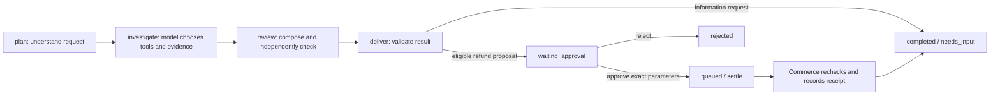

# Stage 14: Bring the Course Together — A Support Agent That Really Calls a Model

> Language: **English** | [简体中文](README.zh-CN.md)

Lin, our product colleague, no longer asks whether an Agent can call a tool. Her new request sounds like an actual service: “Build an after-sales assistant for Qinghe. When a customer asks about delivery, check the shipment. When they ask for a refund, read both the order and the terms. Prepare the amount for human review, and leave a case record we can inspect afterward.”

Putting a support avatar on a chat window will not do this. A customer saying “I paid 9,999” must not change the order balance. An obsolete agreement must not override current terms. A model writing “refunded” must not make the database pretend a payment happened. We need a connected process in which inputs, evidence, decisions, and execution rights have distinct owners.

The normal entry point in this chapter calls **DeepSeek** and launches a separate commerce service using the official **MCP Python SDK 2.x**. The merchant, customers, documents, orders, shipments, and payment receipts are entirely fictional. No real payment gateway is connected. We can therefore investigate difficult failure paths without using somebody's bank account as a test fixture.

## 1. Reconstruct the path we have already travelled

In [Stage 00](../00-foundations/README.md), we started with an ordinary model request. Messages went in; text and structured results came out. Tool calling introduced an important distinction: the model could request an action without actually performing it. [Stage 01](../01-react-runtime/README.md) turned that exchange into a bounded loop. Results became observations for another model turn, while the application kept control of dispatch, call identifiers, failures, and stopping conditions.

An autonomous loop was useful, but [Stage 02](../02-workflows-routing-planning/README.md) showed why not every decision belongs inside it. Language interpretation may need a model; arithmetic, permissions, and known business transitions often do not. Routing and planning describe proposed work, whereas execution determines what may actually happen. [Stage 03](../03-stateful-orchestration/README.md) made progress explicit: a state tells us where we are, nodes do work, and transitions determine what can follow. A graph expresses control flow; drawing one does not create an Agent by itself.

The next problem was information. [Stage 04](../04-agentic-rag/README.md) supplied external evidence through retrieval, chunking, ranking, and bounded attempts to obtain sufficient material. A similarity or relevance score was never a truth probability. [Stage 05](../05-mcp/README.md) standardized a different boundary: how the host discovers and calls external capabilities. The model's function call and the MCP request are related, but they are not the same protocol or the same authority decision.

Once work could outlive a conversation, [Stage 06](../06-memory-persistence-hitl/README.md) introduced durable checkpoints, selected long-term memory, and pauses for human review. Storing everything created another question: what should the next model call actually see? [Stage 07](../07-context-engineering/README.md) answered with deliberate context selection and budgets. [Stage 08](../08-agent-skills/README.md) applied progressive disclosure to reusable procedures: advertise a small catalog, then load the relevant instructions when needed. A procedure explains how to work; it cannot grant access to a tool.

With useful capabilities came useful brakes. [Stage 09](../09-reliability-safety/README.md) put validation, identity, permissions, budgets, retries, idempotency, and deadlines into executable rules. Repeating a request was safe only when the execution contract made it safe. [Stage 10](../10-evaluation-observability/README.md) then asked whether those rules worked and whether a change improved behavior. A trace explains one run; a fixed evaluation compares runs. Neither a fluent last sentence nor a clean exception log is a complete quality measure.

The final three stages extended the system across responsibility, environment, and time. [Stage 11](../11-multi-agent/README.md) separated useful specialist work from merely giving one prompt several job titles. It preserved bounded context, provenance, failure, and ownership. [Stage 12](../12-agent-workspace-sandbox/README.md) distinguished a workspace, a candidate file, and an accepted artifact; it also showed why a subprocess wrapper is not a security sandbox. [Stage 13](../13-long-horizon-harness/README.md) detached durable tasks from individual workers through checkpoints, leases, per-claim credentials, and atomic transitions. Recoverable execution still did not mean every external effect occurred exactly once.

Together these ideas ask one practical question: **who proposes which action from which evidence, who checks and executes it, what survives afterward, and where can another worker safely continue?** Our capstone will answer that question for one support case. It is not a general-purpose framework, but it is also not three strings in a list renamed “enterprise knowledge.”

## 2. Accept one concrete support request before creating classes

Alice asks: “Please process the refund for QH-1001 and explain the basis.” This is a Qinghe stand order with an item payment of CNY 129.00 and an additional CNY 12.00 delivery charge. Delivery was seven days ago, the returns warehouse has received the item, and there is no previous refund. Our fictional policy admits ordinary items within 30 days of delivery, including day 30, after warehouse receipt. The automatic path refunds the outstanding item payment, not the original freight charge.

The model therefore needs to recognize an action request, inspect Alice's actual order, retrieve applicable terms, and explain why the proposed amount is CNY 129.00 rather than the CNY 141.00 invoice total. The case should then stop at human review. Only after reviewer Chen approves the exact order, amount, versions, and digest may the host ask the commerce service to create a **SIMULATED** receipt.

Other requests must also exercise real differences: shipment progress, invoice reconciliation, lamp warranty, an unreceived return, an expired window, a partially refunded order, and a service the documents do not cover. Each case binds at most one order identifier explicitly present in the current question. The assistant can list the customer's accessible orders to help them choose; it cannot select a payment on their behalf.

Two limits make the setting unambiguous. First, `--profile alice` selects a **trusted local demonstration identity**, not a production login. A real service must derive identity from authentication rather than accept a user-supplied tenant or role. Second, domain calculations use the fixture snapshot date, `2026-09-12`, so boundary cases remain reproducible. Leases and approval expiry use the runtime clock. Those are different clocks for different purposes, not a claim that fictional shipment records are current live data.

## 3. Tour the whole system before entering a module

Think of a support office with a front desk, a document room, and a payment counter. DeepSeek helps the front desk interpret requests, choose investigative actions, and write explanations. Documents supply terms; the commerce service owns transaction facts. The payment counter only accepts an exactly approved action. Preparing the paperwork does not entitle the assistant to stamp it “approved.”

In this architecture, arrows represent program calls. The important feature is the missing shortcut: there is no direct path from a model response to changing the order balance.

```mermaid
flowchart TD
    U[Question + application-bound identity] --> H[SupportAgent: phases and budgets]
    H <--> L[DeepSeek: plan / investigate / answer]
    H --> C[Context selection and Skills]
    H --> T[Application tool registry]
    T --> R[Local RAG and refund calculation]
    R --> K[Versioned, scoped, page-labeled documents]
    T --> M[MCP Client over stdio]
    M --> S[MCP Server in a separate process]
    S --> D[(Orders / shipments / invoices / tickets / receipts)]
    H --> V[Independent DeepSeek review: evidence but no tools]
    H <--> P[(Case state / leases / budgets / approvals)]
    P --> A[Human review of exact proposal]
    A --> X[Host settlement unit]
    X --> M
    H --> O[Case artifact with citations and status]
```



The module map is below. Read the responsibilities first; the filenames will become familiar as we follow the case.

| Module | Owns | Does not own |
|---|---|---|
| `domain.py`, `decision.py` | Identity, amount rules, model-result contracts | Authority merely because a string is valid |
| `model.py` | Actual DeepSeek requests, responses, and usage | Database access, approval, or payment amounts |
| `retrieval.py`, `data/knowledge/` | Chunking, scope filters, ranking, ID-based reads | A verdict that Top-K results must be true |
| `skills.py`, `data/skills/` | Procedure discovery and selective loading | New tools or roles |
| `mcp_server.py`, `business.py` | Separate commerce capabilities and per-read authorization | Trust in a model's claimed identity |
| `mcp_bridge.py` | SDK lifecycle, discovery, calls, normalized errors | Automatic exposure of every discovered tool |
| `tools.py` | Local tools, model-facing allowlist, context assembly | Arbitrary commands or file paths |
| `agent.py` | Investigation, review, phase transitions, assembly | Model-controlled state transitions |
| `store.py` | Checkpoints, leases, durable budgets, approvals, preferences | The payment service's transaction |
| `workspace.py` | Retained case artifacts | Executing model-generated scripts |
| `checks.py`, `evaluation.py`, `live_eval.py` | Boundary checks, retrieval evaluation, live review material | Proving model quality with scripted doubles |

Now place those modules on a timeline. `phase` says what kind of work comes next; `status` says whether that work is queued, running, waiting, or finished. Each executable phase is a checkpointable work unit.



The outer flow is deterministic. Dynamic tool selection lives inside investigation. This is the Stage 02 workflow combined with the Stage 01 tool loop, not a choice between “everything is a workflow” and “everything is autonomous.” The state transitions are explicit Python; another graph library is not required to express them.

We will build along that path. First the service needs material it can legitimately use. An impressive assistant in an empty records office is still an assistant with no records.

## 4. Populate the document room with meaningful distinctions

`code/data/knowledge/` contains **eight bilingual documents with 28 labeled logical source pages**. A page is a stable reference unit such as `RETURNS:p02`, not a claim that a 28-page PDF is being parsed. Each page has Chinese and English prose. Main-manual pages contain multiple complete paragraphs describing conditions, exceptions, procedures, and recordkeeping.

| Document | Pages | What a case can learn |
|---|---:|---|
| [RETURNS](code/data/knowledge/RETURNS.md) | 4 | Window, warehouse receipt, net amount, exclusions, approval |
| [DELIVERY](code/data/knowledge/DELIVERY.md) | 4 | Processing, shipment, delivery, address changes, damage and loss |
| [WARRANTY](code/data/knowledge/WARRANTY.md) | 4 | Product terms, safe troubleshooting, repair evidence, exclusions |
| [INVOICES](code/data/knowledge/INVOICES.md) | 4 | Original amounts, access, corrections, reconciliation |
| [AGREEMENT](code/data/knowledge/AGREEMENT.md) | 4 | Responsibilities, privacy, preferences, recovery and retention |
| [PLAYBOOK](code/data/knowledge/PLAYBOOK.md) | 4 | Investigation order, branch handling, suspicious input, closure |
| [RETURNS_OLD](code/data/knowledge/RETURNS_OLD.md) | 2 | An archived 14-day rule for version-filter checks |
| [SOUTH_TERMS](code/data/knowledge/SOUTH_TERMS.md) | 2 | Another merchant's 45-day manual-review terms for scope checks |

The obsolete version and other merchant are deliberate distractors. Both may match the word “refund,” but neither automatically applies to Alice. A document header therefore carries its ID, version, tenant, status, and effective dates. Page identity survives chunking, and the two languages are indexed separately rather than concatenated into one oversized result.

The commerce fixture, [business.json](code/data/business.json), contains 24 orders, six product types, and five demonstration profiles across two tenants. An order includes payment, discount, freight, previous refunds, delivery age, warehouse receipt, shipment events, and invoice data. Initialization seeds a business database; later calls read that database rather than overwriting a recorded refund with the original fixture on every startup.

Several orders will recur. QH-1001 is the ordinary path. QH-1002 is exactly day 30, while QH-1003 is day 31. QH-1004 has not reached the return warehouse. QH-1007 and QH-1008 have excluded categories. QH-1009 paid CNY 129.00 for items and already received CNY 49.00, leaving CNY 80.00. QH-2001 belongs to Bob and is inaccessible to Alice. These differences give each component something meaningful to demonstrate instead of making every input produce the same canned answer.

## 5. Put identity and business facts in the right place first

Identity must exist before the model investigates. `Identity` carries tenant, user, and role: which merchant, on whose behalf, and which kind of operation. Names such as `alice` and `chen` select values from a fixed local registry. They are not editable model tool parameters.

The commerce service queries an order with all three necessary conditions: the identifier, the tenant, and the owning customer. This is the core of `_owned()`, where `c` is the current database connection and `self.identity` was bound when the service process started.

```python
row = c.execute(
    "SELECT payload FROM orders WHERE id=? AND tenant=? AND user=?",
    (order_id, self.identity.tenant, self.identity.user),
).fetchone()
if row is None:
    raise BoundaryError("order_not_accessible")
```

Knowing an order number is no longer sufficient to obtain its contents. A nonexistent order and an inaccessible order produce the same error; the service does not volunteer that a guessed number belongs to Bob. Shipment, invoice, and ticket reads enforce their own scope too. An earlier check at the front desk is not a reason to leave the records-room door open.

Amounts use integer cents, such as `paid_items_cents=12900`, rather than repeated binary floating-point subtraction. The customer expresses intent; the order service supplies payment facts. Documents explain rules, while [refund_rules.json](code/data/refund_rules.json) is the manually maintained executable policy tied to a document version. We do not ask a model to rewrite the payment algorithm after reading a contract.

These facts now have a clear owner, but the model does not yet see them. We first build access to another information source: policy text that the current merchant's customer is allowed to read.

## 6. RAG: decide what applies before ranking what sounds relevant

Looking for refund rules in a filing cabinet is not a race to grab the first sheet containing “refund.” First select current Qinghe documents, then find the delivery-window and amount clauses inside them. Each authored paragraph becomes a `Passage` carrying document, page, language, tenant, version, and body. An identifier such as `RETURNS:p02:zh:0` means the first Chinese paragraph on that page.

Chunk boundaries follow the authored pages and paragraphs instead of slicing through a sentence at an arbitrary character count. Once document metadata, page, and language have been parsed, this loop supplies paragraphs to the `Passage` construction:

```python
for number, paragraph in enumerate(prose.split('\n\n')):
    if len(paragraph) > 2500:
        raise BoundaryError('paragraph_requires_editorial_split')
```

An oversized paragraph fails explicitly so the material can be split at a meaningful boundary. It is not silently truncated, possibly removing an exception. Paragraph identifiers are interpreted alongside the document version. Republishing changed paragraphs requires reindexing; an old identifier must not be assumed to refer to unchanged text forever.

`KnowledgeBase.eligible()` performs the applicability check. The start date is inclusive, the end date exclusive. Archived documents, other tenants, and a different language are removed before scoring.

```python
return (
    p.tenant == tenant
    and p.language == language
    and p.status == "active"
    and p.effective_from <= as_of
    and (p.effective_to is None or as_of < p.effective_to)
)
```

An ID-based `read_knowledge` request runs the same check. Otherwise an attacker could bypass a well-filtered search by guessing an obsolete or foreign-tenant passage ID. Search filtering and direct-read authorization must agree.

The remaining passages use **BM25 lexical retrieval**. In plain terms, a distinctive query term should count more than a common one; repeating “refund” ten times should not create ten times the relevance; and a passage should not win merely because it is longer. English uses word tokens, Chinese uses adjacent-character bigrams. This gives us a reproducible baseline without requiring a separate embedding-model download. It is not a neural semantic embedding and is not described as a “DeepSeek embedding.”

One term contributes the following score. `frequency` is its count in this passage, `df` counts passages containing it, and `length / average` adjusts for length:

```python
idf = math.log(1 + (len(pool) - df + 0.5) / (df + 0.5))
score += idf * frequency * 2.5 / (
    frequency + 1.5 * (0.25 + 0.75 * length / average)
)
```

This uses `k1=1.5`, `b=0.75`, and a nonnegative smoothed IDF. They are parameters, not accuracy estimates. The [information-retrieval textbook discussion](https://nlp.stanford.edu/IR-book/html/htmledition/okapi-bm25-a-non-binary-model-1.html) provides the background. Each search returns at most four passages; the model can reformulate a poor query or read a returned passage explicitly. Direct scoring is understandable at this corpus size. A larger corpus should use an index and a fixed evaluation to compare semantic, hybrid, or reranked retrieval rather than assuming a vector database must improve the result.

High-impact calculations need one more rule: necessary policy must not depend on ranking luck. `calculate_refund` explicitly reads the window and amount pages configured by the host and checks their version against the executable rules. Those passages become mandatory context. Search supports exploratory questions; a payment proposal must not silently omit a required condition. Relevance is not sufficiency, and an existing citation ID does not prove every natural-language claim follows from it.

## 7. MCP: the commerce service really is another process

Policy indexing can be local, but order, shipment, invoice, and ticket operations belong to a separate business boundary. `mcp_server.py` runs in its own process and maintains `commerce.db`. The application sends protocol requests over stdio and reads typed results. Both processes remain on one demonstration machine, but this is not a direct Python call renamed “MCP.”

The service publishes eight tools. Six read records: `list_orders`, `get_order`, `get_shipment`, `get_invoice`, `get_product`, and `get_ticket`. Two write: `create_ticket` demonstrates explicit ticket creation, and `execute_refund` handles an exactly approved simulated payment. A small read-only Resource describes the service scope; it is descriptive data, not authentication.

Publishing an order capability wraps the existing business function in the SDK's tool boundary:

```python
@server.tool()
def get_order(order_id: str) -> dict[str, Any]:
    """Read authoritative order, delivery date, paid cents and warehouse return receipt."""
    return commerce.get_order(order_id)
```

The type signature informs the generated contract, while the business function continues to authorize data access. `server.run()` uses stdio by default. Standard output belongs to the protocol rather than business debug messages. The host constructs `StdioServerParameters` with its Python executable, the server script, state directory, and demonstration profile, then enters `async with Client(params)`. These are the official SDK 2.x [client lifecycle](https://py.sdk.modelcontextprotocol.io/client/) and [server-running interface](https://py.sdk.modelcontextprotocol.io/run/).

The bridge's connection body is below. `root` and `profile_name` come from host configuration; `env` is its minimal environment. The model never constructs this process command.

```python
params = StdioServerParameters(
    command=sys.executable,
    args=[str(Path(__file__).with_name('mcp_server.py')),
          '--state-dir', str(root.resolve()), '--profile', profile_name],
    env=env,
)
async with Client(params) as client:
    bridge = MCPBridge(client)
    await bridge.discover()
    yield bridge
```

The enclosing function uses `@asynccontextmanager`. It yields a connected bridge to the investigation or settlement unit and closes the connection when that context ends. The SDK owns protocol negotiation; the business layer does not recreate another handshake state machine.

A successful protocol exchange can still contain a failed tool. The bridge checks that boundary before accepting structured data:

```python
if result.is_error:
    raise BoundaryError("commerce_call_failed")
value = result.structured_content
if not isinstance(value, dict):
    raise BoundaryError("invalid_commerce_result")
return value
```

Every record-level operation remains identity-scoped inside the server. The child receives no DeepSeek key, only the local configuration it needs. Those launch arguments are trusted-host choices, not authentication fields any remote caller may supply. Moving the service to HTTP requires real authentication and authorization; local process configuration is not a network identity mechanism.

Most importantly, **discovering eight tools does not expose all eight to the model**. Only the six read tools enter its registry. A user explicitly invokes ticket creation through another command, and only the approved settlement unit invokes refunds. We will enforce this again at dispatch rather than rely on the model remembering a warning.

## 8. Give the assistant procedures, not permission slips

Being able to retrieve data does not guarantee a sensible sequence. A support assistant might compute a refund from an invoice or suggest payment before the return has arrived. Five Skills describe the investigation procedures for refunds, delivery, invoices, warranty, and general policy. They are reusable instructions, not five additional Agents that need a meeting.

Each procedure lives in a named directory with a `SKILL.md`, metadata, and bilingual body. The refund Skill asks for order facts, delivery and warehouse checks, previous refunds, and the distinction between invoice total and outstanding item balance. The warranty Skill asks for the SKU and coverage period and restricts troubleshooting to safe checks. The invoice Skill explicitly separates original billed amounts from later refunds.

Planning receives only the manifest's names and descriptions. Once the model proposes an intent, the application loads that procedure:

```python
intent = state["plan"]["intent"]
skill = intent if intent != "greeting" else "policy"
state["procedure"] = self.skills.load(skill, state["language"])
```

This is progressive disclosure: learn which manual exists, then open the useful one. `load_skill` can retrieve another registered procedure during investigation, but it cannot read arbitrary paths or install scripts. The manifest is this application's reviewed catalog, not a general external Skill installer. The files use the basic [Agent Skills convention](https://agentskills.io/specification).

The manual says not to execute refunds, but enforcement does not depend on that sentence. Even if somebody mistakenly changes the procedure to say “refund immediately,” the model-facing registry still lacks the payment tool. Operational knowledge and execution authority must remain separate, or a well-formatted document becomes an accidental master key.

## 9. Introduce the real DeepSeek calls after their surroundings exist

The assistant now has a workplace with meaningful records and tools. `DeepSeekModel` uses `AsyncOpenAI` against DeepSeek's compatible endpoint and reads the key and model ID from the environment. Missing dependencies, credentials, or an available model cause an explicit failure. The live entry never quietly substitutes scripted behavior to make a demonstration look successful.

```python
self.client = AsyncOpenAI(
    api_key=key,
    base_url="https://api.deepseek.com",
    timeout=40,
    max_retries=0,
)
```

Implicit SDK retries are disabled so the application's durable budget and recovery policy remain visible. Planning, final-answer generation, and independent review request JSON objects. Investigation instead supplies a function-tool list and allows successive reads. JSON mode is not the full application contract: the host still validates field sets, types, lengths, and allowed values, and rejects incomplete or truncated responses. The [DeepSeek JSON guide](https://api-docs.deepseek.com/guides/json_mode/) and [tool-calling guide](https://api-docs.deepseek.com/guides/tool_calls/) describe the respective request mechanisms.

A plan contains intent, order ID, whether an action was explicitly requested, up to three search queries, and up to four short milestones. The order ID must actually occur in the current question. Multiple order IDs require separate cases. `action_requested` is still a model interpretation and can be wrong; this is why the later reviewer sees the exact proposed action instead of treating that Boolean as completed customer authorization.

Before sending a request, the application charges the persistent model budget. A request sent before a crash cannot become “free” after recovery. Token counts are recorded only when the provider returns usage. Missing usage remains unknown instead of becoming a fabricated zero-cost call.

This example explicitly selects non-thinking mode with `extra_body={"thinking":{"type":"disabled"}}`. It keeps the message-replay contract straightforward. Enabling thinking requires the additional fields specified in the [official mode guide](https://api-docs.deepseek.com/guides/thinking_mode/); removing that setting alone is not enough to assume the same transcript handling remains valid. We inspect actual calls and results rather than print or depend on hidden reasoning.

## 10. Investigation: the model requests; the registry admits or refuses

A real investigation turn now has a simple rhythm. DeepSeek requests `get_order`, `search_knowledge`, or another capability. The host validates its name and parameters, dispatches locally or through MCP, and returns the result. Investigation allows at most seven model turns, with at most four calls in each batch and unique call identifiers.

There are twelve model-visible capabilities: the six MCP reads plus six local tools. The local set searches documents, reads an identified passage, loads procedures, calculates a refund quote, reads the consented language preference, and saves a short case note. A case note is neither long-term memory nor an external ticket. Payment and ticket creation are absent from this list.

Dispatch starts with the following checks. `fields()` requires the exact parameter set; extra fields are not forwarded downstream just because they look harmless.

```python
self.budget("tool")
if name not in SPECS:
    raise BoundaryError("model_tool_not_allowed")
fields(arguments, set(SPECS[name][1]))
for value in arguments.values():
    text(value, maximum=1500)
if "order_id" in arguments:
    self.order_scope(arguments["order_id"])
```

This budget counts model requests admitted to the application router, including rejected requests, plus the settlement unit's explicit execution request. A verification read inside `calculate_refund` is not a second model-originated request. Do not label this counter as every network I/O operation; transport measurements would need their own instrumentation.

Tool responses preserve the relationship with the assistant's preceding proposal:

```python
history.append({
    "role": "tool", "tool_call_id": call["id"],
    "content": encode(output),
})
```

The assistant message has already been appended before these responses. When history grows, only complete old proposal/result groups can be dropped; an orphan tool response is not a valid replacement for a transcript. Earlier accepted facts and evidence live in the case state and are selected again for the next call.

The rebuilt context contains the current question, plan, selected procedure, authorized commerce facts, chosen evidence, quote, and language preference. Policy needed by a quote is retained first, then recent additional passages fill the remaining positions, up to twelve. The model adapter also limits serialized payload plus history to 36,000 characters. **A character limit is not an exact token budget** and does not guarantee compatibility with every provider context window. It is a clear input-volume limit for this example.

Long-term preferences are intentionally narrow: language only, saved through an explicit `--consent` command. They influence new cases. Working notes stay inside their case. Stored memory, current context, and procedural knowledge thus retain different meanings instead of merging into a container called “everything we can send to the model.”

## 11. A refund quote is calculated, not completed by the model

For an order-specific refund question, investigation uses `calculate_refund`. It refreshes the accessible order over MCP and applies a versioned local policy. A requested amount, a guessed amount, and an invoice total are not payment inputs.

The arithmetic is deliberately understandable: remaining item payment equals the paid item amount minus previous item refunds. QH-1001 produces CNY 129.00; QH-1009 produces CNY 80.00. The original CNY 12.00 freight is excluded by this fictional automatic policy. Discounts must not be subtracted a second time from an amount that already represents the paid value.

```python
amount = max(0, order["paid_items_cents"] - order["refunded_cents"])
```

A positive balance is not sufficient. The order must be delivered; delivery cannot be in the future; the inclusive 30-day window must hold; the category must not be excluded; the return must have reached the warehouse; and the balance must not already be fully refunded. An unmet condition produces a specific reason and zero executable amount. The other merchant has no automatic policy in this implementation and is routed to manual handling rather than borrowing Qinghe's rule.

The quote retains order version, rule version, calculation date, and a `quote_id`. The identifier is a digest of defined fields, not an electronic signature or authorization. The policy pages and executable rule must have matching versions before an automatic proposal is formed. Fluently reading the wrong edition does not resolve a version mismatch.

The automatic path refunds the **remaining item balance as a whole**. Partial quantities, freight disputes, custom items, and other unsupported exceptions need a human channel. We do not expose an arbitrary “choose amount” parameter to the model. Limiting the domain makes the example genuinely executable and testable instead of promising every conceivable after-sales operation.

## 12. One model call writes; an independent call reviews evidence

The investigation summary is not promoted into an authoritative fact. The runtime rebuilds authorized records and document evidence, then asks DeepSeek for an `answer`, `citations`, and `next_action`. Ordinary code first checks that references really appeared in the supplied context.

```python
if not set(citations) <= available:
    raise BoundaryError("citation_not_in_context")
if len(set(citations)) != len(citations):
    raise BoundaryError("duplicate_citations")
```

This rejects invented references, but it does not establish semantic entailment. A second role, the evidence reviewer, therefore makes an independent DeepSeek request containing the question, selected facts, evidence, and candidate. It has no order tools and no approval capability. Its job is to find missing conditions, contradictions, and claims that a proposed payment has already occurred.

This is bounded delegation in the sense studied in Stage 11, not five Agents holding an unlimited debate. The reviewer returns `pass`, `revise`, or `insufficient`. At most one rewrite is allowed; continuing failure produces a request for more material or human handling. The two roles may use the same underlying model, so their mistakes can be correlated. Two calls are not two independently certified experts.

Hard constraints and semantic review still have different jobs. Amounts, versions, permissions, and approval are code checks. Whether an explanation conveys every limitation is a language-quality question. A review pass is advisory, not a production-quality guarantee. The live evaluation later preserves this distinction rather than hiding it behind a single success percentage.

## 13. Keep human approval outside the model conversation

Suppose the generated answer requests a refund proposal. The application checks refund intent, an explicit action-request interpretation, an eligible quote, and citations covering both the window and amount pages. Passing these checks creates a `waiting_approval` case with exact identity, order version, rule version, and amount. It does not call the payment tool.

The approval digest covers the entire proposal. A reviewer first reads it with `review-info`, then supplies the same digest when deciding. Changing the amount, order, or another bound field invalidates the old digest. The reviewer must have the same tenant's reviewer role and must not be the applicant. Approval queues a `settle` work unit; execution occurs later, not as a hidden side effect of recording the decision.

There is no arbitrary amount edit inside the approve command. Reject an unsuitable proposal and produce a new one from current business facts instead. The proposal has a 15-minute lifetime from creation, checked again before first execution. Expiry requires fresh facts and a fresh proposal rather than automatically extending a person's consent.

Keep the two databases visible to understand the critical failure path:

```mermaid
sequenceDiagram
    participant H as Host runtime
    participant A as application.db approvals
    participant C as MCP commerce service
    participant B as commerce.db transactions
    H->>A: Save exact proposal and digest; wait
    Note over A: Human checks and approves; queue settle
    H->>C: execute_refund(approval_id)
    C->>A: Validate approved request and reviewer
    C->>B: Check receipt / reload order / compare quote
    C->>B: Atomically update balance and store receipt
    C-->>H: SIMULATED receipt
    H->>A: Save receipt and finish case
```

Imagine the business transaction commits but its reply is lost. The host retries the same `approval_id`. The service checks its idempotency record first and returns the original receipt when the parameter digest matches. That lookup must precede a new quote comparison: the previous successful refund has already changed the order balance, so checking a fresh quote first would incorrectly prevent reconciliation.

```python
old = c.execute("SELECT * FROM effects WHERE key=?", (key,)).fetchone()
if old:
    if old["payload_hash"] != approval["digest"]:
        raise BoundaryError("idempotency_conflict")
    return json.loads(old["receipt"])
```

For first execution, the service rechecks order version, remaining balance, eligibility, and approval, then commits balance update and receipt together. After `Commerce.execute_refund()` verifies that `current == quote` and the quote is eligible, the actual balance change is ordinary application code:

```python
order['refunded_cents'] += quote['amount_cents']
order['version'] += 1
c.execute("UPDATE orders SET payload=? WHERE id=?",
          (encode(order), order['order_id']))
c.execute("INSERT INTO effects VALUES(?,?,?)",
          (key, approval['digest'], encode(receipt)))
```

These statements share one `with self.session() as c` transaction; `receipt` is constructed by the application. Balance and receipt commit together or roll back on failure, leaving no separate gap between changing the balance and recording what changed. There is no distributed transaction between the application and commerce databases. The service's idempotency contract resolves uncertain outcomes. Replacing the simulated service with a payment provider requires verifying that provider's actual contract; a local table called `effects` does not establish exactly-once remote money movement.

## 14. Commit a work unit so another process can continue

Approval can arrive later and model requests can fail. An entire case cannot live only inside one Python object. `Store` persists phase inputs, plan, evidence, answer, and status in `application.db`. A worker claims a phase, performs bounded work, commits a short transaction, and releases its lease. The database does not hold its write lock while waiting for a model request.

The execution/commit boundary in `work_once()` is small. `_advance()` selects the module for the current phase; ownership is checked again when the state is saved.

```python
await asyncio.wait_for(self._advance(state, profile_name, budget), timeout=150)
if heartbeat.done():
    heartbeat.result()
self.store.save(state, token)
```

Ownership also needs code rather than a promise. `_owner()` reads the current row inside the transaction and rejects a writer if any condition below fails:

```python
if (row is None or row['status'] != 'running'
    or row['lease_token'] != token or row['lease_until'] <= time.time()):
    raise BoundaryError('lease_lost')
```

The same transaction then changes status and phase and releases the lease. A new pending approval is inserted in that commit as well. A reader of committed waiting state does not have to guess whether the approval request was left in a separate unfinished save.

A claim receives a new token and a default 30-second lease. Active work attempts renewal every five seconds. Renewal and commit both validate token and expiry inside a database transaction. A late worker cannot write using a superseded claim. The 150-second unit timeout bounds asynchronous waiting; the HTTP model request has a 40-second timeout. Cancellation does not guarantee the provider stops inference already accepted, and it cannot undo an effect already committed elsewhere.

Budget charges intentionally use separate short transactions from the phase checkpoint. A case allows at most 20 model requests and 24 application tool requests. A charge is durable before sending; failure and explicit `resume --retry` do not reset the counter. Investigation only reads commerce data, so replaying a failed phase is acceptable, although it can cost additional model calls. Settlement writes commerce state and must use the idempotency receipt.

This is not a checkpoint after every token or tool call. A completed investigation commits its collected material; a crash midway may require repeating investigation. Work-unit size trades recovery cost against implementation complexity. A missing state database, disk loss, multi-machine storage, and schema migration are not solved merely by using a local SQLite lease.

Rejection produces a `rejected` terminal case without a payment receipt. Insufficient material produces `needs_input`; this example starts a new case with the additional information rather than treating a terminal state as an open-ended chat loop. A clear stop is also a valid system outcome.

## 15. Deliver an inspectable result without giving away the filesystem

The application chooses an artifact directory and derives a filename from the run ID and content digest. The model supplies prose, not a `../../somewhere` path or a shell command. The file states that the case is fictional and records its status, references, and pending amount. A simulated receipt is added only after the host actually obtains it from the commerce service.

The artifact is written through a temporary file and replaced as a complete version, then its path is committed in the case record. Filesystem and SQLite updates are not one transaction. A crash between them can leave an unreferenced file; external visibility should follow committed case references, not every file found in the directory. A replay reuses identical content. This applies Stage 12's artifact boundary without pretending that the capstone executes untrusted code in a sandbox. It exposes no arbitrary script execution at all.

Observation data is also separate from business state. Recovery needs the question, evidence, and answer in the case database, so that database requires controlled access. The event stream records limited fields such as phase, tool, status, duration, and usage rather than raw prompts, exception details, or credentials. `run_id` joins events. Missing usage remains unknown, and the system invents no dollar cost.

This event stream is not a complete OpenTelemetry deployment and does not implement production encryption, retention, or access governance. It makes the executed boundaries inspectable so the same responsibilities can later be connected to the observability interfaces already studied.

## 16. Assemble the components and run a real-model case

Assembly should now be the least mysterious part. The host creates a state store and a real model adapter, then gives both to the runtime. Its default connection is the MCP stdio bridge, not a direct-call test adapter.

```python
store = Store(args.state_dir)
model = DeepSeekModel()
agent = SupportAgent(store, model)
```

Creating a case and advancing it are separate operations. An application entry first saves identity, question, and language, then asks `drain()` to reach a wait or terminal state and closes the model client on exit:

```python
run_id = store.create(profile('alice'), 'Please refund QH-1001 and cite the terms.', 'en')
try:
    state = await agent.drain(run_id, 'alice')
    print(state['status'], state.get('answer'))
finally:
    await model.close()
```

This assembly fragment belongs inside an asynchronous entry point and never approves its own refund. The CLI additionally handles single-unit execution, identity selection, errors, and result inspection.

The runtime opens and closes MCP connections around the work that needs them. The model client is also closed on exit. Use Python 3.10 or later, preferably in a dedicated virtual environment. Run these commands from the repository root:

```bash
python -m pip install -r stages/14-capstone-enterprise-agent/code/requirements.txt
python stages/14-capstone-enterprise-agent/code/demo.py init
python stages/14-capstone-enterprise-agent/code/demo.py mcp-tools
```

The last command needs no LLM key: it launches the actual MCP server and discovers its eight capabilities. State defaults to this chapter's `code/.state/`. Initialization only inserts missing fictional records; it does not reset cases or refunds. For another directory, put the global option before the subcommand, as in `demo.py --state-dir my-support-state init`, and keep using that directory afterward.

Set the key and an actual model identifier available to your account. On macOS/Linux:

```bash
export DEEPSEEK_API_KEY='your-key'
export DEEPSEEK_MODEL='your-available-model-id'
python stages/14-capstone-enterprise-agent/code/demo.py ask 'Please refund QH-1001 and explain the amount and applicable policy.' --language en
```

In PowerShell:

```powershell
$env:DEEPSEEK_API_KEY="your-key"
$env:DEEPSEEK_MODEL="your-available-model-id"
python stages/14-capstone-enterprise-agent/code/demo.py ask "Please refund QH-1001 and explain the amount and applicable policy." --language en
```

CMD uses `set "DEEPSEEK_API_KEY=your-key"` and `set "DEEPSEEK_MODEL=your-available-model-id"`. Never place a real key in source, the corpus, or a commit. The entry point does not print the key or automatically approve a model proposal.

On the intended path, output first identifies the `run_id`, then reports `waiting_approval`, a 12,900-cent proposal, its `approval_digest`, the artifact path, and bounded events. A model may instead fail to obtain evidence, misuse a tool, or require more information. The program does not promise that every stochastic generation follows the same path. Inspect the record rather than removing the checks to make the demonstration finish.

The reviewer first reads the proposal and then decides on the exact displayed digest. Replace `RUN_ID` and `DIGEST` below with actual output values:

```bash
python stages/14-capstone-enterprise-agent/code/demo.py --profile chen review-info RUN_ID
python stages/14-capstone-enterprise-agent/code/demo.py --profile chen review RUN_ID --digest DIGEST --approve
python stages/14-capstone-enterprise-agent/code/demo.py --profile alice resume RUN_ID
```

The review command only changes application state. The final command performs the approved request over MCP and returns a `SIM-...` receipt. Resuming an already completed case does not pay again. Use `--reject` instead of `--approve` to inspect the rejection path. Experiment with separate cases rather than trying to change an already decided approval repeatedly.

Different requests should select different procedures and capabilities:

```bash
python stages/14-capstone-enterprise-agent/code/demo.py ask "Where is QH-1005, and can its address still be changed?" --language en
python stages/14-capstone-enterprise-agent/code/demo.py ask "Why does the invoice for QH-1009 differ from its refundable balance?" --language en
python stages/14-capstone-enterprise-agent/code/demo.py ask "The QH-1012 lamp does not turn on. What safe checks and warranty steps apply?" --language en
python stages/14-capstone-enterprise-agent/code/demo.py ask "What warranty covers lunar teleportation?" --language en
```

Explicit ticket creation demonstrates a write capability that does not require autonomous model action:

```bash
python stages/14-capstone-enterprise-agent/code/demo.py create-ticket QH-1012 "Lamp will not turn on; request human support" --key lamp-case-1
python stages/14-capstone-enterprise-agent/code/demo.py remember --language en --consent
```

The same identity, key, and ticket parameters return the original receipt. Reusing the key with changed content is rejected; a new business action needs a new key. Saving a language preference affects later cases without an explicit language override and grants no additional commerce rights.

To see checkpoints, add `--one-step` to `ask`. It plans and exits. `resume RUN_ID --one-step` performs the next phase. Closing the terminal between commands does not lose committed state if the same directory remains accessible. After a failure, inspect its category with `inspect RUN_ID`, address the dependency, credential, or temporary service problem, then deliberately use `resume RUN_ID --retry`. A currently valid lease calls for waiting or investigating the active worker, not deleting the database to steal the task.

## 17. Acceptance is more than one successful refund

First test deterministic boundaries without asking a model to cooperate, then observe actual language behavior. Both are necessary, and neither can impersonate the other.

```bash
python stages/14-capstone-enterprise-agent/code/checks.py
python stages/14-capstone-enterprise-agent/code/evaluation.py
python stages/14-capstone-enterprise-agent/code/offline_demo.py
```

The checks cover identity, document versions, amounts, date boundaries, approval digests, expiry, duplicate requests, concurrent settlement, recovery after a lost receipt, stale claims, and provider-response contracts. When the MCP SDK is installed, a check launches the real stdio process. Without it that integration is explicitly skipped, not reported as verified. The offline rehearsal injects a scripted model and a direct commerce adapter and labels itself accordingly: it is neither an LLM-quality test nor an MCP transport test.

The retrieval evaluation has seven labeled questions and one unsupported question. Recall@4 asks whether the leading four chunks cover target pages; reciprocal rank asks where the first useful page appears. An unanswerable question does not earn a meaningless 100% recall. It needs a separate abstention check. Broad words may still retrieve irrelevant positive-score passages, so a nonempty result is never sufficient evidence. This small dataset is a regression starting point, not a claim of general support accuracy.

`live_eval.py` provides end-to-end review material. By default it prints questions and review criteria without issuing requests. Opt into paid calls explicitly:

```bash
python stages/14-capstone-enterprise-agent/code/live_eval.py
python stages/14-capstone-enterprise-agent/code/live_eval.py --run-live --output live-review.jsonl
```

The seven cases cover an eligible order, an expired window, shipment, invoice, warranty, an unsupported service, and another customer's order. They ask questions rather than approve refunds or create tickets. Review labels stay in the evaluation harness, not the model's task. Output includes actual answers, status, citations, and request budgets and leaves semantic review as `PENDING`. Automated observations check unexpected proposals and citation membership. A human still checks amount explanations, omissions, contradictions, and honest refusal. A valid structure does not become a fabricated model-accuracy percentage.

These runs contain only fictional customer material, but the output remains evaluation data. Do not copy full-text capture into real customer traffic without an explicit policy. A larger evaluation should pin corpus and code versions, repeat trials, separate development from held-out cases, and record model and pricing assumptions. Passing one run establishes behavior under those conditions, not a permanent guarantee.

## 18. Take the design with you, not a habit of naming every module “Agent”

We have assembled an actual chain: a real model interprets requests and chooses tools; scoped retrieval supplies policy; MCP reaches a separate commerce service; Skills guide investigation; local rules calculate an exact candidate action; independent review checks its explanation; a human approves through another channel; durable state and idempotent receipts handle process replacement and uncertain responses; artifacts preserve an inspectable result.

Every earlier idea has a place, but not every module needs autonomous control. A database read is not automatically an “Order Agent.” Approval is not an “Approval Model.” An execution component must still validate arguments even when its name sounds intelligent. This capstone does not implement arbitrary code execution, remote A2A, automatic payment, or production multi-user authentication. Diagrams cannot quietly supply missing isolation or authority.

A real deployment still needs authentication, protected storage, secret management, an actual payment provider's execution contract, service monitoring, document-release governance, and broader model evaluation. What we have gained is a way to assign those requirements to the right boundaries instead of rebuilding one enormous `agent.py`.

Hide the model and protocol names. Can you still explain who owns facts, who proposes decisions, who changes business state, and where trustworthy progress survives a failure? If so, the course has connected. For a multi-user serving layer, continue to [Stage 15 (Optional): Production Service](../15%28optional%29-production-deployment/README.md).
