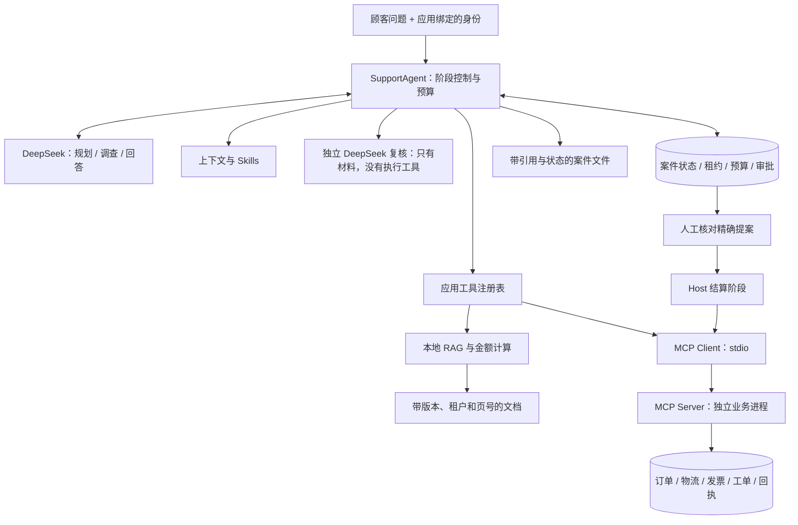
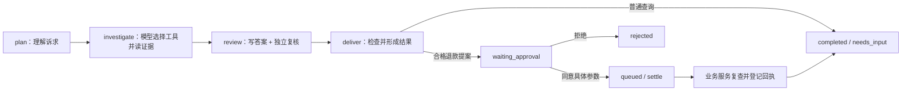
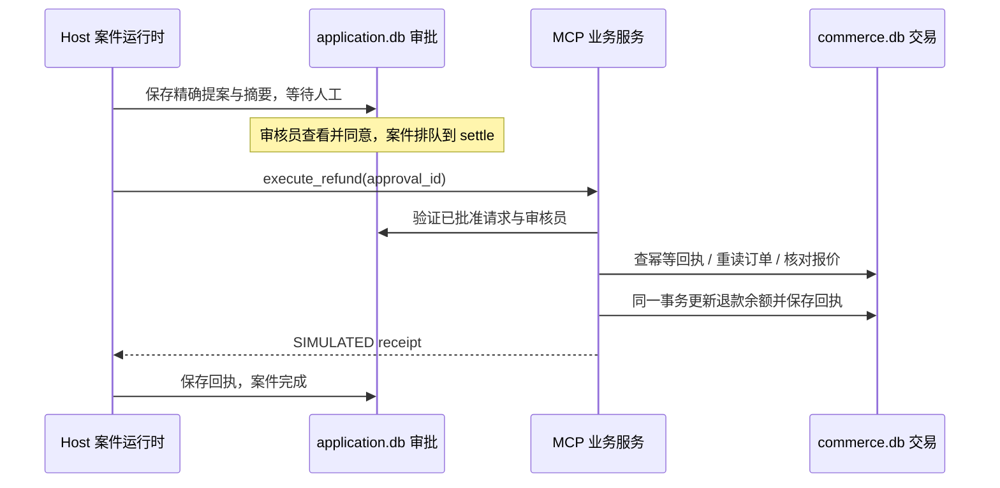

# Stage 14：把前面十四章接起来，做一个真正调用模型的售后助手

> Language: [English](README.md) | **简体中文**

产品同事小林终于不再问“Agent 能不能调用工具”了。这次她带来一张更像实际需求的任务单：“我们给青禾商店做一个售后助手。顾客问物流，它要查记录；问退款，它要同时看订单和条款；真要退款，先把金额和理由交给人审核。处理完了，还得留下能追查的案件记录。”

这不是给聊天窗口换一个客服头像。顾客说“我付了 9999 元”，不能改写订单金额；检索到旧协议，不能拿它覆盖现行规则；模型写了“已退款”，也不能让数据库假装钱已经退了。我们要把此前分别学过的机制接成一条业务链，让每一步的输入、依据和执行权都说得清楚。

本章的正常入口会真正请求 **DeepSeek**，并通过官方 **MCP Python SDK 2.x** 启动独立的订单服务进程。商店、订单、协议、物流和退款回执则全部是虚构资料；不会连接支付渠道、发送真实退款或读取真实顾客信息。这样我们可以认真练习业务约束，又不必拿自己的银行卡来测试异常分支。

## 1. 先把一路学来的东西连成一张完整的地图

回到[Stage 00](../00-foundations/README.zh-CN.md)，我们最先学的不是自主决策，而是一次模型调用怎样进入程序：输入消息，拿到回答，解析结构化结果，再区分“模型提出工具调用”和“程序真的执行工具”。这建立了整门课最重要的界线：模型输出是一份提案，不是执行凭据。到了[Stage 01](../01-react-runtime/README.zh-CN.md)，一次往返变成了循环。模型看到工具结果以后，可以继续提出下一步，但循环必须有停止条件、明确的调用编号和错误处理。

有了循环，我们在[Stage 02](../02-workflows-routing-planning/README.zh-CN.md)又发现：不是所有决定都值得交给模型。语言意图可以让它判断，金额计算、权限条件和固定业务顺序仍然适合普通代码。路由和计划解决“想怎么做”，执行器解决“实际上允许怎么做”。[Stage 03](../03-stateful-orchestration/README.zh-CN.md)再把执行进度显式表达出来：现在在哪个状态，哪些节点可以执行，什么条件会改变下一步。图只是表达控制流的一种方式，画了图并不自动多出一个 Agent。

接着，问题从“怎么走”变成了“凭什么回答”。[Stage 04](../04-agentic-rag/README.zh-CN.md)让模型参考外部证据，学习切块、检索、排序和证据不足时停止猜测。检索分数描述相关性，不是事实正确率。[Stage 05](../05-mcp/README.zh-CN.md)则把外部能力的发现和调用放到标准协议边界上：模型的工具调用是应用内的动作提案，MCP 是应用与工具服务之间的通信方式，两者不是同一个接口，也都不代替授权。

当任务不能一次做完，[Stage 06](../06-memory-persistence-hitl/README.zh-CN.md)要求我们保存继续执行所需的检查点，并把长期偏好与当前任务进度分开；高影响动作还要暂停等待人。记下很多信息以后，[Stage 07](../07-context-engineering/README.zh-CN.md)提醒我们：存过，不等于每轮都该发给模型。应当按需要选择上下文，保留必要证据，限制历史长度。[Stage 08](../08-agent-skills/README.zh-CN.md)把反复使用的工作方法整理成 Skills，先展示名称与用途，需要时才加载正文。操作手册可以教助手怎么检查，不能偷偷给它增加权限。

能力增加以后，[Stage 09](../09-reliability-safety/README.zh-CN.md)把参数、身份、预算、重试、幂等和截止时间变成程序规则。“失败再试一次”必须先回答重复动作是否安全。[Stage 10](../10-evaluation-observability/README.zh-CN.md)进一步追问：这些规则到底生效没有，改完系统有没有退步？一次执行记录帮助定位问题，一组固定案例帮助比较改动；仅看最后一句话，常常看不见丢失的证据和多余的动作。

最后三章把协作、执行环境和时间跨度补齐。[Stage 11](../11-multi-agent/README.zh-CN.md)教我们按职责分工、裁剪上下文、保留失败与来源，而不是给同一份提示词起五个名字。[Stage 12](../12-agent-workspace-sandbox/README.zh-CN.md)区分工作区、候选文件与已经交付的产物，也说明普通子进程包装器不是安全沙箱。[Stage 13](../13-long-horizon-harness/README.zh-CN.md)让工作脱离某一个进程：用持久化状态交接，用租约限制当前提交者，用原子提交避免留下半张任务单。恢复执行不等于外部副作用自动“恰好一次”。

把这条线压缩成一个问题，就是：**谁根据哪些材料提出什么动作，谁检查并执行，执行后留下什么，出错后从哪里继续？** 毕业项目会把这些问题落实到一份售后案件里。它不会重新实现一个通用框架，但也不会只把前三句政策放进列表，然后把列表起名叫“企业知识库”。

## 2. 先接一笔具体售后，不急着写类

顾客 Alice 问：“请帮我处理 QH-1001 的退款，告诉我依据是什么。”这是一笔青禾商店的支架订单。商品实际支付 129.00 元，另付运费 12.00 元；已签收 7 天，退货仓库也已确认收到，之前没有退款。虚构商店的规则是：普通商品在签收后 30 天以内、包括第 30 天，且仓库已签收退货，才允许进入本自动退款流程；只退尚未退过的商品实付金额，不退本例中的原运费。

因此，模型需要理解用户是否要求实际办理，查到该用户的订单，找到适用条款，并解释为什么候选金额是 129.00 元，而不是发票总额 141.00 元。随后案件应该停在“等待审批”，不是直接完成退款。审核员 Chen 确认具体订单、金额、规则版本和报价摘要之后，应用才允许业务服务登记一张 **SIMULATED** 回执。

其他问题也必须能演示：物流查询、发票与退款余额不一致、灯具保修、未入库退货、超期订单、已部分退款以及政策不覆盖的服务。每件案件只绑定用户本次明确写出的一个订单号；需要选择订单时可以列出该用户的订单，但助手不能替用户随便挑一笔付款。

这里有两条现实性边界。第一，`--profile alice` 是受信任本地操作者选择的**演示身份**，不是上线用的登录系统。真实服务必须从认证结果建立身份，不能让请求随意填写租户或角色。第二，日期计算使用资料集的固定快照日 `2026-09-12`，便于重复实验；租约和审批有效期则使用运行时钟。不要把这两只“钟”混成真实订单的当天状态。

## 3. 先看整个系统，再走进各个房间

可以把系统想成一个有前台、资料室和财务窗口的售后办公室。DeepSeek 帮前台理解诉求、选择调查动作、组织解释；资料室提供条款；订单服务保管交易记录；财务窗口只处理已经通过人审的精确请求。模型可以把材料准备好，但不能自己给自己盖财务章。

下面的架构图里，实线表示程序调用。最重要的不是方框数量，而是退款执行没有一条从模型直接通往数据库的捷径。



按职责对应到代码，模块之间的约定如下。先读“负责什么”，暂时不需要记住每个文件名。

| 模块 | 负责什么 | 刻意不负责什么 |
|---|---|---|
| `domain.py`、`decision.py` | 身份、金额规则、模型结果契约 | 不把字符串合法等同于业务允许 |
| `model.py` | 真正的 DeepSeek 请求、响应与用量 | 不查库、不审批、不选择付款金额 |
| `retrieval.py`、`data/knowledge/` | 文档切块、过滤、排序、按编号读取 | 不把 Top-K 当事实判决 |
| `skills.py`、`data/skills/` | 发现与按需加载操作手册 | 不扩展工具或角色 |
| `mcp_server.py`、`business.py` | 独立业务能力和逐次数据授权 | 不相信模型自报身份 |
| `mcp_bridge.py` | SDK 连接、发现、调用、错误归一化 | 不把发现的全部工具交给模型 |
| `tools.py` | 本地工具、模型工具白名单、上下文组装 | 不允许自由命令或任意文件路径 |
| `agent.py` | 有界调查循环、复核、阶段推进、组装 | 不让模型改写状态机 |
| `store.py` | 检查点、租约、持久预算、精确审批、偏好 | 不把本地账本当支付服务 |
| `workspace.py` | 生成和保留案件产物 | 不执行模型生成的脚本 |
| `checks.py`、`evaluation.py`、`live_eval.py` | 边界测试、检索评测和真实运行评审材料 | 不用测试替身证明模型质量 |

再看同一笔退款的时间顺序。`phase` 表示接下来做哪一类工作，`status` 表示任务是在排队、执行、等待还是结束。每个可执行阶段都是一次可以提交检查点的工作单元。



总体阶段是固定工作流，调查阶段内部才是模型动态选择下一步的工具循环。这正是把 Stage 02 的确定性控制与 Stage 01 的灵活循环组合起来。我们没有让模型决定是否需要审批，也没有为了使用 Graph 库而再包一层；状态转移已经在应用中明确表达。

接下来按这条链实现。先准备业务必须知道的材料，再让模型进入系统，否则它会在一间布置漂亮、但文件柜全空的办公室里上班。

## 4. 给资料室装进真正有区分度的材料

`code/data/knowledge/` 包含 **8 份双语文档、28 个有编号的逻辑资料页**。这里的“页”是稳定的引用单元，例如 `RETURNS:p02`，不是声称存在 28 张 PDF 纸页。每页有中文和英文正文，主要手册的页面包含多个完整段落，分别说明条件、例外、处理方法和记录要求。

| 资料 | 页数 | 在案件中解决的问题 |
|---|---:|---|
| [退货退款规则 RETURNS](code/data/knowledge/RETURNS.md) | 4 | 时间、仓库入库、净金额、排除类别、人工审批 |
| [配送与签收 DELIVERY](code/data/knowledge/DELIVERY.md) | 4 | 处理、发运、签收、改址、损坏与丢件 |
| [保修手册 WARRANTY](code/data/knowledge/WARRANTY.md) | 4 | 商品期限、安全排查、维修材料与不覆盖事项 |
| [发票说明 INVOICES](code/data/knowledge/INVOICES.md) | 4 | 原票金额、访问范围、更正、与退款对账 |
| [服务协议 AGREEMENT](code/data/knowledge/AGREEMENT.md) | 4 | 权责、隐私、偏好保存、恢复与留存 |
| [售后作业手册 PLAYBOOK](code/data/knowledge/PLAYBOOK.md) | 4 | 信息顺序、分支处理、可疑输入、结案条件 |
| [历史退货版本 RETURNS_OLD](code/data/knowledge/RETURNS_OLD.md) | 2 | 故意保留旧 14 天规则，检查版本过滤 |
| [另一商户条款 SOUTH_TERMS](code/data/knowledge/SOUTH_TERMS.md) | 2 | 不同租户的 45 天人工条款，检查范围隔离 |

旧版本和另一商户条款不是垃圾数据，而是检索必须面对的干扰。如果检索只对“退款”做字符串匹配，两者都可能很相关，但它们未必适用于 Alice。资料的开头因此记录了文档 ID、版本、租户、状态和有效日期；正文页号保留到每个段落切块。中文与英文分别索引，不把两种语言简单拼成一条很长的结果。

业务记录则在 [business.json](code/data/business.json)：24 笔订单、6 类商品、5 个演示身份，涉及青禾与另一商户两个租户。订单有实付、折扣、运费、既往退款、签收时间、仓库退货签收、物流事件和发票，而不是只有订单号与价格。初始化时写入本地业务数据库；以后查询读数据库，避免每次启动把已经登记的退款又覆盖掉。

我们会反复使用几笔订单：QH-1001 是正常主线；QH-1002 恰好第 30 天，QH-1003 是第 31 天；QH-1004 尚未收到退货；QH-1007 和 QH-1008 属于排除类别；QH-1009 的商品实付 129.00 元、已退 49.00 元，因此剩余是 80.00 元；QH-2001 属于 Bob，Alice 不应该读到。材料差异让每个模块都有事情可做，而不是所有输入最后都得到同一句答复。

## 5. 先把身份和业务事实放对位置

模型还没有开始调查，身份就应该由应用确定。`Identity` 只有租户、用户和角色三个字段，分别回答“属于哪家商户”“代表谁”“可以进入哪类操作”。命令行中的 `alice`、`chen` 等名字只是从固定演示配置中选择这些字段，不会进入模型的可编辑工具参数。

查订单时，业务服务把订单号与两个身份条件一起放进查询。下面是 `_owned()` 的核心；`c` 是当前数据库连接，`self.identity` 是服务进程启动时绑定的身份。

```python
row = c.execute(
    "SELECT payload FROM orders WHERE id=? AND tenant=? AND user=?",
    (order_id, self.identity.tenant, self.identity.user),
).fetchone()
if row is None:
    raise BoundaryError("order_not_accessible")
```

这样，知道一个订单号不等于获得订单内容。不属于当前身份与根本不存在，都会得到相同的不可访问错误，不额外透露“这单属于 Bob”。物流、发票和工单也要在各自读取边界执行相同规则，不能因为前台检查过一次，就让后台接口变成随便查。

金额统一使用整数分。例如 `paid_items_cents=12900`，而不是用二进制浮点数反复相减。用户可以描述诉求，但剩余可退金额只能由业务记录算出。文档负责解释规则；[refund_rules.json](code/data/refund_rules.json) 是经过人工维护、与文档版本绑定的可执行规则，不能让大模型读完一份协议后自行改写支付算法。

此时业务记录的位置清楚了，但它们还没有成为模型的知识。下一步先处理一类允许公开给当前商户用户的信息：政策正文。

## 6. RAG：先决定哪份资料适用，再决定哪段最相关

想象在文件柜里找退款规则。正确顺序不是“找到最像退款的纸就用”，而是先拿青禾当前有效的文件，再在里面找签收日期和金额条款。程序也按这个顺序工作。每个段落成为一个 `Passage`，保留 `document`、`page`、`language`、`tenant`、`version` 和正文。编号例如 `RETURNS:p02:zh:0`，最后的 `0` 是这一页中文正文的第一个段落。

这里的切块不按固定字数从句子中间切开，而是利用资料本身的页与段落。文档头已经读入 `meta`，页面和语言已经解析后，下面这段把正文段落逐一交给 `Passage` 构造逻辑：

```python
for number, paragraph in enumerate(prose.split('\n\n')):
    if len(paragraph) > 2500:
        raise BoundaryError('paragraph_requires_editorial_split')
```

超过上限会明确报错，要求先按语义整理材料，而不是悄悄丢掉末尾的例外条件。段落编号与文档版本一起标识引用；如果发布新版本并调整段落，必须重新建索引，不能假定旧编号永远指向相同文字。

筛选规则在 `KnowledgeBase.eligible()` 中。开始日期包含当天，结束日期不包含当天；历史状态、其他租户和不匹配语言的块不会进入后面的排序池。

```python
return (
    p.tenant == tenant
    and p.language == language
    and p.status == "active"
    and p.effective_from <= as_of
    and (p.effective_to is None or as_of < p.effective_to)
)
```

`read_knowledge` 按编号读取时也执行这项检查。否则搜索接口再严格，调用方仍可能猜一个旧文档 ID 直接取回，等于文件柜正门上锁、侧门敞开。

对已经允许使用的段落，本章使用 **BM25 词项检索**。先用容易理解的话说：一个问题中比较少见、区分度高的词值得更多权重；一个段落重复十遍“退款”，不应该得到十倍奖励；长段落也不能仅凭字多就占便宜。英文按单词取词项，中文使用相邻两字组合，避免要求读者再配置一个模型下载服务。这是词项方法，不是神经语义向量，也不会伪装成“DeepSeek Embedding”。

实现中的一个词项得分如下，`frequency` 是该词在当前块出现的次数，`df` 是包含它的块数，`length / average` 用来调整长短差异：

```python
idf = math.log(1 + (len(pool) - df + 0.5) / (df + 0.5))
score += idf * frequency * 2.5 / (
    frequency + 1.5 * (0.25 + 0.75 * length / average)
)
```

这里使用 `k1=1.5`、`b=0.75` 和非负的平滑 IDF。参数是这个可运行起点的选择，不是业务正确率。BM25 背景可以对照[信息检索教材的说明](https://nlp.stanford.edu/IR-book/html/htmledition/okapi-bm25-a-non-binary-model-1.html)。系统每次返回最多四块，随后模型可以用更具体的查询再找一次，或按返回编号读取原段落。数据规模较小时直接计算清楚可读；更大资料库应建立索引，并通过固定检索集比较向量、混合检索或重排，而不是默认增加一个数据库就一定提高召回。

另一个细节是付款规则不能依赖“这次恰好排在前四名”。`calculate_refund` 会额外按固定政策页读取时间与金额条款，并验证文档版本与可执行规则相符。这些块成为必须保留的证据。普通问答可以靠搜索探索，高影响计算则要确保关键条件实际到场。相关不等于充分，引用编号存在也不等于所有自然语言断言都已被证实。

## 7. MCP：订单服务真的在另一个进程里

政策可以在本地索引，但订单、物流、发票和工单属于另一个业务边界。我们把它们放进独立的 `mcp_server.py` 进程，由它维护 `commerce.db`；应用通过 stdio 发送协议请求并读取结果。它们仍在同一台演示机器上，但不是把普通函数改名叫 MCP，然后直接调用。

这个服务发布八个工具。六个用于读取：`list_orders`、`get_order`、`get_shipment`、`get_invoice`、`get_product`、`get_ticket`；两个用于写入：`create_ticket` 与 `execute_refund`。前者提供各不相同的业务材料，后者分别演示显式创建工单与精确审批后的模拟退款。此外，服务有一个说明作用域的只读 Resource，但它不承担身份认证。

发布一个订单工具只需要把现有业务函数放在 SDK 的工具边界上：

```python
@server.tool()
def get_order(order_id: str) -> dict[str, Any]:
    """Read authoritative order, delivery date, paid cents and warehouse return receipt."""
    return commerce.get_order(order_id)
```

Python 类型说明帮助 SDK 生成输入契约，业务函数继续负责数据授权。`server.run()` 默认以 stdio 运行；stdout 留给协议，不往那里打印业务调试信息。主机用 `StdioServerParameters` 指定当前 Python 解释器、服务脚本、状态目录和演示身份，然后进入 `async with Client(params)`。这是官方 SDK 2.x 的[客户端生命周期](https://py.sdk.modelcontextprotocol.io/client/)与[服务启动方式](https://py.sdk.modelcontextprotocol.io/run/)，不是自己手写一套假协议。

桥接器中的连接主体如下。`root` 和 `profile_name` 来自应用启动参数，`env` 是主机选择的最小环境；模型不会参与构造这条进程命令。

```python
params = StdioServerParameters(
    command=sys.executable,
    args=[str(Path(__file__).with_name('mcp_server.py')),
          '--state-dir', str(root.resolve()), '--profile', profile_name],
    env=env,
)
async with Client(params) as client:
    bridge = MCPBridge(client)
    await bridge.discover()
    yield bridge
```

这里的 `yield` 位于 `@asynccontextmanager` 管理的函数中，把已连接的桥接器交给调查或结算阶段；离开上下文再关闭连接。协议如何协商由 SDK 处理，业务代码不再复制一套握手状态机。

调用之后必须先看工具有没有失败，不能只看“请求函数没有抛异常”。桥接器接受的关键边界是：

```python
if result.is_error:
    raise BoundaryError("commerce_call_failed")
value = result.structured_content
if not isinstance(value, dict):
    raise BoundaryError("invalid_commerce_result")
return value
```

所有记录级工具仍在服务端检查身份。子进程不会得到 DeepSeek 密钥；它只需要业务数据路径和本地演示配置。这个配置是受信任主机的能力，不是任何远程用户都能提交的参数。若改成远程 HTTP 服务，必须增加真正的认证与授权，不能把本地启动参数冒充网络身份机制。

最关键的是：**发现八个工具，不等于把八个工具全部交给模型。** 模型只得到六个只读 MCP 工具；工单写入要由用户明确的命令触发，退款执行只由审批后的结算阶段调用。后面真正组装时，应用工具表会再次落实这个区别。

## 8. 给助手一本操作手册，但不要把手册当通行证

一位客服懂得读资料，仍然可能顺序搞错：先看发票就计算退款，或仓库还没收到退货就说准备打款。于是我们把常用检查方法写成五份 Skills：退款、配送、发票、保修和一般政策咨询。它们不是五个需要彼此聊天的 Agent，而是五套按需加载的操作说明。

每套说明放在独立目录的 `SKILL.md` 中，有名称、描述以及双语步骤正文。例如退款手册明确要求从订单取得事实、检查签收和仓库入库、扣除既往退款、不把发票总额当退款余额；保修手册要求先看商品型号与期限，只做安全排查，不指导用户拆开通电设备。发票手册则特意区分原始票面金额和后续退款余额。

规划阶段只收到 manifest 中的名称与用途；模型选择意图后，应用加载对应正文。其核心调用是：

```python
intent = state["plan"]["intent"]
skill = intent if intent != "greeting" else "policy"
state["procedure"] = self.skills.load(skill, state["language"])
```

这是 Stage 08 的渐进披露：先知道有哪本手册，再翻需要的那本。`load_skill` 也可以在调查时补取其他已登记的手册，但不能读取任意文件，也不能安装新脚本。这里的 manifest 是本应用的审定目录，不是一个通用的外部 Skill 安装器；目录中的文件遵循[Agent Skills 的基本文件约定](https://agentskills.io/specification)。

手册正文会提醒“不能退款”，真正的退款限制却不靠这句话。即使把手册误写成“立刻执行退款”，模型的工具白名单仍没有付款入口。一个是工作知识，一个是程序权限；两道边界各自成立，才不会把印得漂亮的操作指南当作万能钥匙。

## 9. 现在才让真实 DeepSeek 进入系统

办公室的材料和工具准备好了，模型该上班了。`DeepSeekModel` 使用 `AsyncOpenAI` 连接 DeepSeek 的兼容接口，模型 ID 和密钥从环境读取。没有依赖、密钥或可用模型时，真实入口会明确失败，不会静默换成离线规则让演示看起来成功。

```python
self.client = AsyncOpenAI(
    api_key=key,
    base_url="https://api.deepseek.com",
    timeout=40,
    max_retries=0,
)
```

这里禁用 SDK 隐式重试，把是否重新执行留在应用的预算与恢复逻辑里。规划、最终回答、独立复核都要求 JSON 对象；调查阶段则提供函数工具表，模型可以连续查询。普通 JSON 模式保证的范围与应用数据契约不同，因此仍要检查字段、类型、大小和允许值；格式有误或响应被截断，都不能直接进入下一步。[DeepSeek JSON 输出指南](https://api-docs.deepseek.com/zh-cn/guides/json_mode/)与[工具调用指南](https://api-docs.deepseek.com/zh-cn/guides/tool_calls/)对应这两类请求。

规划结果包含意图、订单号、是否明确要求退款、最多三条检索查询和四个短里程碑。订单号必须真的出现在当前问题中；多个订单号会被要求拆成单笔案件。`action_requested` 是模型对意图的解释，仍然可能判断错，因此后面的人审必须展示完整的具体提案，不能把这个布尔值当成顾客已完成授权。

每次发送请求以前，模型计数先写入持久预算。这样即使请求已发送、响应却丢了，重新执行也不会把花过的预算洗掉。响应中的 token 用量只有服务提供时才记录；没有 usage 就保存未知，不编造“免费调用”的零。

本例显式使用非思考模式 `extra_body={"thinking":{"type":"disabled"}}`，让工具消息回传契约保持直观。若切换思考模式，需要按[官方模式说明](https://api-docs.deepseek.com/zh-cn/guides/thinking_mode/)完整处理其额外响应字段，不能只删掉这个设置就假定现有历史组装仍然适用。我们观察实际消息和工具，不打印或依赖隐藏推理过程。

## 10. 调查循环：模型提申请，工具表负责把门

现在来看真正的一轮工作。DeepSeek 根据问题和手册提出 `get_order`、`search_knowledge` 或其他请求，应用先核对工具名称和参数，再调用本地能力或 MCP 桥接器，最后把结果交回模型。整个调查阶段最多七轮，每轮最多四个工具调用；工具调用编号必须唯一。

模型可见的工具共有十二个：六个 MCP 读取工具，加六个本地工具。后六个分别负责搜索资料、读取指定段落、加载手册、计算可退金额、读取已同意保存的语言偏好，以及保存本案件的小笔记。笔记不是长期记忆，也不是外部工单；付款和工单创建不在这张表里。

工具执行的前半段如下。`fields()` 要求参数集合与该工具完全一致，未知字段不会被顺手传给下游。

```python
self.budget("tool")
if name not in SPECS:
    raise BoundaryError("model_tool_not_allowed")
fields(arguments, set(SPECS[name][1]))
for value in arguments.values():
    text(value, maximum=1500)
if "order_id" in arguments:
    self.order_scope(arguments["order_id"])
```

这里的预算统计模型提交到应用路由器的请求，包括被拒绝的请求；结算阶段还额外计入一次业务执行请求。`calculate_refund` 内部为核实事实再读一次订单，并不是另一个由模型提出的请求，所以不要把这个计数解释成所有网络 I/O 的总数。真正衡量传输次数时应另设指标。

结果回传保持 assistant 工具提案与 tool 回应的关联：

```python
history.append({
    "role": "tool", "tool_call_id": call["id"],
    "content": encode(output),
})
```

在追加这些回应之前，运行时已经追加了本轮 assistant 消息。历史过长时只能移除完整的旧“提案—结果”组，不能留下找不到对应调用的 tool 消息。之前得到的授权事实和证据则保存在案件状态中，下一轮会重新选择必要部分提供给模型。

这份重新组装的上下文包含当前问题、计划、所选手册、授权业务事实、选中的证据、报价和语言偏好。报价必须引用的条款优先保留，其余位置才放最近检索的材料，最多十二块。模型调用前还检查上下文与历史的总字符数不超过 36,000。**字符上限不是 token 精确预算**，也不保证服务商上下文窗口一定够用；它是这个示例明确可检查的输入体积边界。

长期保存的偏好只允许语言，并要求命令行操作者明确 `--consent`。它会影响以后新案件的语言选择；当前案件的工作笔记则只在该案件中存在。这样 Stage 06 的记忆、Stage 07 的上下文与 Stage 08 的手册不会变成一锅名叫“给模型的所有东西”的粥。

## 11. 报价是计算结果，不是模型填空题

Alice 要求退款时，调查者应该调用 `calculate_refund`。它先通过 MCP 重新读取当前订单，再使用有版本的本地规则计算。用户写的金额、模型猜的金额和发票总额都不会成为这个函数的付款输入。

最容易理解的算式是：尚可退的商品余额 = 商品实际支付金额 − 已经退过的商品金额。QH-1001 得到 129.00 元；QH-1009 得到 80.00 元。订单上的 12.00 元原运费不进入本自动规则，折扣也不能再从商品实付中重复扣一遍。

```python
amount = max(0, order["paid_items_cents"] - order["refunded_cents"])
```

但算出正数还不够。订单要已送达，日期不能在未来，签收后不能超过 30 天，商品类别不在排除列表，退货仓库已收到，且没有全额退过。任一条件不满足，报价会带明确原因并把可执行金额设为零。另一商户没有本自动规则，直接转人工处理，不套用青禾的 30 天策略。

报价还保存订单版本、规则版本、计算日期和 `quote_id`。`quote_id` 是对确定字段计算出的摘要，用来识别这份报价；它不是电子签名，也不是支付授权。本地条款页面和规则版本必须相符，否则停止形成自动提案。把错误版本读得再流畅，也不能抵消业务条件不匹配。

本例自动处理的是满足规则的**剩余商品金额整笔退款**。部分件数、运费争议、定制商品或其他例外需要人工渠道，不在模型参数里开放“自己选个数”。这种范围限制让例子可演示，也让每个算式能够被测试，而不是做一个什么都答应的空壳。

## 12. 一个模型写答案，另一次独立调用检查证据

调查结束以后，运行时并不把一句研究总结当成事实。它从状态中重建授权事实和条款，让 DeepSeek 生成包含 `answer`、`citations`、`next_action` 的结果；然后先在普通代码中检查引用是否来自本轮真正提供的材料。

```python
if not set(citations) <= available:
    raise BoundaryError("citation_not_in_context")
if len(set(citations)) != len(citations):
    raise BoundaryError("duplicate_citations")
```

这能拒绝凭空创造的来源，却不能证明某句话与该来源语义一致。于是第二个角色——证据复核者——进行一次独立 DeepSeek 调用。它只看到当前问题、事实、选定证据和候选答案，没有订单工具，没有审批入口；它检查条件遗漏、与资料矛盾和把“提案”写成“已经付款”等情况。

这是 Stage 11 的有界分工：不是建立五个互相开会的 Agent，而是为生成者和复核者提供不同职责与输入。复核只返回 `pass`、`revise` 或 `insufficient`，反馈最多允许一次改写；仍不通过就返回需要补充材料或人工处理。它们可以使用同一个底层模型，所以错误可能相关，不能把两次调用当成两名真正独立专家的事实认证。

硬规则与语言审查也不能互换。付款金额、版本、审批、身份必须由程序检查；“这段说明是否把所有限制讲清楚”需要语义评审。模型裁判通过仍不是生产质量证明，后面的真实运行评审会把这部分留给人复核。

## 13. 人工审批在独立通道上，不能混进聊天结果

假设最终答案建议申请退款。应用还会检查：这是退款意图、用户被识别为明确要求办理、报价合格，而且引用包含时间与金额两页关键条款。通过以后，形成的是一个 `waiting_approval` 案件，保存精确的身份、订单版本、规则版本和金额，不调用付款工具。

审批摘要对完整提案计算。审核员先通过 `review-info` 看实际参数，再提交同一摘要。若金额、订单或其他已绑定字段变了，旧摘要就不能用。审核者必须来自同租户的 reviewer 角色，且不能是申请者本人；审批结果保存后，应用只把案件排队到 `settle` 阶段，真正执行在之后的工作单元中发生。

本例不允许在批准请求里任意改金额。需要改动时拒绝旧提案，再从业务事实形成新提案，避免“改动”和“批准”混成一次含糊操作。提案自创建起 15 分钟内有效，执行前也检查有效期；过期未执行应重新取得事实和提案，不能自动延长人的同意。

下面把两个数据库分开看，才能理解出错时该由谁负责：



关键故障位置是倒数第二步：业务已经提交，回执在返回途中丢失。应用重试时还使用同一个 `approval_id`，业务服务先查幂等记录。找到相同参数摘要的回执就返回原结果，而不是再次修改订单余额。这个查重必须发生在新报价比较之前，否则已经退过的钱会使当前报价变化，反而阻止合法的结果重取。

```python
old = c.execute("SELECT * FROM effects WHERE key=?", (key,)).fetchone()
if old:
    if old["payload_hash"] != approval["digest"]:
        raise BoundaryError("idempotency_conflict")
    return json.loads(old["receipt"])
```

首次执行则重新检查订单版本、余额、条件和审批，再把余额更新与回执写入同一个业务事务。`Commerce.execute_refund()` 中，确认 `current == quote` 且合格后，实际改变余额的只有下面这些应用代码：

```python
order['refunded_cents'] += quote['amount_cents']
order['version'] += 1
c.execute("UPDATE orders SET payload=? WHERE id=?",
          (encode(order), order['order_id']))
c.execute("INSERT INTO effects VALUES(?,?,?)",
          (key, approval['digest'], encode(receipt)))
```

这些语句位于同一个 `with self.session() as c` 中，`receipt` 是应用构造的模拟回执。余额与回执要么一起提交，要么因异常回滚；这里没有“先把余额改了，再另找个地方记一下”的缝隙。案件库和业务库之间没有分布式事务；我们依靠执行服务的幂等契约处理不确定结果。换成真正支付服务时，必须确认对方确实实现同等语义，不能把本地有一张 `effects` 表当成远程资金“恰好一次”的证明。

## 14. 每个阶段做完就交接，不让任务依附某个进程

审批可能晚一点到达，模型请求也可能失败，不能把整件案件只放在一个 Python 对象里。`Store` 把阶段输入、计划、已取证据、答案和状态保存到 `application.db`。一个 Worker 领取一次阶段工作，执行以后短事务提交，再释放租约。网络请求不占着数据库写锁等待。

`work_once()` 的骨架是先领取，再执行有界工作，最后提交。这里展示的是执行与提交边界，`_advance()` 根据当前 `phase` 选择前面已经讲过的模块。

```python
await asyncio.wait_for(self._advance(state, profile_name, budget), timeout=150)
if heartbeat.done():
    heartbeat.result()
self.store.save(state, token)
```

提交者资格也不能只靠一段文字约定。`_owner()` 在事务中读取当前行，再检查下面几个条件；任何一个不成立就拒绝写入。

```python
if (row is None or row['status'] != 'running'
    or row['lease_token'] != token or row['lease_until'] <= time.time()):
    raise BoundaryError('lease_lost')
```

检查通过以后，同一事务才更新案件状态与阶段并释放租约；等待审批的提案也在这次提交中写入。因此读者看到一个已提交的等待状态时，不必再猜审批请求是不是保存到了另一个尚未完成的步骤里。

领取时生成本次唯一 token，默认租约 30 秒；活跃工作每 5 秒尝试续租。提交与续租都在数据库事务中检查 token 和有效期。旧进程即使回来，也不能用过期领取修改新进程的状态。150 秒是工作单元的异步等待上限，40 秒是模型 HTTP 请求超时；异步取消不保证服务商停止已经接收的推理，更不能撤销已经完成的外部动作。

预算与阶段检查点有意分开提交。模型请求最多 20 次，应用工具请求最多 24 次；每次出发之前计费式地扣一格，不在失败重试时重置。步骤失败后 `resume --retry` 会重做该阶段，已经使用的次数仍然算数。调查阶段只读业务，重复读取可接受；本地笔记不是外部副作用。结算阶段可能写业务，必须使用刚才讲的幂等回执。

这不是每个 token、每次工具调用之后都保存一份完整模型会话。调查阶段正常结束才提交该阶段的材料；中途崩溃可能需要重新调查，并产生额外的模型费用。工作单元大小是恢复成本与实现复杂度的权衡。状态库丢失、磁盘损坏、机器间共享存储和数据库迁移，也不是本地 SQLite 租约已经解决的事情。

拒绝审批会停在 `rejected`，不会创建付款回执；证据不足停在 `needs_input`，本例需要新建包含补充信息的案件，不把终态重新当自由循环。清楚地停下，也是一种完成任务的方式。

## 15. 结果要能交付，过程要能检查

案件回答使用应用指定的路径导出，文件名由运行编号和内容摘要组成。模型只能提供回答内容，不能指定 `../../somewhere` 这样的目标路径，也不能要求运行 Shell。输出标记虚构案件、当前状态、证据编号和待审批金额；只有真正拿到业务回执以后，应用才另外写入模拟回执信息。

文件先通过临时文件写入并替换为完整版本，再将路径保存到案件状态。文件系统和 SQLite 不是同一事务，所以若在两者之间退出，可能留下尚未被案件引用的文件；对外可见的交付物应以已提交案件记录为准。重新执行会复用内容一致的产物，不能把任意目录中的文件都自动当成已交付。这沿用了 Stage 12 的产物思想，但本章没有运行不可信代码，因此不提供沙箱或自由脚本执行能力。

观测数据与案件数据也分开。案件状态必须保存问题、证据和答案才能恢复，属于需要受控访问的业务数据；`events` 只记录阶段、工具名、状态、耗时和用量等有限字段，不默认记录原始提示词、异常详情或凭证。`run_id` 把这些记录连起来；模型返回 usage 缺失时仍是未知，不能显示一个编造的美元成本。

这种小型事件轨迹不是完整 OpenTelemetry 平台，也没有替你实现生产审计保留、加密和访问控制。它先让我们能实际检查一次案件走过了什么，再在需要部署时接入前面已经理解的观测接口。

## 16. 把模块组装起来，走完第一笔真实模型案件

到这里，组装已经不神秘。应用创建状态存储和真实模型适配器，再把它们交给运行时；默认连接就是 MCP stdio，而不是直接函数替身。

```python
store = Store(args.state_dir)
model = DeepSeekModel()
agent = SupportAgent(store, model)
```

创建案件与推进案件是两步。一个应用入口会先把身份、问题和语言写进状态，再调用 `drain()` 推进到下一个等待或终态；退出时关闭模型客户端：

```python
run_id = store.create(profile('alice'), '请退款QH-1001并解释依据', 'zh')
try:
    state = await agent.drain(run_id, 'alice')
    print(state['status'], state.get('answer'))
finally:
    await model.close()
```

这是异步入口中的组装片段，不会自行批准退款。命令行入口还处理单步执行、身份选择、错误与检查结果展示。

运行时按需打开 MCP 连接，调用结束关闭；模型客户端也在退出时关闭。依赖声明在本章 requirements 中。以下命令从仓库根目录运行，使用 Python 3.10 及以上版本，并建议先建立独立虚拟环境：

```bash
python -m pip install -r stages/14-capstone-enterprise-agent/code/requirements.txt
python stages/14-capstone-enterprise-agent/code/demo.py init
python stages/14-capstone-enterprise-agent/code/demo.py mcp-tools
```

最后一条不需要 LLM 密钥，会实际启动 MCP 服务并发现八项能力。默认状态保留在本章 `code/.state/`；`init` 只补入缺失的虚构记录，不重置已有退款或案件。自选目录时把 `--state-dir` 放在子命令之前，例如 `demo.py --state-dir my-support-state init`，后续也使用同一路径。

先设置自己账号中实际可用的模型 ID，不把示例占位符当模型名。macOS/Linux 终端：

```bash
export DEEPSEEK_API_KEY='your-key'
export DEEPSEEK_MODEL='your-available-model-id'
python stages/14-capstone-enterprise-agent/code/demo.py ask '请退款QH-1001，并解释金额和政策依据。'
```

PowerShell 中对应为：

```powershell
$env:DEEPSEEK_API_KEY="your-key"
$env:DEEPSEEK_MODEL="your-available-model-id"
python stages/14-capstone-enterprise-agent/code/demo.py ask "请退款QH-1001，并解释金额和政策依据。"
```

CMD 使用 `set "DEEPSEEK_API_KEY=your-key"` 和 `set "DEEPSEEK_MODEL=your-available-model-id"`。密钥不要写进源码、资料文件或提交记录。主入口不会打印密钥，也不自动批准模型提案。

正常情况下，输出先给出 `run_id`，随后显示 `waiting_approval`、12900 分的 proposal、`approval_digest`、案件文件路径和有限轨迹。如果模型没有找到足够依据或没有正确使用工具，可能进入补充材料或失败状态；这不是承诺每次概率生成都必定到达同一分支。查看记录，再修正问题，不能为了演示成功把检查删掉。

审核员先查看提案，再对看到的同一摘要作决定。下面的 `RUN_ID` 与 `DIGEST` 都要替换成刚才实际输出的值：

```bash
python stages/14-capstone-enterprise-agent/code/demo.py --profile chen review-info RUN_ID
python stages/14-capstone-enterprise-agent/code/demo.py --profile chen review RUN_ID --digest DIGEST --approve
python stages/14-capstone-enterprise-agent/code/demo.py --profile alice resume RUN_ID
```

审核动作只改变案件状态；最后一条才通过 MCP 执行已批准请求，并生成 `SIM-...` 回执。重复 `resume` 一个已完成案件不会再支付。拒绝分支把 `--approve` 换成 `--reject`；若要同时实验同意与拒绝，应使用不同案件，而不是试图给已经决定过的审批反复改口。

再试几件不一样的事，观察它们是否选择了不同的工具与手册：

```bash
python stages/14-capstone-enterprise-agent/code/demo.py ask "QH-1005到哪了，发货后还能改地址吗？"
python stages/14-capstone-enterprise-agent/code/demo.py ask "QH-1009的发票金额和剩余可退款金额为什么不同？"
python stages/14-capstone-enterprise-agent/code/demo.py ask "QH-1012灯具不亮，应该如何安全排查并申请保修？"
python stages/14-capstone-enterprise-agent/code/demo.py ask "月球瞬移服务享受多久保修？"
```

明确创建工单是另一个入口，展示 MCP 写操作也可以不是模型自主动作：

```bash
python stages/14-capstone-enterprise-agent/code/demo.py create-ticket QH-1012 "灯具不亮，申请人工售后" --key lamp-case-1
python stages/14-capstone-enterprise-agent/code/demo.py remember --language en --consent
```

同一身份用相同 key 和参数重发工单，返回同一回执；相同 key 却更改内容会拒绝。新的业务动作必须使用新的 key。保存语言后，下一次没有显式 `--language` 的案件会使用该偏好，不会因此获得任何额外业务权限。

要观察检查点，给 `ask` 加 `--one-step`，它只做规划就退出；再用 `resume RUN_ID --one-step` 完成下一阶段。可以在两次命令之间关闭终端，只要仍使用同一个状态目录，进度就能读回。失败后先检查 `inspect RUN_ID` 的错误类别；解决依赖、凭证或暂时服务问题后，再明确使用 `resume RUN_ID --retry`。如果另一 Worker 的租约尚有效，应该等待或查明执行者状态，而不是删库抢任务。

## 17. 验收不是只看一次顺利退款

先用不需要 LLM 的检查验证明确规则，再用真实模型观察语义质量。两类检查都重要，但不能互相冒充。

```bash
python stages/14-capstone-enterprise-agent/code/checks.py
python stages/14-capstone-enterprise-agent/code/evaluation.py
python stages/14-capstone-enterprise-agent/code/offline_demo.py
```

第一项覆盖身份范围、文档版本、金额与日期边界、审批摘要、过期、重复请求、并发结算、失去回执后的恢复、旧租约以及模型返回契约。安装 MCP SDK 后，还会实际启动 stdio 进程检查协议路径；缺少 SDK 时明确跳过这一项，不把跳过当作通过。离线回放显式注入测试模型与直接业务适配器，只验证组合逻辑，并会打印它不是 LLM 质量或 MCP 传输测试。

第二项专门评估检索：七道有标注页面的问题，以及一道资料库不支持的问题。Recall@4 检查前四块覆盖了多少目标页，倒数排名关注第一个相关结果的位置。没有相关文档的题不奖励 100% 召回率；它应另行验证是否坦诚拒答。宽泛词可能仍找到无关的正分段落，所以“结果非空”从来不是答案充分性的证明。这个小题集是回归起点，不能据此声称对任意售后问题都有效。

真实端到端检查由 `live_eval.py` 提供，默认只展示题目和人工评审要点，不发请求。明确允许付费调用后再运行：

```bash
python stages/14-capstone-enterprise-agent/code/live_eval.py
python stages/14-capstone-enterprise-agent/code/live_eval.py --run-live --output live-review.jsonl
```

七道题分别检查窗口内、超期、物流、发票、保修、未知服务和他人订单。它们只询问，不执行退款或创建工单；评审标签留在评测程序中，不交给模型。输出保留真实回答、状态、引用与预算，并把人工语义评审标为 `PENDING`。自动项目检查“有没有意外提案”“引用是否来自可见材料”，人还要核对金额解释、遗漏条件、语义矛盾和不支持服务的拒答。不会因为结构合法就计算一个看似漂亮的“模型正确率”。

运行资料只包含本章虚构数据，但输出仍应按评测材料管理，不要把这个保存全文的流程直接套到真实客户请求。对更大测试集，还应固定语料与代码版本，重复运行观察波动，区分开发题与保留题，并记录模型版本和费用口径。一次测试通过，说明这一次、这些条件下的行为符合检查，不是长期质量保证。

## 18. 把这套设计带走，而不是把每个模块都叫 Agent

现在我们真正组装出了一条链：真实模型理解诉求并选择工具，RAG 提供有适用范围的材料，MCP 连接独立业务服务，Skills 指导调查顺序，本地规则计算精确候选动作，独立复核检查说明，人通过另一条通道批准具体请求，持久状态与幂等回执处理进程更换和响应丢失，最后留下可检查的产物。

这条链包含前面各章的思想，但模块不必都升级为一个自主 Agent。数据库查询不是“订单 Agent”，人工审批不是“审批模型”，执行器更不能因为名字里带智能就不检查参数。本例没有任意代码执行、远程 A2A、自动支付或真正的多用户认证；这些能力不是被几张图隐含实现的。真实上线还需要认证、存储保护、秘密管理、支付执行方契约、服务监控、文档发布治理和更系统的模型评测。

最重要的是，拿掉 DeepSeek 的模型名和 MCP 的协议名，这个系统仍然能说清：谁拥有事实，谁提出判断，谁可以改变业务状态，以及失败以后哪里能找到可信的进度。能解释这件事，才算把整门课接了起来。需要进一步提供多用户服务时，再进入[Stage 15（选修）：生产服务](../15%28optional%29-production-deployment/README.zh-CN.md)。
